# System Architecture Patterns: PHP vs. Go

**Part 3 of "Backend Design Patterns: PHP vs. Go"**

This document explores application and system-level architecture patterns that sit between tactical design patterns (GoF) and distributed systems patterns. Pair this guide with:
- [Part 1: GoF Design Patterns](backend-design-patterns-php-vs-go.md)
- [Part 2: Modern Backend & Microservice Patterns](microservices-patterns-php-vs-go.md)
- [Part 4: Security, API Design, Performance & DevOps Patterns](cross-cutting-patterns-php-vs-go.md)
- [Part 5: Testing Patterns](testing-patterns-php-vs-go.md)

---

## Table of Contents

1. [Introduction & Context](#introduction--context)
2. [Architecture Landscape](#architecture-landscape)
   - [Comparing PHP and Go Strengths](#comparing-php-and-go-strengths)
3. [Application Architecture Patterns](#application-architecture-patterns)
   - [Layered Architecture (N-tier)](#layered-architecture-n-tier)
   - [Hexagonal Architecture (Ports & Adapters)](#hexagonal-architecture-ports--adapters)
   - [Clean Architecture](#clean-architecture)
   - [Onion Architecture](#onion-architecture)
   - [MVC, MVP, MVVM](#mvc-mvp-mvvm)
4. [System Architecture Patterns](#system-architecture-patterns)
   - [Monolithic Architecture](#monolithic-architecture)
   - [Service-Oriented Architecture (SOA)](#service-oriented-architecture-soa)
   - [Serverless / Function-as-a-Service](#serverless--function-as-a-service)
   - [Space-Based Architecture](#space-based-architecture)
   - [Pipe and Filter](#pipe-and-filter)
   - [Microkernel / Plugin Architecture](#microkernel--plugin-architecture)
5. [Data Architecture Patterns](#data-architecture-patterns)
   - [Shared Database (When It Works)](#shared-database-when-it-works)
   - [Data Lake & Warehouse Patterns](#data-lake--warehouse-patterns)
   - [Lambda Architecture](#lambda-architecture)
   - [Kappa Architecture](#kappa-architecture)
   - [Event Streaming Backbones](#event-streaming-backbones)
6. [Architecture Decision Framework](#architecture-decision-framework)
7. [Migration & Evolution Patterns](#migration--evolution-patterns)
8. [Hybrid & Emerging Approaches](#hybrid--emerging-approaches)
9. [References](#references)

---

## Introduction & Context

Modern backend teams navigate three tiers of decision-making:

```mermaid
flowchart LR
    Tactical[Code-Level Patterns<br/>(GoF)] --> Structural[Service & Architecture Patterns]
    Structural --> Distributed[Distributed Systems & Microservices]
    note left of Tactical "Part 1"
    note right of Distributed "Part 2"
    note bottom of Structural "This document (Part 3)"
```

This guide focuses on the **structural tier**—how to organize applications, services, and data flows before jumping into full microservices or distributed systems. We compare PHP (often used for business-rich applications) and Go (favored for performant services) to highlight implementation differences, toolchain considerations, and migration paths.

### Why a third part?

- Teams often oscillate between **monolith** and **microservices** discussions without exploring intermediate architectural options.
- PHP and Go have complementary strengths—understanding alignment avoids over-engineering.
- Service decomposition (Part 1.5 in Part 1) sets boundaries; this document helps decide **how** to structure the services within those boundaries.

---

## Architecture Landscape

Architecture choices are multi-dimensional: complexity, team autonomy, deployment frequency, scaling needs, compliance, and operational maturity.

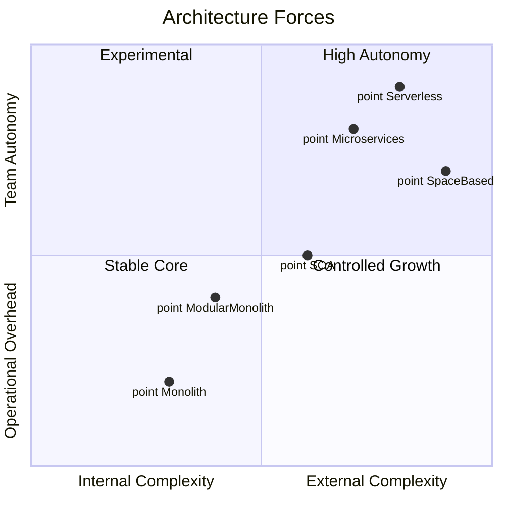

### Comparing PHP and Go Strengths

| Aspect | PHP (Symfony/Laravel) | Go (stdlib/Gin/Fiber) |
| --- | --- | --- |
| **Runtime Model** | Shared-nothing requests, mature web ecosystem | Goroutines + channels, strong concurrency |
| **Hosting** | HTTP-centric, easy scaling via processes | Lightweight binaries, great for containers |
| **Dependency Injection** | Framework containers (higher ceremony) | Manual wiring or small DI libs |
| **Build & Deploy** | Interpreted runtime, fast iteration | Compile-time builds, static binaries |
| **Domain Modeling** | Rich OOP, annotations, Doctrine ORM | Composition over inheritance, explicit modeling |
| **Best Fit** | Business-heavy applications, BFFs, modular monoliths | High-throughput services, pipelines, serverless |
| **Challenges** | Async complexity, concurrency | Rapid prototyping, verbose boilerplate |

**Guideline:** Choose architectures that leverage each language’s strengths rather than fighting the runtime model.

---

## Application Architecture Patterns

### Layered Architecture (N-tier)

**Summary:** Organize code into layers (presentation, application, domain, infrastructure/data) to separate concerns and control dependencies.

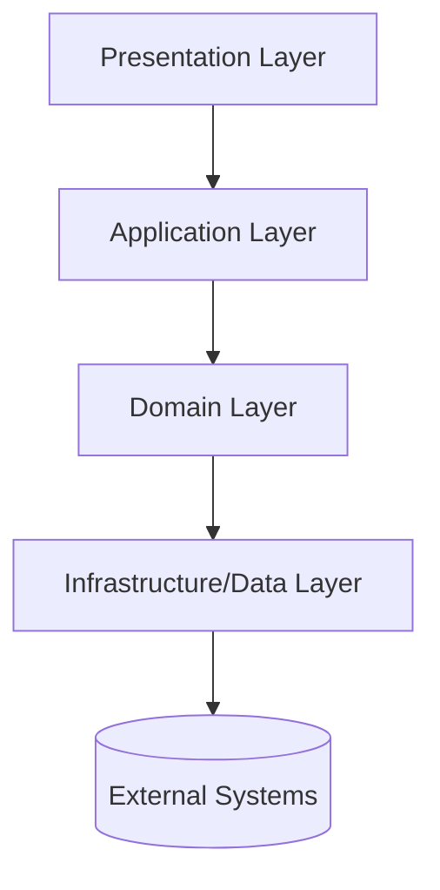

**When to use:**
- Traditional line-of-business applications with clear page/API flows
- Teams with strong MVC background
- Need to enforce boundaries between domain logic and infrastructure

**PHP Example (Symfony):**

```php
namespace App\Controller;

use App\Application\RegisterUserHandler;
use Symfony\Component\HttpFoundation\Request;
use Symfony\Component\HttpFoundation\JsonResponse;

class RegisterUserController
{
    public function __construct(private RegisterUserHandler $handler) {}

    public function __invoke(Request $request): JsonResponse
    {
        $command = RegisterUserCommand::fromRequest($request);
        $userId = $this->handler->handle($command); // Application layer

        return new JsonResponse(['id' => $userId], 201);
    }
}
```

**Go Example:**

```go
package userapi

type RegisterUserHandler struct {
    service application.RegisterUserService // Application layer
}

func (h *RegisterUserHandler) Handle(c *gin.Context) {
    var req RegisterUserRequest
    if err := c.ShouldBindJSON(&req); err != nil {
        c.JSON(http.StatusBadRequest, gin.H{"error": err.Error()})
        return
    }

    id, err := h.service.Handle(c.Request.Context(), req.ToCommand())
    if err != nil {
        c.JSON(http.StatusInternalServerError, gin.H{"error": err.Error()})
        return
    }

    c.JSON(http.StatusCreated, gin.H{"id": id})
}
```

**Trade-offs:**

| Benefit | Trade-off |
| --- | --- |
| Separation of concerns | Can become rigid if layers are too strict |
| Easier testing per layer | Crossing layers (e.g., validation) can cause duplication |
| Aligns with framework tooling | Layer explosion in large apps |

**Language notes:** PHP frameworks provide scaffolding for layered designs. Go benefits from explicit module boundaries (package-level visibility) but requires discipline to avoid circular dependencies.

---

### Hexagonal Architecture (Ports & Adapters)

**Summary:** Center the domain model and define ports (interfaces) that adapters implement. Enables swapping infrastructure without touching core logic.

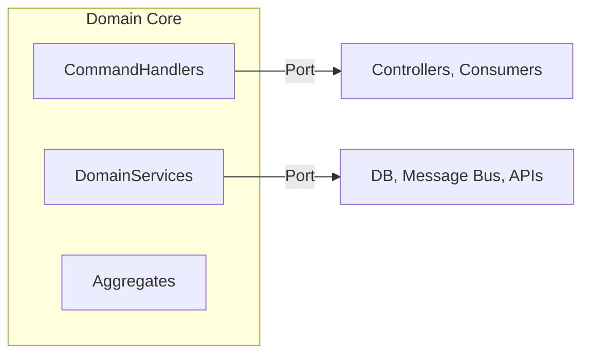

**When to use:**
- Domain-centric systems needing long-term maintainability
- Frequent swapping of external systems (databases, APIs)
- Testing core logic without infrastructure

**PHP Notes:** Symfony service container maps interfaces to adapters. Doctrine repositories implement ports. Autowiring simplifies adapter injection.

**Go Notes:** Interfaces defined near usage. Adapters live in separate packages (`infra/postgres`, `infra/kafka`). Encourage dependency injection via constructors.

**PHP Port Example:**

```php
interface UserRepository
{
    public function save(User $user): void;
    public function byEmail(Email $email): ?User;
}
```

**Go Adapter Example:**

```go
type UserRepository interface {
    Save(ctx context.Context, user domain.User) error
    ByEmail(ctx context.Context, email domain.Email) (*domain.User, error)
}

type PostgresUserRepository struct {
    db *sql.DB
}

func (r *PostgresUserRepository) Save(ctx context.Context, user domain.User) error {
    _, err := r.db.ExecContext(ctx, "INSERT INTO users ...")
    return err
}
```

**Trade-offs:**

| Benefit | Trade-off |
| --- | --- |
| Strong domain isolation | More interfaces + boilerplate |
| Testable core logic | Requires disciplined package structure |
| Easy to swap adapters | Onboarding cost for teams new to DDD |

---

### Clean Architecture

**Summary:** Uncle Bob’s concentric-ring layout enforcing dependencies inward. Entities → Use Cases → Interface Adapters → Infrastructure.

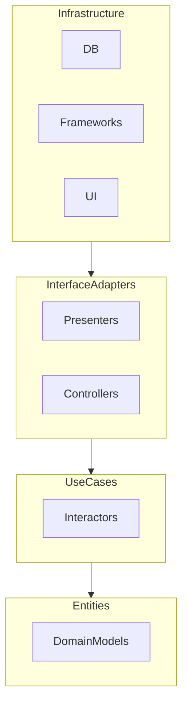

**Guidelines:**
- Place business rules (entities) at the center.
- Use cases coordinate entities and orchestrate external interactions.
- Interface adapters convert data formats.
- Frameworks are details, not foundations.

**PHP Implementation Tips:**
- Use Symfony for delivery mechanism but avoid framework classes in domain/use cases.
- DTOs or value objects move data across boundaries.
- Leverage PHP 8 attributes to keep wiring minimal.

**Go Implementation Tips:**
- Organize modules as packages by ring (`entity`, `usecase`, `adapter`, `driver`).
- Use constructors to inject dependencies across rings.
- Keep data structures defined in inner rings to avoid duplication.

**Trade-offs:**

| Benefit | Trade-off |
| --- | --- |
| High maintainability | Higher upfront complexity |
| Framework independence | Harder to fit quick prototypes |
| Clear dependency rules | Requires disciplined enforcement |

---

### Onion Architecture

**Summary:** Similar to Clean Architecture but emphasizes domain core with concentric layers of service/application infrastructure.

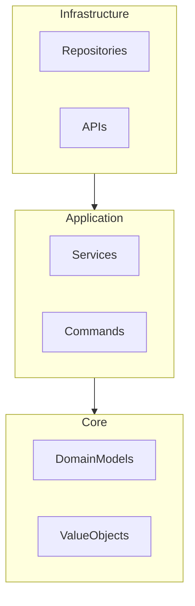

**Differences vs. Hexagonal:** Onion focuses on layering dependencies, while Hexagonal focuses on ports and adapters. Both aim for domain-centric design.

**PHP Fit:** Value objects and aggregates map cleanly to Doctrine entities with custom repositories. Use Symfony Messenger for application services triggered by infrastructure adapters.

**Go Fit:** Struct embedding and interfaces support layering. Keep infrastructure in separate packages to avoid leaking dependencies.

---

### MVC, MVP, MVVM

**Summary:** Presentation patterns for UI-heavy or API-driven applications.

| Pattern | PHP Perspective | Go Perspective |
| --- | --- | --- |
| **MVC** | Symfony controllers (C), Twig views (V), domain models/entities (M). Natural fit. | Gin/Gonic controllers, templates (if server-rendered), models as structs. |
| **MVP** | Useful for legacy UI frameworks (e.g., Zend). Presenter mediates between view and model. | Less common; Go typically used for APIs or minimal templating. |
| **MVVM** | Laravel Livewire/React frontends integrate with PHP backend via APIs. | Go backend typically supplies JSON to frontend frameworks using MVVM.

**Guideline:** Treat web frontends as separate clients (BFF pattern in Part 2). Focus backend on API contracts while allowing frameworks to manage view logic.

---

## System Architecture Patterns

### Monolithic Architecture

**Summary:** Single deployable unit containing all application modules. Still relevant when aligned with team size and complexity.

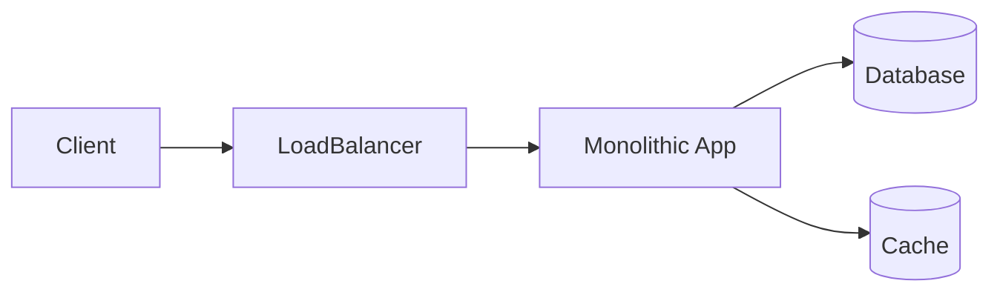

**Variants:**
- **Simple Monolith:** Single codebase, single DB.
- **Modular Monolith:** Strong module boundaries enforced via package/namespace isolation.

**When to use:**
- Small to mid-sized teams (<30 engineers).
- Cohesive domain with high transaction consistency.
- Need for rapid iteration, minimal DevOps overhead.

**PHP Strength:** Symfony bundle system and autowiring make modular monoliths manageable. Use Composer package boundaries or Symfony `/src/Module/*` directories.

**Go Strength:** Modules can be separated via Go packages. Use go workspaces or private modules for strong boundaries.

**Modular Monolith Techniques:**
- Explicit module APIs (`App\Order\API\OrderFacade`).
- Enforce dependency rules via static analysis (`phpstan`, `golangci-lint`).
- Use internal packages in Go to prevent cross-module imports.

**Trade-offs:**

| Benefit | Trade-off |
| --- | --- |
| Simple deployment | Hard to scale parts independently |
| Strong consistency | Potential for accidental coupling |
| Easier debugging | Requires discipline to avoid “big ball of mud” |

---

### Service-Oriented Architecture (SOA)

**Summary:** Precursor to microservices. Services communicate via enterprise service bus (ESB) or shared protocols but often maintain coarse-grained boundaries.

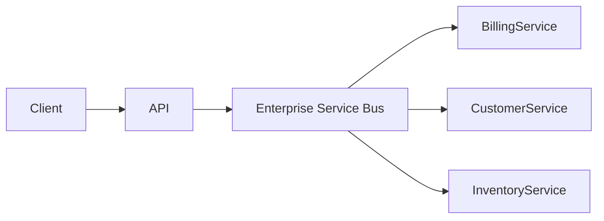

**Key Characteristics:**
- Services share schema/contracts (WSDL, SOAP, XML).
- ESB handles orchestration, transformation, routing.
- More centralized governance than microservices.

**PHP Context:** Legacy enterprises using SOAP-based integrations. Symfony can still expose SOAP endpoints via `phpro/soap-client` and integrate with ESBs.

**Go Context:** Often used to modernize ESB interactions, building lightweight services that plug into existing SOA landscapes.

**When to use:**
- Organizations with existing ESB infrastructure.
- Need central governance, versioning, and security controls.
- Gradual modernization path from monoliths without full microservices leap.

**Trade-offs:**

| Benefit | Trade-off |
| --- | --- |
| Centralized policies | ESB becomes bottleneck |
| Gradual modernization | Complex deployment pipeline |
| Reuse of shared services | Government-style coordination |

---

### Serverless / Function-as-a-Service

**Summary:** Deploy code as managed functions triggered by events (HTTP, queues, cron). Infrastructure is managed by cloud provider.

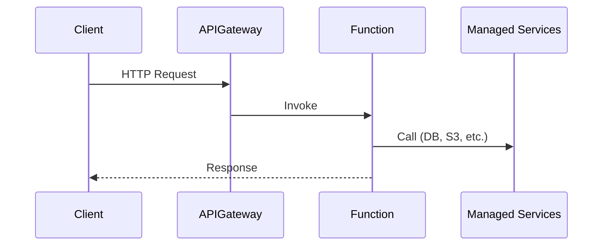

**PHP Implementation:**
- Use [Bref](https://bref.sh) for AWS Lambda (provides PHP runtime layers).
- Focus on stateless handlers (`function handler($event)`).
- Cold start mitigated via warmer events.

**Go Implementation:**
- AWS Lambda with Go runtime (fast cold start, compiled binary).
- Google Cloud Functions, Azure Functions support Go natively.

**When to use:**
- Event-driven workloads, irregular traffic patterns.
- Lightweight APIs, cron jobs, data processing pipelines.
- Need for rapid scaling without managing servers.

**Considerations:**
- Avoid long-running transactions (function timeouts).
- Handle idempotency (retries).
- Observability via structured logs and tracing (X-Ray, OpenTelemetry).

---

### Space-Based Architecture

**Summary:** Designed for extreme scalability by eliminating database bottlenecks. Uses distributed in-memory data grids and replicated processing units.

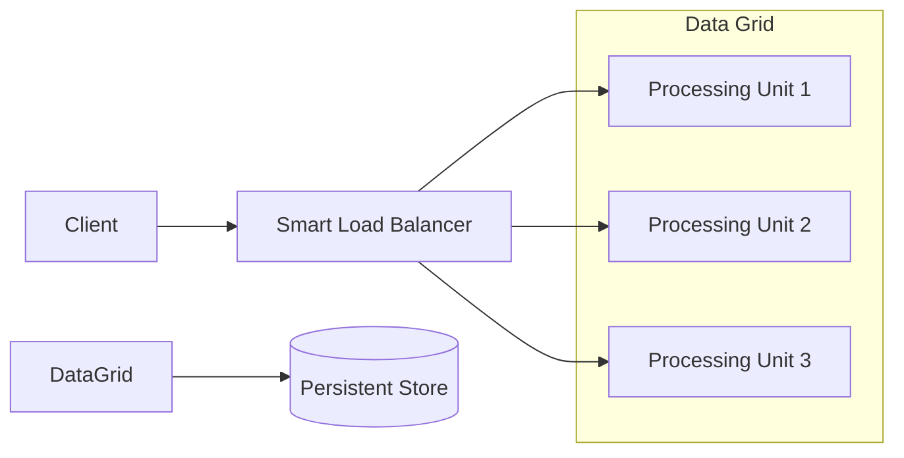

**Key Concepts:**
- In-memory data grid (Hazelcast, Redis Cluster, Tarantool).
- Processing unit contains application logic + cache + optional DB fragment.
- Persistence layer handles asynchronous writes (write-behind).

**PHP Fit:**
- Pair PHP frontends with Redis/Memcached for caching; however, full space-based implementation requires external services or moving compute to Go/Java microservices.

**Go Fit:**
- Build processing units as Go services using Redis Streams, NATS JetStream, or Aerospike clients.
- Goroutines and channels simplify intra-process concurrency.

**When to use:**
- High-traffic systems (e-commerce flash sales, gaming leaderboards).
- Need to handle large spikes without central DB saturation.

**Trade-offs:**
- Complex data consistency models.
- Requires cache invalidation strategies and write-behind reliability.

---

### Pipe and Filter

**Summary:** Break data processing into sequential filters connected by pipes. Each filter transforms data, enabling streaming and parallel processing.

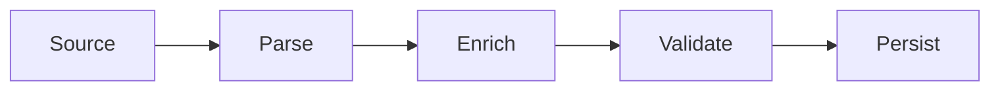

**PHP Implementation:**
- Use iterators/generators for memory-efficient streams.
- Symfony Messenger pipelines for asynchronous filters.
- Example: ETL scripts processing CSV → normalizing → persisting.

```php
function parseCsv(string $path): Generator
{
    $handle = fopen($path, 'r');
    while (($row = fgetcsv($handle)) !== false) {
        yield $row;
    }
}

function enrich(iterable $rows): Generator
{
    foreach ($rows as $row) {
        yield array_merge($row, ['processed_at' => new DateTimeImmutable()]);
    }
}
```

**Go Implementation:**
- Channels model pipes; goroutines implement filters.

```go
func parse(ctx context.Context, r io.Reader) <-chan Row {
    out := make(chan Row)
    go func() {
        defer close(out)
        scanner := bufio.NewScanner(r)
        for scanner.Scan() {
            select {
            case out <- parseRow(scanner.Text()):
            case <-ctx.Done():
                return
            }
        }
    }()
    return out
}
```

**When to use:**
- ETL pipelines, media processing, log enrichment.
- Streaming transformations where composition matters.

---

### Microkernel / Plugin Architecture

**Summary:** Core system provides minimal functionality; plugins extend behavior dynamically. Suitable for extensible platforms (CMS, IDEs, payment processors).

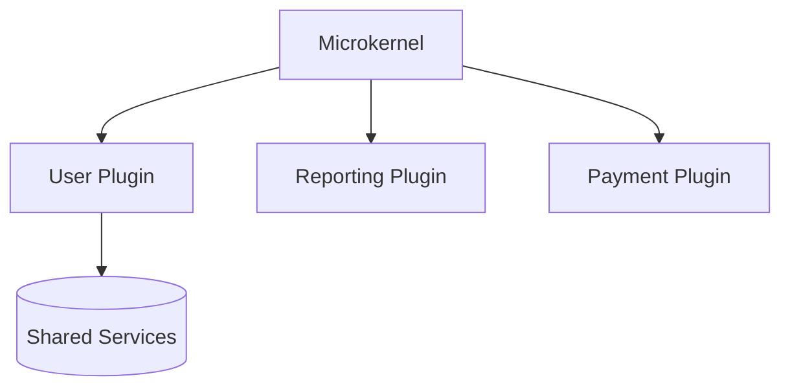

**PHP Examples:**
- WordPress, Drupal: plugin-based extension.
- Symfony bundles can be treated as plugins with service providers.
- Implement plugin registry loading classes from `/plugins` directory.

**Go Examples:**
- HashiCorp plugins via gRPC (`go-plugin`).
- `plugin` stdlib package (Linux/macOS) for shared objects.
- Dynamic command discovery (e.g., `kubectl` plugins).

**Key Considerations:**
- Define stable plugin interfaces.
- Sandbox and validate third-party plugins.
- Lifecycle management (install, enable, upgrade, disable).

---

## Data Architecture Patterns

### Shared Database (When It Works)

**Summary:** Multiple services sharing a database is an anti-pattern in microservices, but valid in cohesive modular monoliths or tightly-coupled services.

**Use responsibly when:**
- Services form a single bounded context.
- Team is small; deployment is coordinated.
- Database schema acts as integration contract.

**Mitigations:**
- Schema ownership agreements.
- Database views to abstract shared access.
- Read replicas for reporting.

**Transition Strategy:** Adopt database per service when teams or features require independent evolution (see Migration section).

---

### Data Lake & Warehouse Patterns

**Summary:** Centralized repositories for analytical workloads.

- **Data Warehouse:** Structured, schema-on-write (Snowflake, BigQuery). Ideal for BI.
- **Data Lake:** Raw storage, schema-on-read (S3 + Glue/Presto). Flexible but requires governance.

**Implementation Tips:**
- Use PHP/Go services to stream events to lake (e.g., Kafka → S3).
- Schedule batch jobs (serverless functions) to transform and load into warehouse.

---

### Lambda Architecture

**Summary:** Combines batch (for accuracy) and speed (for latency) layers with a serving layer.

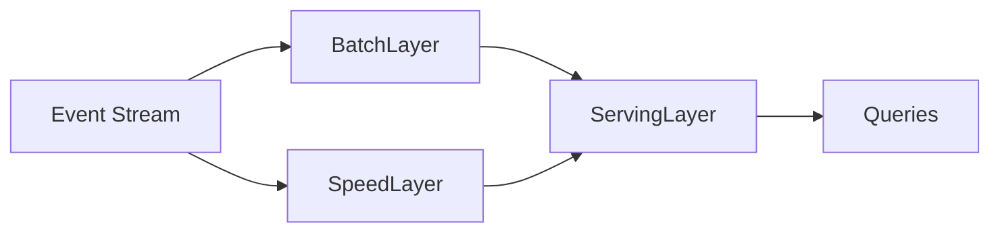

- **Batch Layer:** Processes historical data, generates master dataset.
- **Speed Layer:** Handles real-time updates using stream processing (Kafka Streams, Spark Streaming, Flink).
- **Serving Layer:** Merges results (e.g., key-value store, Elasticsearch).

**Go Fit:** Build speed layer services using Kafka consumers and streaming libraries.

**PHP Fit:** Typically used for batch or orchestration (triggering jobs), while real-time components run in Go/Java/Scala.

---

### Kappa Architecture

**Summary:** Stream-only alternative to Lambda. Uses a single streaming pipeline for both real-time and reprocessing.

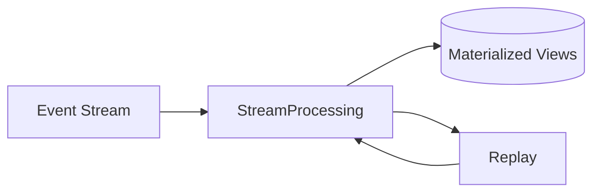

- Simplifies pipeline by treating batch as replayed streams.
- Requires strong stream processing platform (Kafka Streams, Pulsar Functions).

**Go Fit:** Implement processors with segment replays. Use bounded reprocessing when schemas evolve.

**PHP Fit:** Better suited for producing/consuming events via Symfony Messenger, not for heavy stream processing.

---

### Event Streaming Backbones

**Summary:** Use Kafka/Pulsar/NATS as central nervous system. Services publish/subscribe to events for decoupled communication.

- Reinforces CQRS and event sourcing patterns from Part 2.
- Enables polyglot services to integrate.

**Implementation Notes:**
- Standardize schema (Avro/Protobuf + schema registry).
- Provide SDKs for PHP and Go producers/consumers.
- Govern topic lifecycle and retention policies.

---

## Architecture Decision Framework

Choosing an architecture involves balancing forces:

| Criterion | Monolith | Modular Monolith | SOA | Microservices | Serverless |
| --- | --- | --- | --- | --- | --- |
| Team Size | 1-15 | 10-40 | 20-100 | 20-500 | 1-50 |
| Deployment Frequency | High | High | Medium | High | Very High |
| Operational Overhead | Low | Medium | High | Very High | Low |
| Scalability | Vertical | Horizontal (module) | Horizontal | Horizontal | Automatic |
| Compliance/Security | Centralized | Centralized | Central governance | Decentralized | Provider-managed |
| PHP Fit | Excellent | Excellent | Good | Good for BFFs | Good (Bref) |
| Go Fit | Good | Good | Excellent | Excellent | Excellent |

**Decision Checklist:**

1. **Domain Cohesion:** If aggregates span modules, favor monolith/modular.
2. **Team Topology:** Apply Conway’s law—architecture mirrors team structure.
3. **Operational Maturity:** Microservices demand observability, CI/CD, DevOps.
4. **Scalability Needs:** Identify hotspots; use modular monolith or microservices for uneven load.
5. **Compliance:** Is data sovereignty or audit centralization required?
6. **Skill Set:** Do teams have experience with distributed systems?

---

## Migration & Evolution Patterns

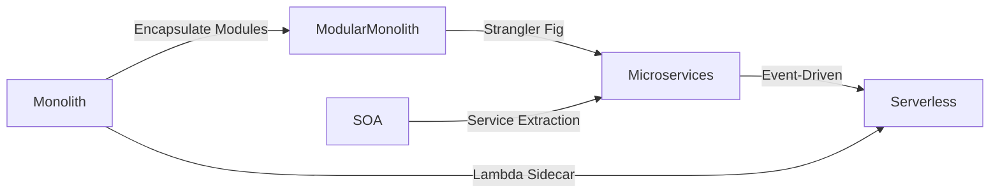

### Monolith → Modular Monolith
- Identify bounded contexts.
- Enforce module boundaries via namespaces/packages.
- Introduce module APIs (facades) to prevent direct cross-module calls.

### Modular Monolith → Microservices
- Apply Strangler Fig (Part 2) at module boundaries.
- Split database using shared database view or change data capture (Debezium).
- Use message bus/outbox pattern for integration.

### SOA → Microservices
- Gradually replace ESB orchestrations with API gateways + event brokers.
- Modernize schemas (JSON/Protobuf) and protocols (HTTP/gRPC).

### Microservices → Serverless
- Extract stateless endpoints to functions.
- Keep stateful or high-throughput components as services.
- Ensure observability (AWS X-Ray, OpenTelemetry) and tracing across functions.

### Shared Database → Database per Service
- Introduce schema ownership per team.
- Use read replicas for transitional data access.
- Implement data replication via CDC or events.

---

## Hybrid & Emerging Approaches

### Modular Monoliths
- Maintain monolith deployment but treat modules like services with explicit contracts.
- Use internal API calls (method invocations) with facades to simulate service APIs.
- PHP: Symfony Encapsulation via packages. Go: `internal` packages.

### Macroservices
- Larger-grained services (2-5 bounded contexts). Useful stepping stone from monolith to microservices without explosion of services.

### Cell-Based Architecture

```mermaid
flowchart LR
    Client --> CellGateway
    subgraph Cell A
        ServiceA1
        ServiceA2
        DataA[(Data A)]
    end
    subgraph Cell B
        ServiceB1
        ServiceB2
        DataB[(Data B)]
    end
    CellGateway --> Cell A
    CellGateway --> Cell B
```

- Duplicate slices of the system (cells) for isolation and scalability (e.g., Netflix).
- PHP services can act as BFF per cell; Go handles data plane.

### Deep Integration with BFF (Backend for Frontend)
- Combine BFF pattern with architecture choices:
  - PHP BFF for server-rendered web (monolith or modular).
  - Go BFF for mobile APIs with serverless integrations.

### Event-Driven Modular Monolith
- Keep single deployment but use internal event bus to decouple modules.
- Symfony Messenger or Go channels/gobus.

---

## Continue the Series

- **Part 1**: [GoF Design Patterns](backend-design-patterns-php-vs-go.md)
- **Part 2**: [Modern Backend & Microservice Patterns](microservices-patterns-php-vs-go.md)
- **Part 4**: [Security, API Design, Performance & DevOps Patterns](cross-cutting-patterns-php-vs-go.md)
- **Part 5**: [Testing Patterns](testing-patterns-php-vs-go.md)
- **Part 6**: [Naming Conventions & Class Role Patterns](naming-conventions-php-vs-go.md)
- **Part 7**: [Domain-Driven Design (DDD) Guide](domain-driven-design-guide.md)
- **Part 8**: [Data Persistence Patterns: SQL vs NoSQL](data-persistence-patterns-sql-vs-nosql.md)

---

## References

1. Chris Richardson, *Microservices Patterns* (Microservices.io)
2. Martin Fowler, *Patterns of Enterprise Application Architecture*
3. Robert C. Martin, *Clean Architecture*
4. Sam Newman, *Monolith to Microservices*
5. Vaughn Vernon, *Implementing Domain-Driven Design*
6. AWS Prescriptive Guidance, *Serverless Architectures*
7. Azure Architecture Center, *Cloud Design Patterns*
8. ThoughtWorks Technology Radar (Architecture Trends)
9. HashiCorp, *go-plugin* documentation
10. Bref, *Running PHP on AWS Lambda*
