# Backend Design Patterns: PHP vs. Go

Welcome to a polyglot-friendly tour of the most influential backend design patterns. This guide compares how the patterns look and feel in PHP’s classic object-oriented world and Go’s composition-first philosophy. We cover the 23 Gang of Four (GoF) patterns and essential modern distributed-system patterns, highlighting language-specific trade-offs and implementation notes.

---

## Table of Contents

1. [Series Roadmap](#series-roadmap)
2. [Introduction](#introduction)
3. [The Philosophical Divide: Inheritance vs. Composition](#the-philosophical-divide-inheritance-vs-composition)
4. [Part 1: Gang of Four Patterns](#part-1-gang-of-four-patterns)
   1. [Creational Patterns](#creational-patterns)
      - [Factory Method](#factory-method)
      - [Abstract Factory](#abstract-factory)
      - [Builder](#builder)
      - [Prototype](#prototype)
      - [Singleton](#singleton)
   2. [Structural Patterns](#structural-patterns)
      - [Adapter](#adapter)
      - [Bridge](#bridge)
      - [Composite](#composite)
      - [Decorator](#decorator)
      - [Facade](#facade)
      - [Flyweight](#flyweight)
      - [Proxy](#proxy)
   3. [Behavioral Patterns](#behavioral-patterns)
      - [Chain of Responsibility](#chain-of-responsibility)
      - [Command](#command)
      - [Iterator](#iterator)
      - [Mediator](#mediator)
      - [Memento](#memento)
      - [Observer](#observer)
      - [State](#state)
      - [Strategy](#strategy)
      - [Template Method](#template-method)
      - [Visitor](#visitor)
      - [Interpreter](#interpreter)
5. [Part 1.5: Service Decomposition & Design](#part-15-service-decomposition--design)
   - [Dependency Injection vs. Service Locator](#dependency-injection-vs-service-locator)
   - [Middleware / HTTP Pipeline](#middleware--http-pipeline)
   - [Message Bus / Event-Driven Architecture](#message-bus--event-driven-architecture)
   - [API Gateway](#api-gateway)
   - [Backend-for-Frontend (BFF)](#backend-for-frontend-bff)
   - [Strangler Fig](#strangler-fig)
   - [Circuit Breaker](#circuit-breaker)
   - [CQRS](#cqrs)
   - [Event Sourcing](#event-sourcing)
   - [Saga](#saga)
   - [Resilience Patterns](#resilience-patterns)
     - [Retry Pattern](#retry-pattern)
     - [Timeout Pattern](#timeout-pattern)
     - [Bulkhead Pattern](#bulkhead-pattern)
   - [Database Patterns](#database-patterns)
     - [Database per Service](#database-per-service)
     - [Transactional Outbox](#transactional-outbox)
     - [Shared Database Anti-Pattern](#shared-database-anti-pattern)
   - [Infrastructure Patterns](#infrastructure-patterns)
     - [Service Discovery](#service-discovery)
     - [Sidecar Pattern](#sidecar-pattern)
     - [Health Check API](#health-check-api)
6. [Conclusion](#conclusion)
7. [Continue the Series](#continue-the-series)
8. [References](#references)

---

## Series Roadmap

This is **Part 1** of a five-part guide:

- **Part 1 (this document)**: GoF patterns and foundational design concepts across PHP and Go.
- **Part 2**: [Modern Backend & Microservice Patterns](microservices-patterns-php-vs-go.md) explores distributed system tactics.
- **Part 3**: [System Architecture Patterns](system-architecture-patterns-php-vs-go.md) bridges application architecture and large-scale system design.
- **Part 4**: [Security, API Design, Performance & DevOps Patterns](cross-cutting-patterns-php-vs-go.md) covers cross-cutting concerns.
- **Part 5**: [Testing Patterns](testing-patterns-php-vs-go.md) establishes quality assurance and testing strategies.

---

## Introduction

- Audience: Backend engineers working across PHP and Go
- Goal: Understand how each language shapes the classic and modern design patterns you rely on
- Approach: Break patterns into their PHP (inheritance-friendly) and Go (composition-driven) implementations

---

## The Philosophical Divide: Inheritance vs. Composition

| Aspect | PHP | Go |
| --- | --- | --- |
| Polymorphism | Explicit `implements` keywords | Implicit interface satisfaction |
| Code reuse | Class inheritance and traits | Struct embedding and interface composition |
| Pattern bias | Inheritance-heavy patterns feel natural | Composition-first patterns are idiomatic |

**Key mechanisms in Go**

1. *Implicit Interfaces*: Any type that implements the right methods satisfies the interface.
2. *Struct Embedding*: Compose behavior by embedding structs, not by extending classes.

---

## Part 1: Gang of Four Patterns

### Creational Patterns

> **Quick Reference — Creational Patterns 🧰**
> - `Factory Method`: Choose when creation logic depends on runtime context.
> - `Abstract Factory`: Group related products to keep UIs consistent.
> - `Builder`: Assemble complex objects step by step (consider functional options in Go).
> - `Prototype`: Clone existing objects when constructors are expensive.
> - `Singleton`: Guard shared resources; prefer dependency injection when possible.

#### Factory Method

**Summary**: Define an interface for creating an object while letting subclasses (PHP) or helper constructors (Go) decide which concrete type to return.

- **PHP**: Abstract base class with an abstract `factoryMethod()` implemented by subclasses.
- **Go**: Use standalone constructor-like functions returning interface types to decouple creation.

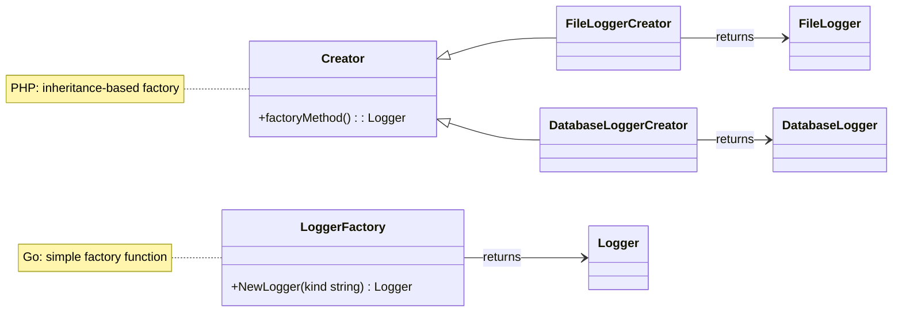

```php
<?php
abstract class LoggerCreator
{
    abstract protected function factoryMethod(): Logger;

    public function write(string $message): void
    {
        $this->factoryMethod()->log($message);
    }
}
```

```go
type Logger interface {
    Log(msg string)
}

func NewLogger(kind string) (Logger, error) {
    switch kind {
    case "file":
        return &FileLogger{}, nil
    case "db":
        return &DatabaseLogger{}, nil
    default:
        return nil, fmt.Errorf("unknown logger type: %s", kind)
    }
}
```
#### Abstract Factory

**Summary**: Provide an interface for creating families of related objects without specifying their concrete classes.

- Works almost identically in PHP and Go thanks to interfaces.

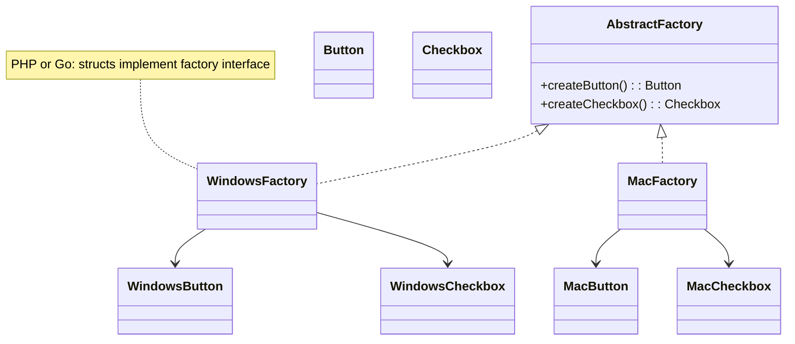

#### Builder

**Summary**: Construct complex objects step-by-step and allow the same construction process to produce different representations.

- **PHP**: Common in fluent interfaces (`$builder->select()->where()->getSQL()`).
- **Go**: Similar structure with interfaces. Go also embraces the Functional Options pattern as an alternative.

#### Prototype

**Summary**: Clone existing objects without depending on their concrete classes.

- **PHP**: Built-in `clone` keyword with customizable `__clone()` method.
- **Go**: No built-in clone; define an explicit `Clone()` method that returns copies.

#### Singleton

**Summary**: Ensure a class has only one instance and provide global access to it.

- **PHP**: Private static `$instance` with lazy initialization; thread safety is usually not a concern.
- **Go**: Use `sync.Once` to guarantee thread-safe initialization across goroutines.

```mermaid
flowchart LR
    subgraph PHP Singleton
        A[Request instance] --> B{Instance exists?}
        B -- No --> C[Create new instance]
        B -- Yes --> D[Return existing instance]
        C --> D
    end

    subgraph Go Singleton with sync.Once
        E[Call GetInstance()] --> F(sync.Once.Do(init))
        F --> G{Initialized?}
        G -- First call --> H[Run init function]
        G -- Subsequent call --> I[Skip init]
        H --> J[Return pointer]
        I --> J
    end
```

```php
final class Config
{
    private static ?self $instance = null;

    private function __construct() {}
    private function __clone() {}
    private function __wakeup() {}

    public static function getInstance(): self
    {
        if (self::$instance === null) {
            self::$instance = new self();
        }

        return self::$instance;
    }
}
```

```go
var (
    configInstance *Config
    once           sync.Once
)

type Config struct{}

func GetConfig() *Config {
    once.Do(func() {
        configInstance = &Config{}
    })
    return configInstance
}
```
### Structural Patterns

> **Quick Reference — Structural Patterns 🧱**
> - `Adapter`: Translate interfaces without touching legacy code.
> - `Bridge`: Combine abstractions with multiple implementations cleanly.
> - `Composite`: Treat trees of objects and leaves uniformly.
> - `Decorator`: Layer additional behavior without subclass explosion.
> - `Proxy`: Add caching, security, or rate limiting transparently.

#### Adapter

**Summary**: Let objects with incompatible interfaces collaborate.

- **PHP**: Explicit adapter implements the expected interface and translates calls.
- **Go**: Implement the required method signatures; satisfying interfaces is automatic.

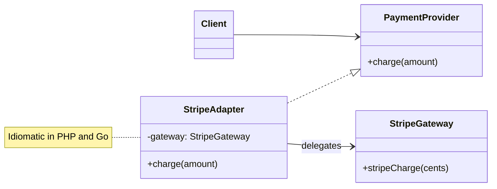

```php
class StripeAdapter implements PaymentProvider
{
    public function __construct(private StripeGateway $gateway) {}

    public function charge(float $amount): void
    {
        $this->gateway->stripeCharge((int) ($amount * 100));
    }
}
```

```go
type PaymentProvider interface {
    Charge(amount float64) error
}

type StripeAdapter struct {
    gateway *StripeGateway
}

func (a *StripeAdapter) Charge(amount float64) error {
    return a.gateway.StripeCharge(int(amount * 100))
}
```
#### Bridge

**Summary**: Split a large hierarchy into abstraction and implementation layers that can vary independently.

- Natural fit for Go’s composition; PHP uses abstract classes with interface fields.

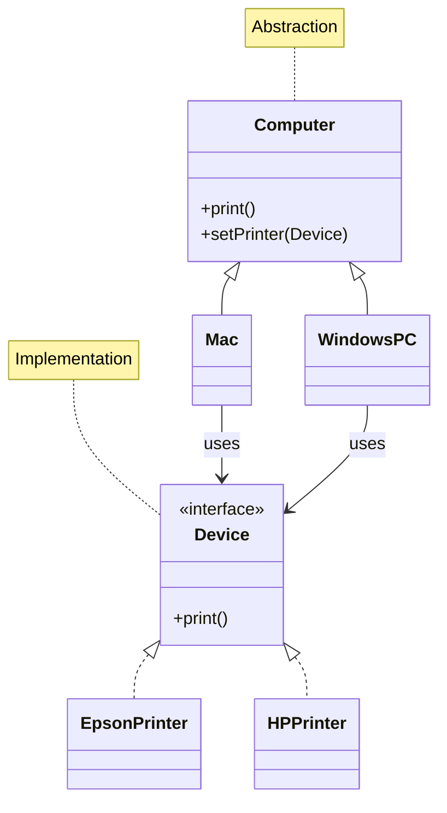

#### Composite

**Summary**: Compose objects into tree structures and treat them uniformly.

- Both languages rely on interfaces to unify leaf and composite behavior.

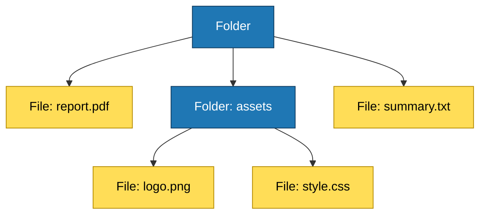

#### Decorator

**Summary**: Attach additional responsibilities dynamically without modifying the original object.

- Wrappers that implement the same interface are idiomatic in both PHP and Go.

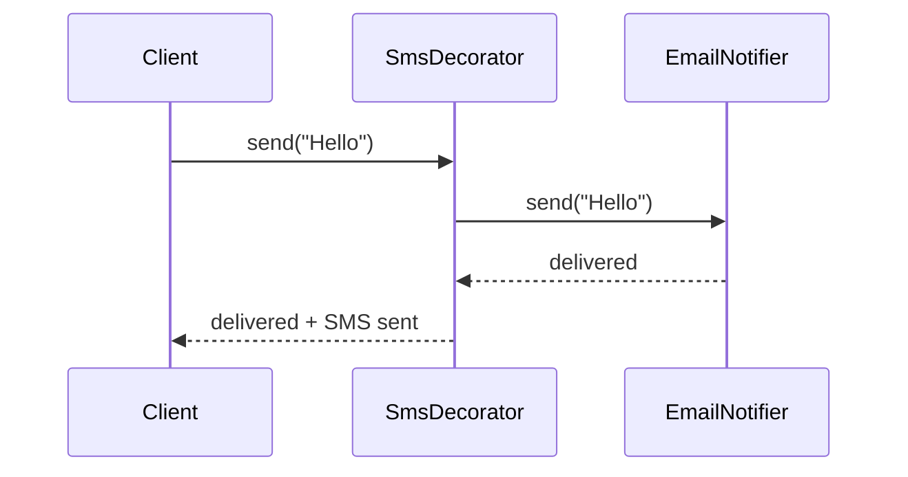

#### Facade

**Summary**: Provide a simplified interface to a complex subsystem.

- Universally applicable. Create a single entry point that hides subsystem complexity.

#### Flyweight

**Summary**: Share common state among multiple objects to reduce memory usage.

- Use factories to manage shared intrinsic state in both languages.

#### Proxy

**Summary**: Control access to another object, adding behavior before or after requests.

- PHP example: Caching proxy for a database.
- Go example: Rate limiting proxy wrapping a server implementation.

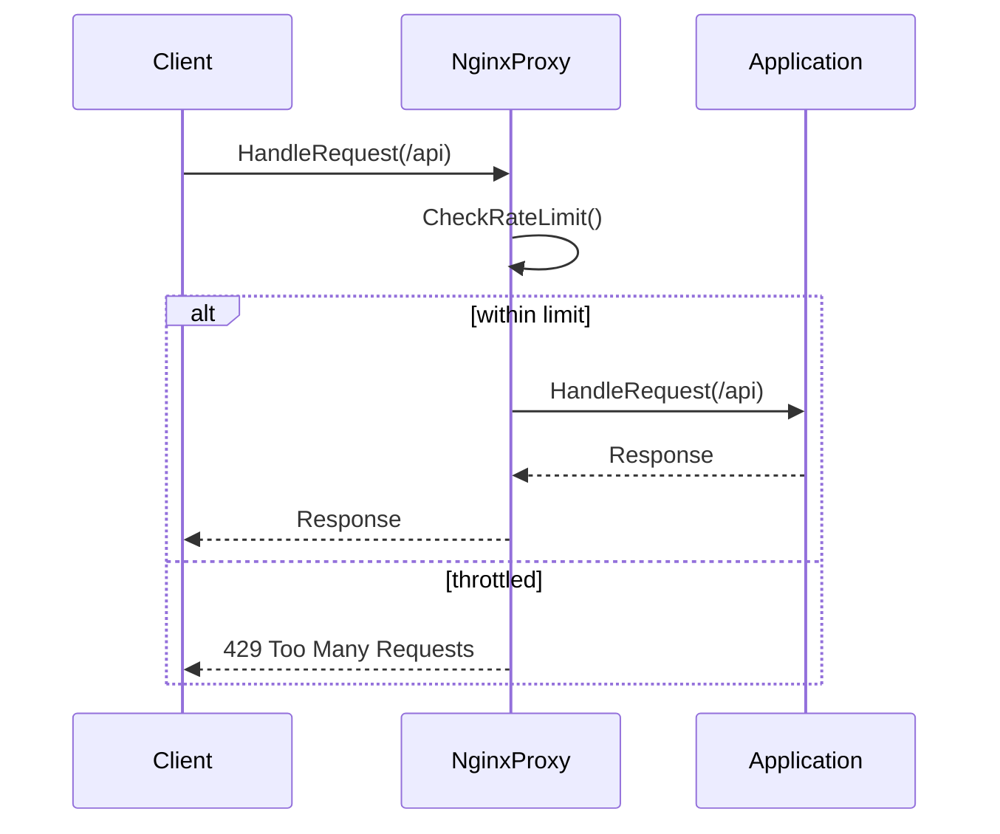

### Behavioral Patterns

> **Quick Reference — Behavioral Patterns 🧠**
> - `Chain of Responsibility`: Assemble pipelines of handlers.
> - `Observer`: Notify subscribers when state changes.
> - `State`: Swap behavior by switching objects at runtime.
> - `Strategy`: Package algorithms for easy replacement.
> - `Template Method`: Preserve algorithm skeleton while customizing steps.

#### Chain of Responsibility

**Summary**: Pass requests through a chain of handlers until one handles it.

- **PHP**: Often uses an abstract base class providing `setNext()` logic.
- **Go**: Composition with structs that store a `next` handler and forward manually.

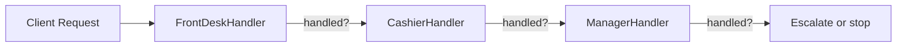

**Framework Examples**

**Symfony**: The event dispatcher system is a refined chain. Event subscribers can stop propagation:

```php
use Symfony\Component\EventDispatcher\EventSubscriberInterface;
use Symfony\Component\HttpKernel\Event\RequestEvent;

class ApiKeyAuthenticator implements EventSubscriberInterface
{
    public function onKernelRequest(RequestEvent $event): void
    {
        if (!$this->isValidApiKey($event->getRequest())) {
            $event->setResponse(new JsonResponse(['error' => 'Unauthorized'], 401));
            $event->stopPropagation(); // Breaks the chain
        }
    }

    public static function getSubscribedEvents(): array
    {
        return [RequestEvent::class => ['onKernelRequest', 10]]; // Priority: 10
    }
}
```

**Gin**: Middleware functions form an explicit chain via `c.Next()`:

```go
func RateLimiter() gin.HandlerFunc {
    return func(c *gin.Context) {
        if !checkRateLimit(c.ClientIP()) {
            c.JSON(429, gin.H{"error": "Too many requests"})
            c.Abort() // Breaks the chain
            return
        }
        c.Next() // Continue to next handler
    }
}

r := gin.Default()
r.Use(RateLimiter(), Logger(), AuthMiddleware())
r.GET("/api/data", DataHandler)
```

#### Command

**Summary**: Encapsulate requests as objects to parameterize, queue, or log operations.

- Nearly identical implementations; focus on interface-driven commands and invokers.

#### Iterator

**Summary**: Traverse elements without exposing underlying representation.

- **PHP**: Implement `Iterator`/`IteratorAggregate`.
- **Go**: Usually unnecessary thanks to `for range`, but useful for custom structures.

#### Mediator

**Summary**: Reduce coupling by having objects communicate via a central mediator.

- PHP chat rooms, Go train scheduling, or Go channels as lightweight mediators.

#### Memento

**Summary**: Capture and restore an object’s state without revealing implementation details.

- PHP leverages visibility keywords; Go uses package-level visibility to restrict access.

#### Observer

**Summary**: Maintain a subscription list and notify observers on state changes.

- PHP can implement `SplSubject`/`SplObserver`; Go uses slices of observers or channels.

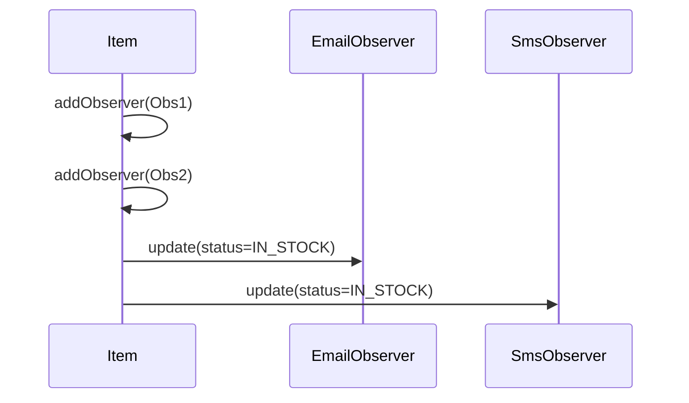

#### State

**Summary**: Allow an object to change behavior when its internal state changes.

- Both languages rely on `State` interfaces and delegate calls to the current state object.

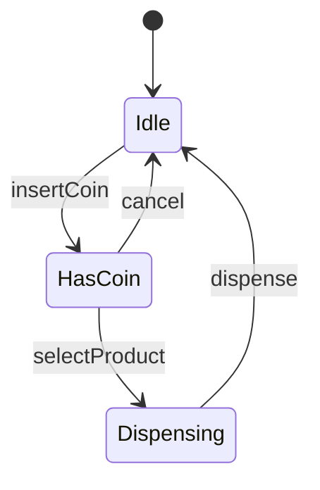

#### Strategy

**Summary**: Define interchangeable algorithms and make them swappable at runtime.

- PHP shopping cart payment strategies vs. Go cache eviction algorithms.

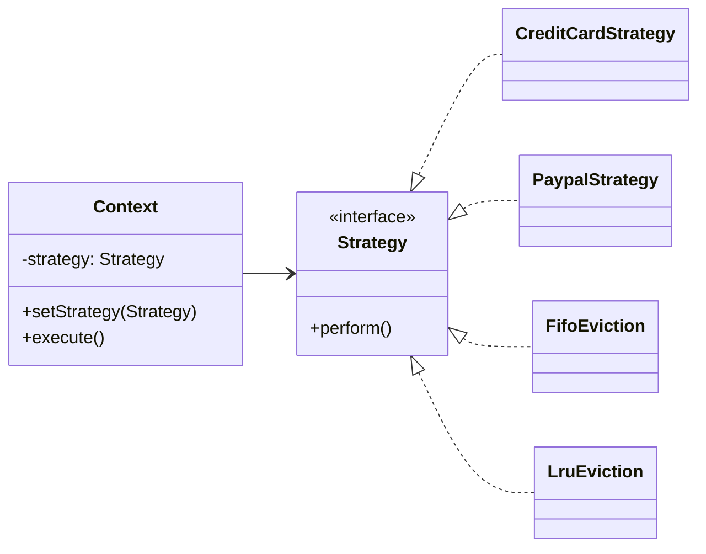

```php
interface PaymentStrategy
{
    public function pay(float $total): void;
}

class ShoppingCart
{
    public function __construct(private PaymentStrategy $strategy) {}

    public function checkout(float $total): void
    {
        $this->strategy->pay($total);
    }
}
```

```go
type EvictionAlgo interface {
    Evict(c *Cache)
}

type Cache struct {
    eviction EvictionAlgo
}

func (c *Cache) SetAlgorithm(algo EvictionAlgo) {
    c.eviction = algo
}

func (c *Cache) Evict() {
    c.eviction.Evict(c)
}
```
#### Template Method

**Summary**: Define an algorithm skeleton and leave specific steps to subclasses.

- PHP: Natural fit with abstract classes.
- Go: Simulated with interfaces injected into a struct; highlights Go’s aversion to inheritance.

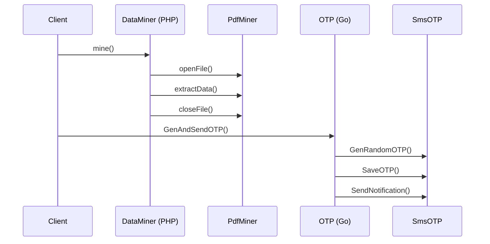

```php
abstract class DataMiner
{
    final public function mine(): string
    {
        $file = $this->openFile();
        $data = $this->extractData($file);
        return $this->closeFile($data);
    }

    abstract protected function openFile(): SplFileObject;
    abstract protected function extractData(SplFileObject $file): array;
    abstract protected function closeFile(array $data): string;
}
```

```go
type Otp interface {
    GenRandomOTP(length int) string
    SaveOTP(code string) error
    SendNotification(code string) error
}

type OTPWorkflow struct {
    provider Otp
}

func (w *OTPWorkflow) GenAndSendOTP(len int) error {
    code := w.provider.GenRandomOTP(len)
    if err := w.provider.SaveOTP(code); err != nil {
        return err
    }
    return w.provider.SendNotification(code)
}
```

| Aspect | PHP Implementation | Go Implementation |
| --- | --- | --- |
| Structure | Abstract superclass with `final` template method and protected hooks | Struct with exported method delegating to injected interface |
| Extension Point | Subclasses override protected methods | Concrete types implement the interface; wiring happens in composition root |
| Testability | Mock subclasses or override hooks | Swap interface implementations for tests |
| Common Risk | Inheritance depth and fragile base classes | Boilerplate and risk of leaking implementation details |

**When to Use**

- You already have a stable algorithm structure with variable steps.
- You need to enforce ordering logic across multiple implementations.

**Key Benefits**

- Centralizes control flow while allowing customization of individual steps.
- Reduces code duplication across related workflows.

**Trade-offs**

- PHP implementation can become rigid if subclass hierarchies grow deep.
- Go version requires extra boilerplate (interfaces, explicit wiring), which can feel verbose.

**Real-world Example**

- Payment processing that always performs validation, execution, and logging—while each payment method customizes the execution step.

**Common Pitfall**

- Overuse in Go can signal the need to rethink the algorithm as separate composable functions rather than forcing a class-style hierarchy.

#### Visitor

**Summary**: Separate algorithms from the objects they operate on via double dispatch.

- Both languages require an `Accept` method that forwards to the visitor’s specialized method.

**When to Use**

- You need to add operations to a stable set of element types without modifying them.

**Key Benefits**

- Centralizes related behavior for multiple element types.
- Improves cohesion for operations like serialization, UI rendering, or analytics exports.

**Trade-offs**

- Adding a new element type requires updating every visitor implementation.
- Go’s lack of generics in older releases makes type handling verbose; PHP relies on runtime type hints.

**Real-world Example**

- Exporting drawing primitives (dot, circle, square) into different formats such as SVG or JSON without changing the primitives themselves.

**Common Pitfall**

- Avoid using Visitor when element hierarchies change frequently; the maintenance cost outweighs the benefits.
#### Interpreter

**Summary**: Represent and interpret grammar rules for domain-specific languages.

- Build abstract syntax trees with terminal and non-terminal expressions in both languages.

---

## Part 1.5: Service Decomposition & Design

> **Reference**: The patterns in this section are based on [Microservices.io by Chris Richardson](https://microservices.io), the authoritative source for microservice architecture patterns.

Before diving into modern backend patterns, understanding **how to decompose** a system into services is critical. Poor decomposition leads to distributed monoliths that slow down delivery.

### Decomposition Strategies

#### Decompose by Business Capability

**Summary**: Define services based on business capabilities—stable aspects of a business that generate value.

- Business capabilities are what a business does, not how it does it.
- Examples: Order Management, Inventory Management, Customer Management, Shipping.

**Symfony Approach**

```php
// Each business capability becomes a bounded context
namespace App\OrderManagement;

use App\OrderManagement\Entity\Order;
use App\OrderManagement\Repository\OrderRepository;

class OrderService
{
    public function __construct(
        private OrderRepository $orderRepository,
        private EventBusInterface $eventBus
    ) {}
    
    public function placeOrder(PlaceOrderCommand $command): Order
    {
        $order = Order::create($command->customerId, $command->items);
        $this->orderRepository->save($order);
        
        // Publish domain event for other bounded contexts
        $this->eventBus->dispatch(new OrderPlacedEvent($order->getId()));
        
        return $order;
    }
}
```

**Go Package Structure**

```go
// Project structure reflects business capabilities
// ordermanagement/
//   ├── domain/
//   │   ├── order.go
//   │   └── repository.go
//   ├── application/
//   │   └── order_service.go
//   └── api/
//       └── order_handler.go

package ordermanagement

type OrderService struct {
    repo      OrderRepository
    eventBus  EventBus
}

func (s *OrderService) PlaceOrder(ctx context.Context, cmd PlaceOrderCommand) (*Order, error) {
    order := NewOrder(cmd.CustomerID, cmd.Items)
    
    if err := s.repo.Save(ctx, order); err != nil {
        return nil, err
    }
    
    // Publish domain event
    s.eventBus.Publish(ctx, OrderPlacedEvent{
        OrderID:    order.ID,
        CustomerID: order.CustomerID,
    })
    
    return order, nil
}
```

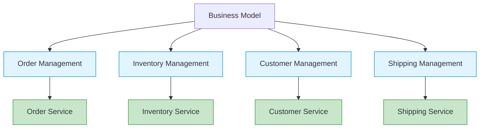

---

#### Decompose by Subdomain (DDD)

**Summary**: Use Domain-Driven Design to identify bounded contexts and decompose along subdomain boundaries.

- **Core Subdomains**: Competitive advantage (e.g., recommendation engine)
- **Supporting Subdomains**: Necessary but not differentiating (e.g., user management)
- **Generic Subdomains**: Off-the-shelf solutions (e.g., email, payments)

**Symfony with Bounded Contexts**

```php
// Each subdomain has its own bounded context with separate models

// Ordering Context
namespace App\Ordering\Domain;

class Order
{
    private OrderId $id;
    private CustomerId $customerId;  // Reference to customer
    private OrderLineCollection $lines;
    private OrderStatus $status;
}

// Customer Context (different model!)
namespace App\Customer\Domain;

class Customer
{
    private CustomerId $id;
    private CustomerProfile $profile;
    private CreditLimit $creditLimit;
}
```

**Go with Bounded Contexts**

```go
// ordering/domain/order.go
package domain

type Order struct {
    ID         OrderID
    CustomerID CustomerID  // Just an ID reference
    Lines      []OrderLine
    Status     OrderStatus
}

// customer/domain/customer.go
package domain

type Customer struct {
    ID          CustomerID
    Profile     Profile
    CreditLimit Money
}
```

**When to Use**

- Complex domain with multiple subdomains
- Need clear boundaries between different parts of the system
- Team autonomy is a priority

**Key Benefits**

- Clear ownership boundaries
- Reduces cognitive load by limiting context
- Enables independent evolution of models

**Trade-offs**

- Requires DDD expertise
- Data duplication across contexts
- Need integration events for cross-context communication

---

### The Assemblage Process

**Summary**: Chris Richardson's methodology for grouping subdomains/bounded contexts into services by balancing competing forces.

The Assemblage process acknowledges that there's no perfect decomposition—only trade-offs shaped by **dark energy** and **dark matter** forces.

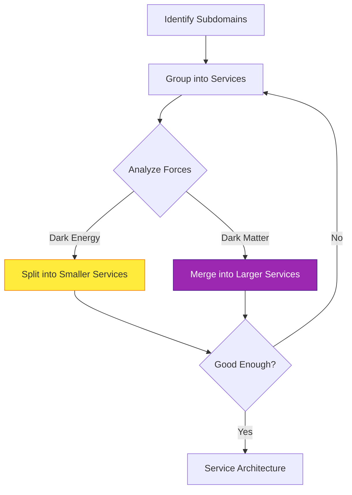

---

### Dark Energy Forces (Favor Decomposition)

**Forces that encourage splitting into smaller services:**

| Force | Description | Impact |
| --- | --- | --- |
| **Team Autonomy** | Each team owns services independently | Faster development, less coordination |
| **Independent Deployment** | Deploy without coordinating with other teams | Faster release cycles |
| **Fault Isolation** | Failure in one service doesn't crash others | Higher availability |
| **Technology Diversity** | Use optimal stack per service | Innovation, efficiency |
| **Scalability** | Scale services independently | Cost efficiency, performance |
| **Security** | Isolate sensitive data/operations | Better compliance, reduced blast radius |

**Example: Splitting Services**

```php
// Originally one monolithic service
class ECommerceService
{
    public function processOrder(Order $order): void
    {
        $this->validateInventory($order);
        $this->processPayment($order);
        $this->sendConfirmation($order);
    }
}

// Split into three services for independent scaling/deployment
```

```go
// Order Service (high traffic)
type OrderService struct{}

func (s *OrderService) CreateOrder(ctx context.Context, items []Item) (*Order, error) {
    // Validate and create order
    // Publish OrderCreated event
}

// Payment Service (PCI compliance isolation)
type PaymentService struct{}

func (s *PaymentService) ProcessPayment(ctx context.Context, orderID string) error {
    // Handle payment securely
}

// Notification Service (can scale independently)
type NotificationService struct{}

func (s *NotificationService) SendConfirmation(ctx context.Context, orderID string) error {
    // Send emails, SMS
}
```

---

### Dark Matter Forces (Resist Decomposition)

**Forces that encourage keeping services together:**

| Force | Description | Impact |
| --- | --- | --- |
| **Network Latency** | Remote calls are slower than in-process | Degraded performance |
| **Reduced Availability** | More services = more points of failure | Lower system availability |
| **Distributed Transactions** | Maintaining consistency across services is hard | Complexity, eventual consistency |
| **Operational Complexity** | More services = more to deploy, monitor, debug | Higher ops overhead |
| **Code Duplication** | Shared logic may be duplicated | Maintenance burden |
| **Inter-Service Communication** | Need APIs, contracts, versioning | Development overhead |

**Example: Keeping Services Together**

```php
// Keep Order and OrderLine together (strong consistency required)
class OrderService
{
    public function addLineItem(OrderId $orderId, LineItem $item): void
    {
        $order = $this->repository->find($orderId);
        $order->addLine($item);  // In-process, transactional
        $this->repository->save($order);
    }
}

// Splitting would require distributed transaction:
// OrderService -> HTTP -> OrderLineService (network call, eventual consistency)
```

```go
// Keep tightly-coupled aggregates in one service
type Order struct {
    ID    OrderID
    Lines []OrderLine  // Strong consistency via single transaction
}

func (s *OrderService) AddLineItem(ctx context.Context, orderID string, item LineItem) error {
    tx, _ := s.db.BeginTx(ctx, nil)
    defer tx.Rollback()
    
    // Both operations in same transaction (ACID guarantees)
    order, _ := s.repo.FindByID(ctx, tx, orderID)
    order.Lines = append(order.Lines, item)
    _ = s.repo.Save(ctx, tx, order)
    
    return tx.Commit()
}
```

---

### Service Granularity Metrics

**How to determine if a service is the right size:**

#### Too Small (Nano-services)
- High network overhead relative to business logic
- Operational burden outweighs benefits
- Excessive inter-service chattiness

**Signs:**
```go
// Anti-pattern: Service that just validates an email
type EmailValidatorService struct{}

func (s *EmailValidatorService) Validate(email string) bool {
    return regexp.MustCompile(`^[^@]+@[^@]+$`).MatchString(email)
}
// This should be a library, not a service!
```

#### Too Large (Mini-monoliths)
- Multiple teams modifying same codebase
- Can't deploy features independently
- Forced to use same technology stack

**Signs:**
```php
// Anti-pattern: Service handling 10+ business capabilities
class MegaService
{
    public function processOrder() {}
    public function manageInventory() {}
    public function handleShipping() {}
    public function processPayments() {}
    public function manageCustomers() {}
    // ...100 more methods
}
```

#### Just Right
- Single team ownership
- Independent deployment
- Cohesive business capability
- Minimal inter-service dependencies

**Rule of Thumb**: A service should be small enough for a team to rewrite in 2-4 weeks if needed.

---

### Practical Decision Framework

**Use this checklist when deciding service boundaries:**

| Question | Decompose | Keep Together |
| --- | --- | --- |
| Do different teams need to evolve these independently? | ✓ | |
| Do they need to scale differently? | ✓ | |
| Is there strong data consistency required? | | ✓ |
| Would splitting create a distributed transaction? | | ✓ |
| Is the coupling temporary (will requirements diverge)? | ✓ | |
| Is the coupling fundamental (aggregate root relationship)? | | ✓ |
| Would network calls dominate execution time? | | ✓ |
| Do security/compliance require isolation? | ✓ | |

**Symfony Example: Decision in Action**

```php
// Decision: Keep Order + OrderLine together (aggregate root)
namespace App\Order\Domain;

class Order  // Aggregate Root
{
    private array $lines = [];  // Entities within aggregate
    
    public function addLine(OrderLine $line): void
    {
        // Business rules enforced here
        if ($this->status->isClosed()) {
            throw new OrderClosedException();
        }
        $this->lines[] = $line;
    }
}

// Decision: Separate Payment service (PCI compliance + different scaling)
namespace App\Payment;  // Different bounded context

class PaymentService
{
    public function charge(OrderId $orderId, Money $amount): PaymentResult
    {
        // Isolated payment processing
    }
}
```

**Go Example: Decision in Action**

```go
// Keep together: User authentication + profile (same security context)
package user

type UserService struct {
    authRepo    AuthRepository
    profileRepo ProfileRepository
}

func (s *UserService) Authenticate(ctx context.Context, credentials Credentials) (*User, error) {
    // Both use same database transaction
    user, err := s.authRepo.FindByCredentials(ctx, credentials)
    if err != nil {
        return nil, err
    }
    
    profile, _ := s.profileRepo.LoadProfile(ctx, user.ID)
    user.Profile = profile
    return user, nil
}

// Separate: Analytics service (different scaling, eventual consistency OK)
package analytics

type AnalyticsService struct{}

func (s *AnalyticsService) TrackUserLogin(ctx context.Context, event UserLoginEvent) error {
    // Consumes events asynchronously, no strong consistency needed
}
```

---

**Microservices.io References:**
- [Decompose by Business Capability](https://microservices.io/patterns/decomposition/decompose-by-business-capability.html)
- [Decompose by Subdomain](https://microservices.io/patterns/decomposition/decompose-by-subdomain.html)
- [Dark Energy and Dark Matter Forces](https://microservices.io/post/architecture/2023/03/26/dark-matter-dark-energy-force-descriptions.html)

---

## Conclusion

This document covered the 23 Gang of Four design patterns and service decomposition strategies, showing how they translate from PHP's inheritance-rich ecosystem to Go's composition-first philosophy.

**Key Takeaways:**

1. **Creational Patterns**: Go's factory functions and functional options provide cleaner alternatives to PHP's class-based factories
2. **Structural Patterns**: Both languages handle these similarly through interfaces, with Go's implicit satisfaction reducing boilerplate
3. **Behavioral Patterns**: PHP excels with template methods and inheritance; Go shines with composition and channel-based patterns
4. **Service Decomposition**: Apply dark energy and dark matter forces to find the right service boundaries

**When to Use Each Language:**

- **PHP (Symfony)**: Complex business logic, rapid development, mature ORM support, monolithic or BFF architectures
- **Go**: High-performance services, concurrent processing, API gateways, event processors, infrastructure components

---

## Continue the Series

- **Part 2**: [Modern Backend & Microservice Patterns](microservices-patterns-php-vs-go.md)
- **Part 3**: [System Architecture Patterns](system-architecture-patterns-php-vs-go.md)
- **Part 4**: [Security, API Design, Performance & DevOps Patterns](cross-cutting-patterns-php-vs-go.md)
- **Part 5**: [Testing Patterns](testing-patterns-php-vs-go.md)
- **Part 6**: [Naming Conventions & Class Role Patterns](naming-conventions-php-vs-go.md)
- **Part 7**: [Domain-Driven Design (DDD) Guide](domain-driven-design-guide.md)
- **Part 8**: [Data Persistence Patterns: SQL vs NoSQL](data-persistence-patterns-sql-vs-nosql.md)

---

## References

1. [Gang of Four (GOF) Design Patterns — GeeksforGeeks](https://www.geeksforgeeks.org/system-design/gang-of-four-gof-design-patterns/)
2. [Design Patterns — Wikipedia](https://en.wikipedia.org/wiki/Design_Patterns)
3. [Finished All 23 Patterns? Let's Wrap It Up Together — Maxim Gorin](https://maxim-gorin.medium.com/finished-all-23-patterns-lets-wrap-it-up-together-f22c736ba5ad)
4. [Creational Design Patterns — Refactoring.Guru](https://refactoring.guru/design-patterns/creational-patterns)
5. [Design Patterns in PHP — Refactoring.Guru](https://refactoring.guru/design-patterns/php)
6. [Design Patterns in Go — Refactoring.Guru](https://refactoring.guru/design-patterns/go)
7. [GoF Design Patterns that Still Make Sense in Go — DEV Community](https://dev.to/mauriciolinhares/gof-design-patterns-that-still-make-sense-in-go-27k5)
8. [Structural Design Patterns — Refactoring.Guru](https://refactoring.guru/design-patterns/structural-patterns)
9. [Behavioral Design Patterns — Refactoring.Guru](https://refactoring.guru/design-patterns/behavioral-patterns)
10. [Chain of Responsibility in PHP — Refactoring.Guru](https://refactoring.guru/design-patterns/chain-of-responsibility/php/example)
11. [Chain of Responsibility in Go — Refactoring.Guru](https://refactoring.guru/design-patterns/chain-of-responsibility/go/example)
12. [Strategy in Go — Refactoring.Guru](https://refactoring.guru/design-patterns/strategy/go/example)
13. [Go Doesn't Need Inheritance — Sogol Hedayatmanesh](https://medium.com/@sogol.hedayatmanesh/go-doesnt-need-inheritance-here-s-what-it-does-instead-and-why-it-s-smarter-e6ca5063acd9)
14. [Composition over Inheritance — Wikipedia](https://en.wikipedia.org/wiki/Composition_over_inheritance)
15. [Golang vs PHP — Ukiah Smith](https://ukiahsmith.com/blog/golang-vs-php/)
16. [Idiomatic Go Equivalent to Subclasses — Stack Overflow](https://stackoverflow.com/questions/34636455/idiomatic-go-equivalent-to-subclasses)
17. [Golang and Composition over Inheritance — Aran Wilkinson](https://aran.dev/posts/go-and-composition-over-inheritance/)
18. [Decompose by Business Capability — Microservices.io](https://microservices.io/patterns/decomposition/decompose-by-business-capability.html)
19. [Decompose by Subdomain — Microservices.io](https://microservices.io/patterns/decomposition/decompose-by-subdomain.html)
20. [Dark Energy and Dark Matter Forces — Chris Richardson](https://microservices.io/post/architecture/2023/03/26/dark-matter-dark-energy-force-descriptions.html)

---

