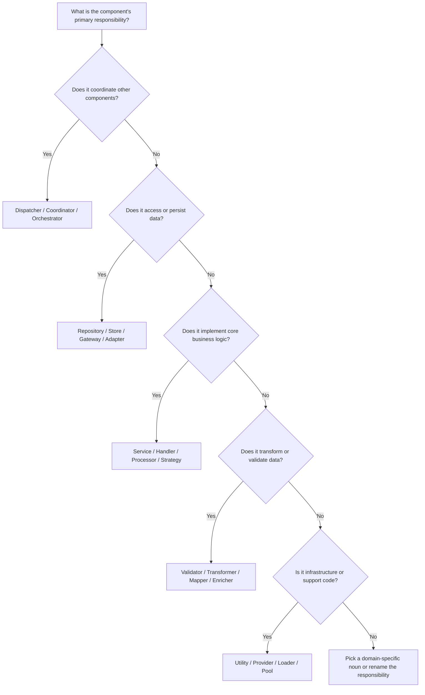

# Naming Conventions & Class Role Patterns: PHP vs. Go

**Part 6 of "Backend Design Patterns: PHP vs. Go"**

This document rounds out the series with a practical guide to naming the building blocks you design in PHP and Go. While the previous parts focused on patterns, architecture, and process, this installment narrows in on language—the labels that keep those patterns understandable as codebases grow and teams scale.

---

## Table of Contents

1. [Introduction & Context](#introduction--context)
2. [Core Naming Principles](#core-naming-principles)
3. [Naming Patterns by Use Case](#naming-patterns-by-use-case)
   1. [Coordination & Control Patterns](#coordination--control-patterns)
   2. [Data Access Patterns](#data-access-patterns)
   3. [Business Logic Patterns](#business-logic-patterns)
   4. [Request/Response Patterns](#requestresponse-patterns)
   5. [Validation & Processing Patterns](#validation--processing-patterns)
   6. [Utility & Helper Patterns](#utility--helper-patterns)
   7. [Observer & Notification Patterns](#observer--notification-patterns)
   8. [Configuration & Context Patterns](#configuration--context-patterns)
   9. [State & Data Structures](#state--data-structures)
   10. [Lifecycle & Resource Patterns](#lifecycle--resource-patterns)
   11. [Container & Collection Patterns](#container--collection-patterns)
4. [Anti-Patterns & What to Avoid](#anti-patterns--what-to-avoid)
5. [Language-Specific Idioms](#language-specific-idioms)
6. [Decision Framework](#decision-framework)
7. [Quick Reference Tables](#quick-reference-tables)
8. [Real-World Examples](#real-world-examples)
9. [References](#references)
10. [Continue the Series](#continue-the-series)

---

## Introduction & Context

Names are the first documentation your teammates encounter every time they open a file, skim a diff, or scan a stack trace. Good naming habits make design patterns approachable; poor naming habits add friction no matter how elegant the underlying architecture might be. This guide distills naming conventions for the common roles that classes, structs, and interfaces play in PHP and Go, complementing the structural guidance in Parts 1–5.

We focus on four themes:

1. **Clarity over cleverness**: Names should communicate intent to someone revisiting code months later.
2. **Domain language first**: Prefer terminology the business uses, then supplement with technical suffixes when necessary.
3. **Language-aware conventions**: PHP leans into explicit, verbose OOP names; Go favors concise names constrained by package context and exported identifiers.
4. **Consistency across the ecosystem**: Projects spanning multiple services and languages benefit when shared vocabulary stays aligned.

If you have already absorbed the design patterns (Part 1), microservice techniques (Part 2), architectural strategies (Part 3), cross-cutting concerns (Part 4), and testing approaches (Part 5), you now have the structural canvas. This part helps you label the pieces accurately so the entire series remains navigable for future contributors.

---

## Core Naming Principles

Effective naming follows a few universal guardrails before branching into language-specific idioms. Treat these principles as a checklist whenever you introduce a new class, struct, interface, or function.

### Language-Agnostic Guidelines

- **Lead with intent**: Choose nouns that describe what an object *is* (e.g., `InvoiceRepository`) or verbs that describe what a function *does* (e.g., `CalculateTotals`). Avoid metaphor or whimsical references.
- **Mirror the domain**: Align names with ubiquitous language from product discussions and specifications. A `FulfillmentCoordinator` resonates more than a generic `ProcessManager`.
- **Prefer explicit over implicit**: `RetryingMessageDispatcher` communicates a behavioral nuance that `Dispatcher` hides.
- **Keep names pronounceable**: Acronyms are fine when industry-standard (API, CSV, JWT). Otherwise, spell terms out—`Configuration` over `Cfg`.
- **Use consistent suffixes**: Readers should infer responsibilities from suffixes like `Repository`, `Service`, or `Handler`. Reserve new suffixes for concepts that genuinely differ.
- **Document with context, not comments**: When the name and API convey purpose, you rely less on fragile comments.

### PHP-Specific Conventions

- **Follow PSR standards**: Classes use PascalCase, methods use camelCase, constants use UPPER\_SNAKE\_CASE. Stick to namespaces that reflect directory structure (`App\Domain\Order`).
- **Suffix interfaces intentionally**: Two popular approaches exist:
  - No suffix for the interface and `*Impl` or `DoctrineUserRepository` for implementations (preferred for many DDD projects).
  - Add `Interface` suffix (`UserRepositoryInterface`) when runtime type hints must differentiate interface from concrete class.
- **Abstract class naming**: Use `Abstract` prefix (`AbstractController`) when the class is not instantiable but shares behavior. Avoid `Base` unless there are multiple extension hierarchies.
- **Trait naming**: Communicate mixin behavior with `*Trait` or capability language: `TimestampableTrait`, `SoftDeletes`, `CanBeArchivedTrait`.
- **Factory vs static constructors**: PHP encourages dedicated factory classes (`UserFactory`) when creation logic is complex. Reserve static constructors (`User::fromRequest()`) for alternate named constructors.
- **Service containers**: When registering services, match IDs to class names (`App\Service\EmailNotifier`) to keep wiring obvious.

### Go-Specific Conventions

- **Exported vs unexported**: Capitalized identifiers are exported from the package, lowercase identifiers remain private. Reflect this in your naming—`orderService` keeps the type private while `OrderService` exposes it.
- **Leverage package names**: Avoid stuttering; if the package is `repository`, the exported type can be `type User struct`. Calling it `repository.Repository` is redundant.
- **Interface naming**: Idiomatic Go favors the `-er` suffix derived from the single dominant method (`Reader`, `Writer`, `Formatter`). Multi-method interfaces should still describe capability (`Cache`, `Repository`).
- **Constructor functions**: Prefer `NewType()` to communicate ownership and configuration (`NewOrderService`, `NewEventDispatcher`). When arguments disambiguate, `New` alone is acceptable inside tight package contexts.
- **Acronyms**: Use consistent casing (`HTTPServer`, `APIGateway`) following Effective Go guidance—initialisms remain uppercase even when embedded.
- **Context propagation**: Functions that accept `context.Context` should place it as the first parameter and avoid embedding it in struct names (`OrderService` rather than `OrderContextService`).
- **Avoid helper packages**: Instead of `utils` or `helpers`, group functions by domain (`validation`, `transport`, `crypto`) and rely on short function names.

---

## Naming Patterns by Use Case

The fastest way to settle on a name is to identify the role the component plays. The sections that follow group common suffixes by responsibility, clarifying when to prefer `Dispatcher` over `Controller`, or `Coordinator` over `Orchestrator`. Each entry explains the typical duties, guidance on when to use the name, and illustrates PHP and Go naming idioms.

### Coordination & Control Patterns

These names signal classes or structs that manage flow—routing requests, coordinating workflows, or mediating communication between collaborators.

#### Dispatcher

- **Role**: Routes messages or requests to the appropriate handler or listener.
- **When to use**: Event buses, message brokers, HTTP routing layers that remain decoupled from transport details.
- **PHP naming**: `EventDispatcher`, `MessageDispatcher`, `DomainEventDispatcher`. Frameworks like Symfony already expose this name; stay consistent with existing conventions.
- **Go naming**: `EventDispatcher`, `Dispatcher`, or `WebhookDispatcher` depending on package context. Keep names short and rely on package (e.g., `events.Dispatcher`) to avoid repetition.
- **Avoid**: Using `Dispatcher` for classes that render responses or apply business rules—those should be Controllers or Services instead.

#### Invoker

- **Role**: Executes command objects, often supporting undo/redo or queued execution.
- **When to use**: Command pattern implementations, job execution systems, and task schedulers where invocation is the primary concern.
- **PHP naming**: `CommandInvoker`, `JobInvoker`, `DeferredInvoker`.
- **Go naming**: `Invoker`, `CommandExecutor`. When the invoker also manages concurrency, consider `AsyncInvoker` or `WorkerInvoker`.
- **Tip**: Pair `Invoker` with `Command` to reinforce the pattern (e.g., `CancelOrderCommand`, `OrderCommandInvoker`).

#### Mediator

- **Role**: Central point that coordinates communication between multiple collaborators without them referencing each other directly.
- **When to use**: UI components, domain models with many interdependent parts, collaborative editing flows.
- **PHP naming**: `ComponentMediator`, `ChatRoomMediator`, `InventoryMediator`.
- **Go naming**: Keep the name short—`Mediator` inside the `ui` or `workflow` package is sufficient. Export only when other packages must interact.
- **Warning**: Avoid turning a Mediator into a God object. If behavior grows too large, consider splitting responsibilities or demoting to events.

#### Coordinator

- **Role**: Drives multi-step workflows, often across bounded contexts or external services.
- **When to use**: Saga orchestrations, batch jobs, data migration flows.
- **PHP naming**: `OrderCoordinator`, `PaymentCoordinator`, `FulfillmentCoordinator`.
- **Go naming**: `Coordinator` or `Orchestrator` typically exported from a workflow package. Combine with verbs when appropriate (`RefundCoordinator`).
- **Pattern pairing**: Works well with `Service` and `Repository` naming to indicate which components it coordinates.

#### Orchestrator vs Choreographer

- **Orchestrator**:
  - **Role**: Central controller decides the order of operations and explicit transitions.
  - **Naming**: `SubscriptionOrchestrator`, `SagaOrchestrator`.
  - **Languages**: Both PHP and Go use the same suffix when emphasizing centralized control.
- **Choreographer**:
  - **Role**: Enables event-driven collaboration without a central controller.
  - **Naming**: Fewer classes use `Choreographer`; instead name the component after the event stream (`InventoryChoreography`, `ShipmentChoreographer`) or stick with `EventDispatcher`.
  - **Use sparingly**: Most teams understand `Orchestrator` better; only use `Choreographer` when documenting event-driven alternatives to orchestrated workflows.

---

### Data Access Patterns

These names typically live near persistence layers. They clarify how a class interacts with storage engines, whether that is a relational database, document store, or external API masquerading as data.

#### Repository

- **Role**: Provides an interface that mimics a collection of aggregate roots and encapsulates query logic.
- **When to use**: Domain-driven design, where the calling code should not care about persistence details.
- **PHP naming**: `UserRepository`, `OrderRepository`, `InventoryRepository`. Consider specialization when necessary—`ReportingOrderRepository`.
- **Go naming**: `UserRepository`, `OrderRepo`, or `orders.Repository`. Shortened `Repo` is acceptable in Go when package names make intent clear.
- **Method conventions**: `FindById`, `Save`, `Remove`, `FindByEmail`, avoiding database-specific language like `select`.

#### DAO (Data Access Object)

- **Role**: Encapsulates CRUD operations, usually in systems that predate DDD or prefer minimal abstraction.
- **When to use**: Legacy codebases, code generators, or when the team is comfortable with persistence-centric terminology.
- **PHP naming**: `UserDAO`, `OrderDao` (keep casing consistent). Often paired with frameworks like Doctrine or Laminas when bridging older modules.
- **Go naming**: `UserDAO` is less idiomatic; prefer `Repository` or `Store`. Use only when matching an existing enterprise convention.
- **Migration tip**: When moving toward DDD, wrap `DAO` implementations behind a `Repository` interface to ease transition.

#### Store

- **Role**: Represents a simple key-value or stateful storage mechanism without rich query semantics.
- **When to use**: Caching layers, session storage, feature flag data, or persistence in specialized services (e.g., in-memory state machines).
- **PHP naming**: `SessionStore`, `CacheStore`, `TokenStore`. Because PHP often uses Symfony Cache or PSR-6, align names with the abstraction being extended.
- **Go naming**: `Store` is idiomatic (`UserStore`, `SessionStore`). Combine with adjectives when there are multiple implementations (`MemoryStore`, `RedisStore`).

#### Gateway

- **Role**: Wraps access to an external system that behaves like a data source (payment provider, search index, CRM).
- **When to use**: Integrations where differences between transport protocols and domain operations should be hidden from calling code.
- **PHP naming**: `PaymentGateway`, `SearchGateway`, `BillingGateway`.
- **Go naming**: `Gateway` or `Client` depending on the team’s preference. For HTTP-heavy integrations, `PaymentClient` may be clearer.
- **Contrast with Adapter**: A Gateway may orchestrate multiple requests and map domain concepts, whereas an Adapter usually bridges two interfaces within the same process.

#### Adapter

- **Role**: Translates between an expected interface and a concrete implementation, often for third-party libraries or legacy systems.
- **When to use**: When a component needs to satisfy an interface without modifying the underlying dependency.
- **PHP naming**: `StripePaymentAdapter`, `LegacyUserAdapter`. Prefix the dependency to show what is being adapted.
- **Go naming**: `StripeAdapter`, `LegacyAdapter`. Because interfaces are small, you can often implement adapters inline, but naming them aids readability.
- **Pair with tests**: Adapters are perfect candidates for contract tests that ensure compliance with the expected interface.

---

### Business Logic Patterns

These names carry the weight of domain behavior. They typically orchestrate repositories, gateways, and validators to deliver use-case level outcomes.

#### Service

- **Role**: Encapsulates a use case or cohesive business capability.
- **When to use**: Application services, domain services, background processing where logic spans multiple repositories or policies.
- **PHP naming**: `UserService`, `CheckoutService`, `NotificationService`. Differentiate domains with prefixes when necessary (`CatalogPricingService`).
- **Go naming**: `Service` suffices when the package provides context (`order.Service`). For exported types used externally, `OrderService` is clearer.
- **Heuristic**: If a class mostly coordinates repositories rather than owning data, `Service` is often the right suffix.

#### Manager

- **Role**: Manages lifecycles, resources, or scheduling where the emphasis is on maintenance rather than business rules.
- **When to use**: Connection pools, cache invalidation, feature toggles, or background worker registries.
- **PHP naming**: `ConnectionManager`, `SessionManager`, `FeatureFlagManager`. Avoid `Manager` when `Service` would communicate business semantics better.
- **Go naming**: `Manager` is used sparingly. Prefer naming after the behavior (`Limiter`, `Pool`) unless the component truly manages a set of resources (`worker.Manager`).

#### Handler

- **Role**: Processes a specific command, event, or request step.
- **When to use**: CQRS command handlers, domain event listeners, durable queue consumers.
- **PHP naming**: `CreateUserHandler`, `OrderCreatedHandler`. Pair the action or event with the suffix to clarify the trigger.
- **Go naming**: For commands, `CreateUserHandler` is acceptable; for HTTP transport, Go often prefers `HandleCreateUser`.
- **Testing tip**: Handlers should consume DTOs or commands, making them easy to test without infrastructure.

#### Processor

- **Role**: Applies a transformation pipeline to data or jobs.
- **When to use**: ETL jobs, streaming data processing, payment workflows that have multiple steps but little branching.
- **PHP naming**: `PaymentProcessor`, `ImageProcessor`, `WebhookProcessor`.
- **Go naming**: `Processor`, `Pipeline`, or more specific alternatives like `Normalizer`. Combine with adjectives to communicate stage (`FraudScreeningProcessor`).

#### Builder

- **Role**: Constructs complex objects or aggregates step by step, often providing fluent APIs or staged validation.
- **When to use**: Query composition, test data generation, assembling aggregates from multiple DTOs.
- **PHP naming**: `InvoiceBuilder`, `QueryBuilder`, `TestOrderBuilder`.
- **Go naming**: Builders are less common; prefer constructor functions with functional options. If an explicit builder struct is needed, `Builder` works but keep methods short (`WithCustomer`, `Build`).

#### Factory

- **Role**: Creates objects while abstracting away initialization logic or selection of concrete types.
- **When to use**: Selecting strategy implementations, initializing aggregates with invariants, encapsulating dependency injection.
- **PHP naming**: `OrderFactory`, `LoggerFactory`, `EventFactory`.
- **Go naming**: Prefer `New` functions (`NewOrder`, `NewLogger`). When multiple factories exist, use package context (`strategies.NewPayment`) or create a `Factory` type with methods (`type Factory struct { ... }`).
- **Clarify scope**: `Factory` should produce a specific concept; otherwise prefer `Provider`.

#### Provider

- **Role**: Supplies dependencies, configuration, or computed values lazily.
- **When to use**: Dependency injection containers, feature flag providers, credential providers.
- **PHP naming**: `ConfigProvider`, `ServiceProvider`, `CredentialsProvider`. Symfony and Laravel have established conventions—mirror them for consistency.
- **Go naming**: When exposing an interface, `type Provider interface { Provide() }`. For AWS-like SDKs, follow existing naming (`CredentialProvider`, `EndpointProvider`).
- **Note**: Use `Provider` when supplying something shared; use `Factory` when creating new instances per call.

---

### Request/Response Patterns

Names in this category live near controllers, transport adapters, serializers, and mappers—the bridge between user input and domain objects.

#### Controller

- **Role**: Receives transport-specific requests (HTTP, CLI) and delegates to services.
- **When to use**: PHP frameworks that align with MVC or ADR patterns, e.g., Symfony, Laravel.
- **PHP naming**: `UserController`, `OrderController`, `AuthController`. Use route-specific suffixes like `ApiUserController` only when multiple transport layers coexist.
- **Go naming**: Rare, because Go favors handlers. If using a framework that adopts controllers (e.g., `gofiber`), keep names short and package aware.
- **Rule of thumb**: Controllers should convert transport DTOs, invoke services, and map responses—business logic belongs elsewhere.

#### Handler (HTTP or Transport)

- **Role**: Processes a request in frameworks that expose handler functions or structs.
- **When to use**: Go `net/http`, Fiber, Echo, or PHP applications implementing PSR-15 middleware/handlers.
- **PHP naming**: For PSR-15, `CreateUserHandler` or `ListOrdersAction` (Action is another popular suffix).
- **Go naming**: `CreateUserHandler`, `OrdersHandler`, or simply functions `HandleCreateUser`. Group handlers by resource in packages for clarity.
- **Tip**: Keep handler signatures consistent and delegate heavy lifting to services or processors.

#### Presenter

- **Role**: Formats domain data for presentation (JSON, HTML, CLI).
- **When to use**: Hexagonal architecture or clean architecture implementations aiming to keep controllers slim.
- **PHP naming**: `UserPresenter`, `OrderPresenter`, `InvoicePresenter`. Some teams prefer `ViewModel` for the output shape.
- **Go naming**: Less common. Instead of distinct presenter structs, expose functions like `func PresentUser(u domain.User) UserResponse`.

#### Transformer

- **Role**: Converts between formats or shapes, often for API responses or import/export pipelines.
- **When to use**: Serializing nested structures, mapping third-party API payloads to internal DTOs.
- **PHP naming**: `UserTransformer`, `InvoiceTransformer`, `WebhookPayloadTransformer`.
- **Go naming**: `Transformer` interface or `Transform` functions that return a specific struct. Keep names explicit: `ToAPIResponse`, `FromRequest`.

#### Serializer / Deserializer

- **Role**: Converts objects to or from bytes/text formats (JSON, XML, CSV).
- **When to use**: When you require custom serialization logic beyond framework defaults.
- **PHP naming**: `JsonSerializer`, `XmlSerializer`, `YamlDeserializer`. Symfony Serializer uses normalizers/encoders—mirror terms already adopted.
- **Go naming**: Prefer `Marshal` and `Unmarshal` methods. When a struct dedicated to serialization is needed, call it `Serializer`.
- **Note**: Keep serialization pure; avoid referencing infrastructure directly to maintain reusability.

#### Mapper

- **Role**: Maps between domain objects, DTOs, and persistence models.
- **When to use**: When shapes diverge significantly or when reconciling fields from multiple sources.
- **PHP naming**: `UserMapper`, `OrderMapper`, `PaymentRequestMapper`. If mapping direction matters, use `UserToPayloadMapper`.
- **Go naming**: Use verbs when possible (`MapUserToDTO`). When using types, `Mapper` works but keep functions small.
- **Best practice**: Centralizing mapping logic avoids duplication and simplifies refactors when DTOs change.

---

### Validation & Processing Patterns

These names convey assurance and hygiene. They guard inputs and normalize data before it reaches core business logic.

#### Validator

- **Role**: Ensures a payload, entity, or command satisfies rules before processing.
- **When to use**: Form validation, domain invariants, API payload checks.
- **PHP naming**: `UserValidator`, `CheckoutValidator`, `CommandValidator`. Symfony’s validator uses constraints; complement them with explicit validator classes for complex rules.
- **Go naming**: Interfaces like `type Validator interface { Validate(ctx context.Context) error }` or structs such as `OrderValidator`.
- **Guideline**: Separate validation logic from persistence or command handlers to keep responsibilities pure.

#### Sanitizer

- **Role**: Cleans or normalizes input (trims whitespace, strips HTML, canonicalizes phone numbers).
- **When to use**: Before validation or persistence, especially when accepting user-generated content.
- **PHP naming**: `InputSanitizer`, `HtmlSanitizer`, `PhoneSanitizer`.
- **Go naming**: `Sanitizer` struct or functions like `func SanitizeInput(s string) string`. Combine with `Pipeline` when chaining operations.
- **Note**: Distinguish from validators—sanitizers mutate, validators report errors.

#### Filter

- **Role**: Includes or excludes items based on predicates.
- **When to use**: Query composition, collection filtering, middleware pipelines.
- **PHP naming**: `OrderFilter`, `SpamFilter`, `ActiveUserFilter`.
- **Go naming**: Instead of dedicated structs, prefer functions returning predicates (`FilterFunc`). For reusable logic, `EventFilter` or `Filter` interface works.
- **Tip**: Pair `Filter` naming with the data it filters (`ProductFilter` rather than a generic `Filter`).

#### Enricher

- **Role**: Adds derived or external data to an object (e.g., fetching customer loyalty status).
- **When to use**: Event enrichment, projection building, API response augmentation.
- **PHP naming**: `OrderEnricher`, `CustomerEnricher`, `EventEnricher`.
- **Go naming**: `Enricher` interface or function like `func EnrichOrder(ctx context.Context, o *Order) error`.
- **Caution**: Avoid mixing enrichment with persistence; keep these transformations stateless whenever possible.

---

### Utility & Helper Patterns

Use these names sparingly; they can become junk drawers. Employ them only when the responsibility truly spans many domains or is purely technical.

#### Utility

- **Role**: Offers stateless, reusable functions grouped by technical concern (string manipulation, math, time).
- **When to use**: When no domain-specific name describes the group of functions.
- **PHP naming**: `StringUtility`, `DateUtility`. Avoid dumping unrelated helpers into a single `Utility` class.
- **Go naming**: Prefer package-level functions within focused packages (`slug.Make`, `timeutil.Parse`). Avoid `util` packages; Go code review guidelines discourage them.

#### Helper

- **Role**: Provides support functions tightly coupled to a feature (e.g., view rendering helpers).
- **When to use**: Blade/Twig helpers, test helpers, CLI formatting that does not warrant a service.
- **PHP naming**: `TwigHelper`, `RoutingHelper`, `TestHelper`. Keep them scoped to the module using them.
- **Go naming**: Rare; better to export small functions in the consuming package or create test helper files (`testing_helpers.go`).

#### Calculator

- **Role**: Performs deterministic calculations or aggregations.
- **When to use**: Pricing, tax, scoring, metrics.
- **PHP naming**: `PriceCalculator`, `TaxCalculator`, `ScoreCalculator`.
- **Go naming**: `Calculator` or explicit names like `SubtotalCalculator`. Provide pure functions where possible for easier testing.

#### Converter

- **Role**: Converts values across units or representations (currency, measurement, localization).
- **When to use**: Data migration, import/export, API integrations.
- **PHP naming**: `CurrencyConverter`, `UnitConverter`, `LocaleConverter`.
- **Go naming**: `Converter`, `ConvertCurrency`, or type-specific conversions. Group related conversions per package.

#### Comparator

- **Role**: Compares two entities and determines ordering or equality.
- **When to use**: Sorting complex structures, deduplication logic.
- **PHP naming**: `UserComparator`, `VersionComparator`. Implement `__invoke` or dedicated compare methods returning `int`.
- **Go naming**: Typically use functions compatible with `sort.Slice` or implement `Less(i, j int) bool`. If a struct is necessary, `type Comparator func(a, b Item) bool` keeps things lightweight.

---

### Observer & Notification Patterns

These names highlight components that react to or broadcast state changes. Use them to clarify the direction of information flow in event-driven systems.

#### Observer

- **Role**: Watches a subject and reacts to changes or events.
- **When to use**: Domain events, UI updates, aggregate lifecycle hooks.
- **PHP naming**: `OrderObserver`, `UserObserver`. Laravel uses observers heavily; follow framework naming.
- **Go naming**: Optionally define `Observer` interfaces with `Notify` or `Update` methods. Channels are often sufficient, but naming still helps documentation.

#### Listener

- **Role**: Listens for a specific event and performs side effects.
- **When to use**: Event buses where consumers act on discrete event types (e.g., `OrderPlaced`).
- **PHP naming**: `OrderPlacedListener`, `SendReceiptListener`. Symfony events often use `Subscriber`, but `Listener` remains common for single-event hooks.
- **Go naming**: `Listener` suffix appears in lower-level networking (`net.Listener`). For business events, use descriptive names like `ShipmentListener`.
- **Suggestion**: Use `Listener` when the component reacts synchronously and `Subscriber` when using pub/sub systems.

#### Subscriber

- **Role**: Subscribes to event streams, typically registering multiple handlers.
- **When to use**: Event-driven architectures, message buses, or frameworks that require subscription mapping.
- **PHP naming**: `InventorySubscriber`, `UserLifecycleSubscriber`. Symfony expects `getSubscribedEvents`.
- **Go naming**: Many projects call these `Consumer` or `Subscriber`. Stick with `Subscriber` when modelling message-bus semantics.

#### Watcher

- **Role**: Monitors external systems or files for changes, often triggering events or sync jobs.
- **When to use**: File system notifications, configuration reloads, health monitoring.
- **PHP naming**: `FileWatcher`, `ConfigWatcher`.
- **Go naming**: `Watcher` is idiomatic (`fsnotify.Watcher`). Combine with context, e.g., `DeploymentWatcher`.

#### Notifier

- **Role**: Sends notifications to people or systems.
- **When to use**: Email, SMS, Slack, push notifications, webhooks.
- **PHP naming**: `EmailNotifier`, `SlackNotifier`, `WebhookNotifier`.
- **Go naming**: `Notifier` interface or concrete types like `EmailNotifier`. Provide `Notify(ctx, message)` or similar method signatures.
- **Best practice**: Keep notifier names medium-specific to avoid confusion with domain-specific services.

---

### Configuration & Context Patterns

These components wrap environmental data, configuration, or request scope. They are foundational to dependency management.

#### Config / Configuration

- **Role**: Represents structured configuration data loaded from files, environment variables, or secrets managers.
- **When to use**: Applications with multiple deployment environments or feature flags.
- **PHP naming**: `AppConfig`, `DatabaseConfig`, `FeatureFlagConfiguration`.
- **Go naming**: Prefer `Config` structs (`type Config struct { ... }`). Combine with package context (`server.Config`).
- **Advice**: Keep configuration immutable after bootstrapping to avoid hidden side effects.

#### Context

- **Role**: Carries request-scoped metadata such as authorization, deadlines, and correlation IDs.
- **When to use**: Any operation that depends on request lifetime or tracing.
- **PHP naming**: `RequestContext`, `SecurityContext`, `TenantContext`.
- **Go naming**: Rely on `context.Context`. Avoid creating custom context structs; instead embed values using `context.WithValue` sparingly or dedicated structs carried alongside context.
- **Pattern**: In PHP, prefer value objects over arrays for context details.

#### Environment

- **Role**: Encapsulates environment-specific settings (production vs staging).
- **When to use**: Feature toggles, environment-aware configuration fallbacks.
- **PHP naming**: `Environment`, `RuntimeEnvironment`.
- **Go naming**: Use `env` package or `Environment` struct only when necessary; otherwise environment variables are read at startup into `Config`.

#### Settings

- **Role**: User or tenant-specific preferences separate from system configuration.
- **When to use**: User profiles, notification preferences, personalization features.
- **PHP naming**: `UserSettings`, `NotificationSettings`.
- **Go naming**: `Settings` struct or `Preferences`. Keep them distinct from `Config`.
- **Tip**: Use `Provider` suffix when retrieving settings from remote stores (`UserSettingsProvider`).

---

### State & Data Structures

These suffixes describe patterns that represent state machines, strategies, or business rules.

#### State

- **Role**: Encapsulates behavior tied to a particular state of an aggregate or workflow.
- **When to use**: State pattern implementations (`Pending`, `Approved`, `Shipped`).
- **PHP naming**: `OrderState`, with concrete classes like `PendingState`, `PaidState`. Group them under a namespace for clarity.
- **Go naming**: Interfaces such as `type State interface { Advance(ctx context.Context) (State, error) }`. Concrete types `PendingState` or `state.Pending`.
- **Guideline**: Ensure state names align with domain terminology to avoid confusion.

#### Strategy

- **Role**: Encapsulates interchangeable algorithms.
- **When to use**: Payment methods, caching policies, pricing calculations, sorting approaches.
- **PHP naming**: `PaymentStrategy`, `CacheStrategy`, `DiscountStrategy`. Concrete strategies adopt descriptive prefixes (`CreditCardStrategy`).
- **Go naming**: Use interfaces (`type Strategy interface { Apply(...) }`) or function types. Avoid redundant names like `StrategyStrategy`.

#### Policy

- **Role**: Describes governing business rules or permissions.
- **When to use**: Authorization checks, discounts, refund rules, feature eligibility.
- **PHP naming**: `RefundPolicy`, `AccessPolicy`, `DiscountPolicy`.
- **Go naming**: `Policy` interface or types like `RefundPolicy`. Many Go projects favor `Checker` or `Authorizer`; choose whichever best reflects domain language.
- **Tip**: Policies should answer yes/no questions or return decisions, not execute side effects.

#### Specification

- **Role**: Encapsulates business rules that can be combined (AND/OR/NOT).
- **When to use**: Filtering entities, enforcing domain invariants while keeping rules composable.
- **PHP naming**: `CustomerEligibilitySpecification`, `OrderAmountSpecification`.
- **Go naming**: Less common but still useful; express as interfaces with `IsSatisfiedBy` methods or functions returning bool.
- **Combine**: `Specification` pairs well with `Repository` to build expressive queries.

#### Criteria

- **Role**: Holds filtering or sorting parameters, often fed into repositories.
- **When to use**: Search forms, API list endpoints, reporting queries.
- **PHP naming**: `SearchCriteria`, `OrderCriteria`, `PaginationCriteria`.
- **Go naming**: `Criteria` struct with exported fields, e.g., `type OrderCriteria struct { Status []Status; Limit int }`.
- **Note**: Keep criteria immutable to avoid race conditions in concurrent contexts.

#### Query vs Command

- **Role**: `Query` represents read-only requests; `Command` represents state-changing requests (CQRS).
- **When to use**: CQRS, message buses, task queues.
- **PHP naming**: `GetUserQuery`, `ListOrdersQuery`, `CreateOrderCommand`, `CancelOrderCommand`.
- **Go naming**: Structs or interfaces with the same suffixes. Handled by `QueryHandler` or `CommandHandler`.
- **Consistency**: Keep verb usage in commands imperative (`Create`, `Update`, `Delete`) and queries descriptive (`Get`, `Find`, `List`).

---

### Lifecycle & Resource Patterns

These suffixes capture resource access and transformation workflows at a lower level than business logic.

#### Loader

- **Role**: Loads data or resources from a specific location.
- **When to use**: Configuration loaders, fixture loaders, translation loaders.
- **PHP naming**: `ConfigLoader`, `FixtureLoader`, `TranslationLoader`.
- **Go naming**: `Loader` interface with `Load(ctx)`. Combine with resource name (`TemplateLoader`).
- **Tip**: Distinguish between `Loader` (reads) and `Importer` (transforms + persists).

#### Reader / Writer

- **Role**: Abstract reading or writing streams of data.
- **When to use**: File IO, network streams, report generation.
- **PHP naming**: `CsvReader`, `JsonWriter`. Implement PSR-7 or PSR-17 when applicable.
- **Go naming**: Stick to `io.Reader` / `io.Writer`. For custom types, embed these interfaces and name specific behavior (`AuditLogWriter`).

#### Scanner

- **Role**: Tokenizes or scans input line-by-line, often as a preprocessing step.
- **When to use**: Log parsing, lexical analysis, streaming analytics.
- **PHP naming**: `LogScanner`, `TokenScanner`.
- **Go naming**: The `bufio.Scanner` pattern is standard; extend by wrapping or composing (`MetricsScanner`).
- **Note**: Scanners should be cheap and stateless to reuse across streams.

#### Parser

- **Role**: Converts structured text into ASTs or domain objects.
- **When to use**: Configuration parsing, DSLs, import routines.
- **PHP naming**: `YamlParser`, `ExpressionParser`, `SchemaParser`.
- **Go naming**: `Parser` struct with `Parse` methods. For simple cases, use functions like `ParseConfig`.
- **Guideline**: Separate parsing from validation to keep responsibilities clear.

#### Lexer

- **Role**: Breaks input into tokens for parsers.
- **When to use**: Building DSLs, template engines, query languages.
- **PHP naming**: `SqlLexer`, `TemplateLexer`.
- **Go naming**: `Lexer` per package; use rune-based scanning like Go’s template engine.
- **Advice**: Keep tokens in dedicated types (`type Token struct { Kind TokenType; Literal string }`) regardless of language.

#### Compiler

- **Role**: Transforms high-level representations into lower-level executable forms or optimized plans.
- **When to use**: Template compilation, query compilation, code generation.
- **PHP naming**: `QueryCompiler`, `TemplateCompiler`.
- **Go naming**: `Compiler` struct or `Compile` functions. Compose with `Parser` and `Analyzer`.
- **Reminder**: Compilers often have multiple passes; name each stage for clarity (`Validator`, `Optimizer`).

---

### Container & Collection Patterns

These names indicate infrastructure surrounding dependency injection, object registries, and shared resources.

#### Container

- **Role**: Dependency injection container or service locator (when used judiciously).
- **When to use**: Frameworks that support DI (Symfony, Laravel) or testing bootstraps.
- **PHP naming**: `ServiceContainer`, `Container`, `ContainerBuilder`. Follow the framework's vocabulary.
- **Go naming**: Rarely needed. Manual dependency injection via constructors is idiomatic. If you must, name it `Registry` or `Graph` to avoid conflating with PHP semantics.

#### Registry

- **Role**: Central registry for plugins, handlers, or dynamic lookups.
- **When to use**: Plugin architectures, dynamic dispatch tables, runtime discovery.
- **PHP naming**: `PluginRegistry`, `FormatterRegistry`, `EventRegistry`.
- **Go naming**: `Registry` struct with maps. Use generics in Go 1.18+ to enforce types.
- **Caution**: Keep registries focused; otherwise they become hidden service locators.

#### Locator

- **Role**: Finds services by name at runtime. Considered an anti-pattern when overused.
- **When to use**: Transitional code migrating toward DI, or when working with legacy frameworks lacking DI.
- **PHP naming**: `ServiceLocator`, `RepositoryLocator`. Document rationale in comments.
- **Go naming**: Avoid; rely on constructors or registries instead.

#### Pool

- **Role**: Manages reusable resource instances (connections, workers, buffers).
- **When to use**: High-throughput systems requiring resource reuse to minimize allocation.
- **PHP naming**: `ConnectionPool`, `WorkerPool`.
- **Go naming**: `Pool`, `WorkerPool`, `sync.Pool` (standard library). Compose with contexts for cancellation.
- **Tip**: Include adjectives to differentiate implementations (`BufferedWorkerPool`, `LazyConnectionPool`).

#### Cache

- **Role**: Stores data for quick retrieval.
- **When to use**: Caching layers, memoization, feature toggles.
- **PHP naming**: `UserCache`, `QueryCache`, `CacheStore`.
- **Go naming**: `Cache` interface or specific types (`LRUCache`). Many Go libraries provide `cache` packages; align naming accordingly.

#### Buffer

- **Role**: Temporarily holds data in transit.
- **When to use**: Stream processing, file writes, network operations.
- **PHP naming**: `OutputBuffer`, `ResponseBuffer`.
- **Go naming**: Use `bytes.Buffer` or `bufio.Writer`. Custom buffers should describe contents (`MetricBuffer`).
- **Reminder**: Buffers usually imply capacity limits—document behavior when full.

---

## Anti-Patterns & What to Avoid

Strong naming conventions also require guardrails against vague or misleading terms. Watch for the following pitfalls:

- **Over-suffixing**: Doubling suffixes (`UserServiceManager`, `OrderRepositoryDAO`) dilutes meaning. Pick the most accurate suffix and drop the rest.
- **Empty catch-all classes**: Names like `Helper`, `Manager`, or `Processor` without context invite dumping unrelated functions. Always qualify them (`RoutingHelper`, `CacheManager`).
- **Redundant prefixes**: Avoid repeating domain names already present in namespaces or packages (`Order\OrderService`). PHP namespaces and Go packages already convey context.
- **Inconsistent casing**: Stick to PSR standards in PHP and Effective Go conventions in Go. Mixed casing (e.g., `HttpClient` vs `HTTPClient`) confuses code search.
- **Ambiguous abbreviations**: Unless universally recognized (`DTO`, `API`, `HTML`), avoid abbreviations that obscure meaning (`UsrSvc`). Clarity outlives brevity.
- **Service locator creep**: `Locator` components that hand out arbitrary services hide dependencies and complicate testing. Favor constructor injection and explicit wiring.
- **Anemic names for rich behavior**: If a class does more than mediate or coordinate, elevate its name accordingly (`FulfillmentWorkflow` instead of `WorkflowManager`).
- **Framework leakage**: Do not blindly mirror framework-specific suffixes if they mislead contributors (e.g., naming a queue consumer `Controller`).

Add guardrail notes to your README or contribution guidelines so reviewers can enforce these conventions consistently.

---

## Language-Specific Idioms

Even with shared principles, PHP and Go communities have evolved distinct preferences. Respecting these idioms keeps your codebase idiomatic and lowers the surprise factor for new team members.

### PHP Naming Idioms

- **Namespaces mirror directories**: Align namespaces with folder structure (`App\Domain\Order\OrderRepository`). Avoid duplicating the final segment in class names.
- **Interfaces and implementations**:
  - If an interface defines the abstraction, some teams omit suffixes (`UserRepository`) and name concrete classes after technology (`DoctrineUserRepository`).
  - Others prefer `UserRepositoryInterface` paired with `DatabaseUserRepository`. Pick one style and document it.
- **Abstract classes**: Prefix with `Abstract` when providing base behavior (`AbstractApiController`). Use `Final` keyword for classes intentionally closed to extension.
- **Traits**: Communicate capability with `Trait` suffix, e.g., `TimestampableTrait`, `SoftDeleteTrait`. When mixing into multiple domains, clarify the behavior (`ResolvesLocaleTrait`).
- **Event naming**: Use past tense for domain events (`OrderPlacedEvent`). Symfony’s EventDispatcher uses suffix `Event`; align with that to keep auto-discovery consistent.
- **Handler vs Action**: In PSR-15 or ADR architectures, action classes use `*Action` (`CreateOrderAction`). For command bus handlers, stick to `*Handler`.
- **Config and service definitions**: Match service IDs and filenames with class names so `services.yaml` references remain predictable.
- **Testing conventions**: Test doubles often end with `Stub`, `Mock`, or `Fake`. Ensure naming clarifies the fake’s behavior (`PaymentGatewayFake`).
- **Doctrine/Laminas conventions**: Repositories, entity listeners, hydrators, and form types carry established suffixes—prefer them over inventing new ones.

### Go Naming Idioms

- **Packages own the context**: Because package names appear in usage (`repository.New`, `http.Handler`), keep exported type names concise. Avoid repeating the package name (`type OrderRepository struct` inside `orderrepository` package introduces stutter).
- **Interface naming**: Use behavior-driven names ending with `er` when the interface has one dominant method (`Reader`, `Notifier`). For multi-method interfaces, use capability names (`Repository`, `Cache`).
- **Constructor functions**: Expose `NewType` functions returning interfaces or structs. When configuration grows, consider functional options (`NewServer(WithTLS(...))`).
- **Avoid getters/setters**: Instead of `GetName()`, just use `Name()`; setters often become `SetName` only when necessary.
- **Error variables**: Use `Err` prefix for package-level errors (`var ErrNotFound = errors.New("...")`). Custom error types end with `Error`.
- **Abbreviations and initialisms**: Follow Go’s established casing: `HTTPServer`, `URLParser`, `JSONConfig`. Keep the initialism fully uppercase.
- **Context usage**: Place `context.Context` as the first parameter (`func (s *Service) Do(ctx context.Context, input Input) error`). Avoid embedding context inside struct names.
- **Test helpers**: Put shared helper functions in `_test.go` files with the same package name. Avoid global `testutil` packages unless shared across modules.
- **Configuration**: Favor structs and functional options over maps. Example: `type Config struct { Addr string }`.
- **Command handlers**: For CLI tools, commands often live in packages named after the command (`cmd/root`, `cmd/migrate`). Handlers accept `*cobra.Command` or context-specific data; name them `run*` to match community defaults.

---

## Decision Framework

When naming a new component, follow a simple decision path that anchors the choice in responsibility and language norms.



**Decision checklist**

1. **Responsibility**: Can you describe the component with a single verb or noun? If not, split it.
2. **Domain vocabulary**: Does the name reflect terminology users or business stakeholders recognize?
3. **Language idiom**: Does the suffix match PHP or Go norms for that role?
4. **Consistency**: Does the name align with similar components already in the codebase?
5. **Context**: Does the package or namespace already provide part of the meaning? Avoid duplication.

Document these steps in your architecture guidelines so code reviews can apply them consistently.

---

## Quick Reference Tables

### By Responsibility

| Responsibility | PHP Naming | Go Naming | Notes |
| --- | --- | --- | --- |
| Workflow coordination | `OrderCoordinator`, `SagaOrchestrator` | `Orchestrator`, `Coordinator` | Use when sequencing steps across services |
| Data access | `UserRepository`, `PaymentGateway` | `Repository`, `Store`, `Gateway` | Prefer `Repository` for aggregates, `Store` for key-value |
| Business logic | `CheckoutService`, `PaymentStrategy` | `Service`, `Strategy` | Keep services thin; move heavy logic to domain objects |
| Request handling | `UserController`, `CreateUserHandler` | `Handler`, `Middleware` | Use `Controller` in MVC frameworks, `Handler` elsewhere |
| Validation & hygiene | `OrderValidator`, `InputSanitizer` | `Validator`, `Filter` | Validators should return errors; sanitizers mutate |
| Transformation | `UserMapper`, `InvoiceTransformer` | `Mapper`, `Transformer` | Map to DTOs or API responses |
| Notifications | `EmailNotifier`, `OrderListener` | `Notifier`, `Subscriber` | Differentiate synchronous listeners from async subscribers |
| Configuration | `AppConfig`, `TenantContext` | `Config`, `context.Context` | PHP uses classes; Go relies on structs and context |
| State machines | `PendingState`, `RefundPolicy` | `State`, `Policy` | Align states with domain vocabulary |
| Resource access | `FileLoader`, `CsvReader` | `Loader`, `io.Reader` | Adopt standard library names when available |

### Pattern Mapping

| Pattern | Typical Names | Usage Notes |
| --- | --- | --- |
| Command | `*Command`, `*CommandHandler`, `Invoker` | Commands change state; handlers execute them |
| Query | `*Query`, `*QueryHandler` | Queries return data without side effects |
| Strategy | `*Strategy`, `StrategyFactory` | Capture interchangeable algorithms |
| Observer | `*Event`, `*Listener`, `*Subscriber` | Choose suffix based on synchronous vs async handling |
| State | `*State`, `StateFactory` | Each state implements the same interface |
| Repository | `*Repository`, `RepositoryInterface` | Abstract persistence details |
| Builder | `*Builder` | For complex object construction or test data |
| Decorator | `Caching*`, `Logging*` | Prefix with behavior being added |
| Factory | `*Factory`, `New*` | `Factory` classes in PHP, `New` functions in Go |
| Adapter | `ExternalSystemAdapter` | Name after the system being adapted |

### Suffix Dictionary

| Suffix | Meaning | PHP Example | Go Example |
| --- | --- | --- | --- |
| `Controller` | HTTP/transport entry point | `UserController` | Rare; prefer `Handler` |
| `Handler` | Processes a command/event/request | `CreateOrderHandler` | `CreateOrderHandler` |
| `Service` | Encapsulates business use case | `NotificationService` | `Service` within package |
| `Repository` | Collection-style persistence abstraction | `InvoiceRepository` | `Repository` |
| `Gateway` | External system integration | `PaymentGateway` | `PaymentGateway` / `Client` |
| `Store` | Simple storage or cache | `SessionStore` | `SessionStore` |
| `Provider` | Supplies dependencies/config | `ConfigProvider` | `CredentialProvider` |
| `Factory` | Creates objects/strategies | `UserFactory` | `NewUser` |
| `Builder` | Fluent object construction | `OrderBuilder` | `Builder` (less common) |
| `Validator` | Enforces rules | `OrderValidator` | `Validator` |
| `Sanitizer` | Cleans inputs | `HtmlSanitizer` | `Sanitizer` |
| `Transformer` | Converts formats | `UserTransformer` | `Transformer` |
| `Mapper` | Maps between models/DTOs | `OrderMapper` | `Mapper` |
| `Observer`/`Listener` | Reacts to events | `OrderObserver` | `OrderListener` |
| `Notifier` | Sends notifications | `EmailNotifier` | `Notifier` |
| `Manager` | Manages lifecycle/resources | `ConnectionManager` | `Manager` (sparingly) |
| `Coordinator` | Orchestrates workflows | `FulfillmentCoordinator` | `Coordinator` |
| `Orchestrator` | Centralized workflow control | `SagaOrchestrator` | `Orchestrator` |
| `Context` | Request or domain scope data | `SecurityContext` | Use `context.Context` |
| `Config` | Application configuration | `DatabaseConfig` | `Config` struct |

Keep these tables near your team charter or architecture decision records so newcomers acclimate quickly.

---

## Real-World Examples

Ground the conventions by mapping them to existing frameworks and standard library idioms.

### Symfony (PHP)

- **Controllers** live under `App\Controller\*Controller`. Each action delegates to services and returns responses.
- **Command Handlers** implement a `__invoke` method and sit under `App\Application\*Handler`.
- **Event Subscribers** implement `EventSubscriberInterface`, returning an array mapping events to handler methods.
- **Service Registration** in `config/services.yaml` references classes directly, matching names 1:1.

Example command handler:

```php
namespace App\Application\Order;

use App\Domain\Order\Command\CreateOrderCommand;
use Symfony\Component\Messenger\Attribute\AsMessageHandler;

#[AsMessageHandler]
final class CreateOrderHandler
{
    public function __construct(
        private OrderFactory $factory,
        private OrderRepository $orders,
        private PaymentGateway $payments,
    ) {}

    public function __invoke(CreateOrderCommand $command): void
    {
        $order = $this->factory->fromCommand($command);
        $this->orders->save($order);
        $this->payments->charge($order);
    }
}
```

### Go Standard Library & Ecosystem

- **HTTP handlers** adhere to `func(w http.ResponseWriter, r *http.Request)` and are often grouped in `handler` packages.
- **Repositories/Stores** expose narrow interfaces; implementations stay private to the package.
- **Notifiers** or background jobs use context-aware methods (`Notify(ctx, msg)`).
- **Config** structs reside in `config` or root packages and are populated via environment variables or flags.

Example Go service wiring:

```go
package order

type Service struct {
    repo      Repository
    payments  PaymentGateway
    notifier  Notifier
}

func NewService(repo Repository, payments PaymentGateway, notifier Notifier) *Service {
    return &Service{repo: repo, payments: payments, notifier: notifier}
}

func (s *Service) Create(ctx context.Context, cmd CreateOrderCommand) error {
    order := NewOrder(cmd.CustomerID, cmd.Items)

    if err := s.repo.Save(ctx, order); err != nil {
        return err
    }
    if err := s.payments.Charge(ctx, order); err != nil {
        return err
    }
    return s.notifier.Notify(ctx, OrderCreatedNotification{OrderID: order.ID})
}
```

### Combined Naming in Practice

When PHP and Go services collaborate in a single product:

- Use the same domain lexicon across languages (`OrderService`, `OrderRepository`, `OrderCreatedEvent`).
- Document interfaces in a shared glossary so the naming story stays consistent even when implementation details diverge.
- Mirror naming between APIs and workers to simplify observability (`CheckoutOrchestrator` in PHP aligns with `checkout.Orchestrator` package in Go).

---

## References

1. [PSR-1: Basic Coding Standard](https://www.php-fig.org/psr/psr-1/)
2. [PSR-4: Autoloader](https://www.php-fig.org/psr/psr-4/)
3. [Symfony Naming Conventions](https://symfony.com/doc/current/best_practices/naming.html)
4. [Effective Go](https://go.dev/doc/effective_go)
5. [Go Code Review Comments](https://github.com/golang/go/wiki/CodeReviewComments)
6. [Domain-Driven Design Reference](https://dddcommunity.org/library/)
7. [Clean Architecture, Robert C. Martin](https://www.oreilly.com/library/view/clean-architecture/9780134494272/)
8. [Designing Data-Intensive Applications, Martin Kleppmann](https://dataintensive.net/)

---

## Continue the Series

- **Part 1**: [GoF Design Patterns](backend-design-patterns-php-vs-go.md)
- **Part 2**: [Modern Backend & Microservice Patterns](microservices-patterns-php-vs-go.md)
- **Part 3**: [System Architecture Patterns](system-architecture-patterns-php-vs-go.md)
- **Part 4**: [Security, API Design, Performance & DevOps Patterns](cross-cutting-patterns-php-vs-go.md)
- **Part 5**: [Testing Patterns](testing-patterns-php-vs-go.md)
- **Part 6 (this document)**: Naming Conventions & Class Role Patterns

---
