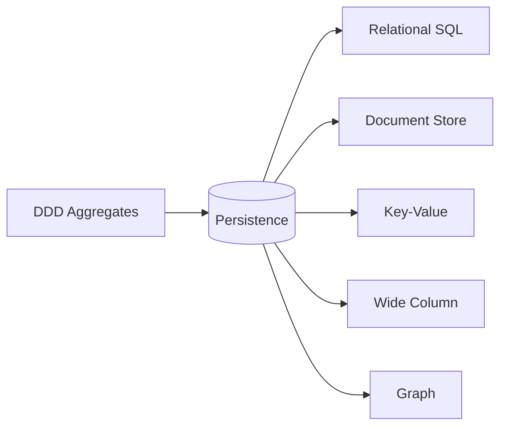
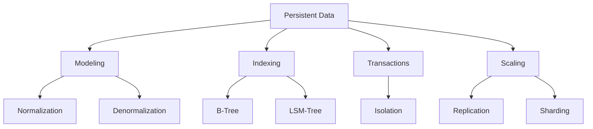
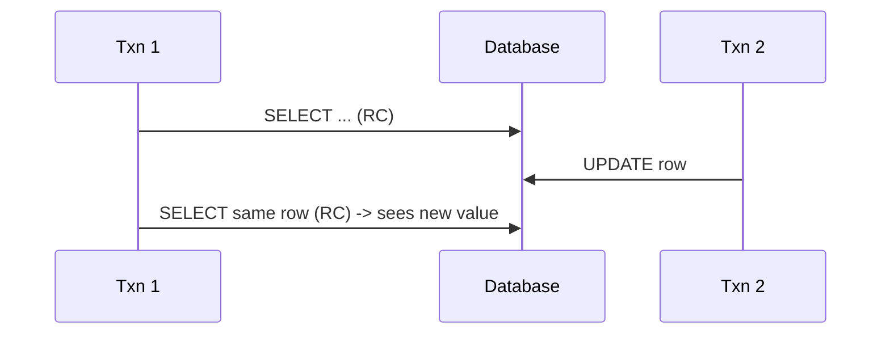
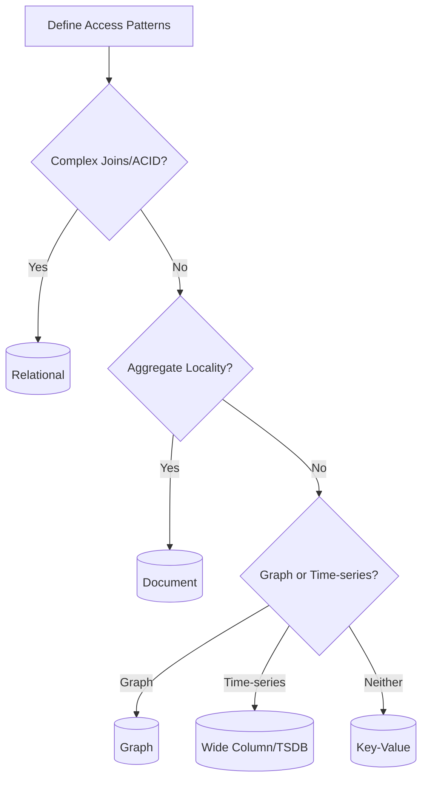
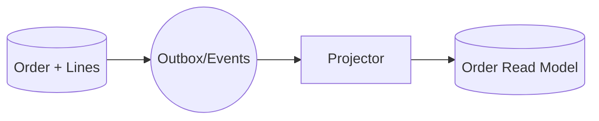
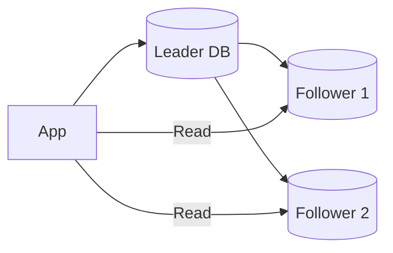

# Data Persistence Patterns: SQL vs NoSQL

Language-agnostic guide to persistent data. Focuses on fundamentals (indexes, queries, transactions), modeling and scaling patterns, and decision frameworks. Complements:
- DDD aggregates and mapping: `domain-driven-design-guide.md`
- Microservices (database per service, outbox): `microservices-patterns-php-vs-go.md`
- Performance & caching: `cross-cutting-patterns-php-vs-go.md`
- Architecture choices: `system-architecture-patterns-php-vs-go.md`
- Testing DB access: `testing-patterns-php-vs-go.md`

---

## Table of Contents
1) Introduction & Context
2) Core Concepts & Glossary
3) SQL Fundamentals
4) NoSQL Fundamentals
5) Choosing SQL vs NoSQL
6) Indexing & Query Optimization (Deep Dive)
7) Modeling Patterns by Use Case
8) Scaling Patterns
9) Reliability, Safety & Operations
10) Practical Patterns & Anti-Patterns
11) Quick Reference Tables
12) References & Further Reading

---

## 1) Introduction & Context

- Persistence patterns underpin correctness, performance, and scalability.
- Align storage with domain boundaries (DDD), read/write profiles (CQRS), and service ownership (DB-per-service).
- Scope: Relational SQL; NoSQL families (document, key-value, wide-column, graph).



---

## 2) Core Concepts & Glossary

- Table/Collection, Row/Document, Primary Key, Foreign Key
- Index: clustered/non-clustered, composite, covering; selectivity; cardinality
- Query plan/explain; cost estimation; join; window function
- Transactions: ACID; isolation levels; anomalies
- Replication; sharding/partitioning; range/hash; rebalancing
- Consistency models: strong/eventual/tunable (BASE)
- Storage engines: B-tree vs LSM-tree; compaction; write amplification
- TTL; materialized view; projection; denormalization



---

## 3) SQL Fundamentals

### Normalization vs Denormalization
- Normalize OLTP schemas (1NF–3NF) to reduce anomalies; denormalize read models for analytics or CQRS.

### Keys & Constraints
- PK (unique identity), FK (referential integrity), Unique, Check constraints.

### Indexing Strategies
- B-tree defaults; hash (exact match), GiST/GiN (full-text/geo) depending on engine.
- Composite indexes with order: put most selective and filtering columns first; align with WHERE + ORDER BY.
- Covering indexes include needed columns to avoid lookups.
- Trade-offs: indexes speed reads but slow writes and consume space.

### Query Patterns
- Joins: inner/left joins; ensure join columns are indexed.
- Pagination: prefer cursor (seek) over offset for large data sets.
- Window functions for analytics (rank, rolling sums).
- Avoid N+1 by using appropriate joins or pre-aggregations.

SQL examples (ANSI-leaning):
```sql
-- Composite covering index for frequent filter + sort
CREATE INDEX idx_orders_customer_created
  ON orders (customer_id, created_at)
  INCLUDE (total_amount);

-- Cursor pagination (seek)
SELECT id, created_at, total_amount
FROM orders
WHERE customer_id = :c
  AND (created_at, id) > (:last_created_at, :last_id)
ORDER BY created_at, id
FETCH FIRST 50 ROWS ONLY;
```

### Transactions & Isolation
- Isolation levels: Read Uncommitted, Read Committed, Repeatable Read, Serializable.
- Locking: pessimistic vs optimistic (version columns).



---

## 4) NoSQL Fundamentals

### Types & Fit
- Document: flexible schemas; embed vs reference; aggregate-friendly.
- Key-value: ultra-fast lookups; caching, sessions, feature flags.
- Wide-column (column-family): time-series, large sparse datasets.
- Graph: relationships-first; recommendations, fraud rings.

### Indexing in NoSQL
- Primary vs secondary indexes; compound keys; sparse indexes.
- LSM-tree behavior: fast writes, compaction costs; read amplification.

### Consistency Models
- Eventual vs strong; tunable consistency (read/write quorum).

### Modeling Patterns
- Embed data used together (aggregate locality).
- Reference across aggregates; maintain write ownership per aggregate.
- Precomputed/materialized docs for read performance.
- Time-series partitioning (by time buckets).

```mermaid
flowchart LR
    OrderDoc[Order Document] --> Lines[Embedded Lines]
    OrderDoc --> CustomerRef[CustomerRef (id only)]
    Customer[Customer Document] -.-> CustomerRef
```

---

## 5) Choosing SQL vs NoSQL

Decision factors:
- Access pattern complexity (joins), transactions, invariants → SQL
- Flexible schema, aggregate locality, massive scale writes → Document/NoSQL
- Graph-centric traversals → Graph
- Time-series/analytics → Wide-column/TSDB



---

## 6) Indexing & Query Optimization (Deep Dive)

Selecting index keys:
- Match WHERE filters, JOIN columns, and ORDER BY.
- Use compound index ordering: equality columns → range column → sort columns.
- Cover with INCLUDE (when supported) to avoid table lookups.

Explain/plan basics:
- Check index usage, rows examined vs returned, join strategy (nested loop/hash/merge).
- Avoid anti-patterns: functions on indexed columns, leading wildcard `%text`, implicit casts.

```mermaid
graph TD
    Query[Query: WHERE a=? AND b>? ORDER BY c] --> Index
    Index[Compound Index (a,b,c)] --> Seek[Seek on a,b]
    Seek --> SortFree[Order satisfied by c]
```

---

## 7) Modeling Patterns by Use Case

### E-commerce (Orders)
- SQL: `orders` + `order_lines` (FK), transactional invariants.
- Document: embed lines within order; reference customer by id.

### Event Streams & Time-Series
- Wide-column/TSDB with partition by time bucket; rollups; downsampling.

### Graph-like Features
- Graph DB for friend-of-friend; or adjacency lists with SQL + recursive CTEs.

### CQRS Read Models
- Denormalized projections for dashboards; refreshed via outbox/consumer.



---

## 8) Scaling Patterns

- Vertical vs horizontal scaling; measure first.
- Replication: leader/follower; read scaling with followers and lag awareness.
- Sharding/Partitioning: range/hash; hotspot mitigation; rebalancing.
- Caching: cache-aside, write-through, write-behind; TTL and invalidation.
- Materialized views and ETL for heavy reads.



---

## 9) Reliability, Safety & Operations

- Backups & PITR; restore testing; DR plans.
- Online schema changes; blue/green data migrations; backfills with throttling/idempotency.
- Data evolution: versioned schemas, JSON columns, feature flags for rollout.
- Security: encryption at rest/in transit; roles/least privilege; RLS (row-level security).
- Observability: slow query logs, query sampling; metrics (connections, cache hit ratio, lock waits).

---

## 10) Practical Patterns & Anti-Patterns

Do:
- Use cursor/seek pagination with suitable compound indexes.
- Order composite indexes by filter selectivity → sort columns.
- Add covering indexes for hot read queries.
- Bound queries by predicates; page large reads.

Don’t:
- `SELECT *` in hot paths; it blocks index-only scans.
- Join without indexes; allow cartesian joins to slip in.
- Use leading wildcards or functions on indexed columns.
- Over-index; each index costs memory and write performance.

Testing data access:
- Use fixtures/factories; seed data versioned per migration.
- Integration/contract tests for critical queries and projections.

---

## 11) Quick Reference Tables

| Need | Best Fit |
| --- | --- |
| Complex joins, ACID invariants | Relational SQL |
| Flexible schema, aggregate locality | Document |
| Key-based fast access | Key-Value |
| Time-series/analytics | Wide Column/TSDB |
| Relationship graphs | Graph |

| Isolation Level | Prevents |
| --- | --- |
| Read Committed | Dirty reads |
| Repeatable Read | Dirty + non-repeatable |
| Serializable | Dirty + non-repeatable + phantoms |

| Index Pattern | When |
| --- | --- |
| (filter_eq, filter_range, sort) | Common OLTP lists |
| (foreign_key) | Joins by FK |
| (prefix, term) full-text | Search (engine-dependent) |

---

## 12) References & Further Reading

- Designing Data-Intensive Applications — Kleppmann
- Use the Index, Luke
- PostgreSQL and MySQL docs (indexes, EXPLAIN, isolation)
- DynamoDB/Druid/Cassandra docs (LSM, partitioning)
- CAP theorem clarifications (Brewer)

---

## Continue the Series

- Part 1: [GoF Design Patterns](backend-design-patterns-php-vs-go.md)
- Part 2: [Modern Backend & Microservice Patterns](microservices-patterns-php-vs-go.md)
- Part 3: [System Architecture Patterns](system-architecture-patterns-php-vs-go.md)
- Part 4: [Security, API Design, Performance & DevOps Patterns](cross-cutting-patterns-php-vs-go.md)
- Part 5: [Testing Patterns](testing-patterns-php-vs-go.md)
- Part 6: [Naming Conventions & Class Role Patterns](naming-conventions-php-vs-go.md)
- Part 7: [Domain-Driven Design (DDD) Guide](domain-driven-design-guide.md)
- Part 8: Data Persistence Patterns (this document)


