# Domain-Driven Design (DDD): A Comprehensive, Language-Agnostic Guide

This guide explains Domain-Driven Design in a language-agnostic way. It uses pseudocode where needed and Mermaid diagrams to visualize concepts. It also compares DDD with alternatives such as MVC, Transaction Script, CRUD, Active Record, SOA, Event-Driven, Data-Driven, and Microservices, with clear guidance on when DDD is better and when other approaches are more suitable.

---

## Table of Contents

1. [Introduction & Context](#introduction--context)
2. [DDD Philosophy & Core Principles](#ddd-philosophy--core-principles)
3. [Strategic DDD](#strategic-ddd)
   - [Bounded Contexts](#bounded-contexts)
   - [Context Mapping Patterns](#context-mapping-patterns)
   - [Ubiquitous Language](#ubiquitous-language)
4. [Tactical DDD Patterns](#tactical-ddd-patterns)
   - [Entities](#entities)
   - [Value Objects](#value-objects)
   - [Aggregates](#aggregates)
   - [Domain Events](#domain-events)
   - [Domain Services](#domain-services)
   - [Repositories](#repositories)
   - [Factories](#factories)
   - [Specifications](#specifications)
5. [Layered Architecture in DDD](#layered-architecture-in-ddd)
6. [Comparative Analysis: DDD vs Alternatives](#comparative-analysis-ddd-vs-alternatives)
   - [DDD vs MVC](#ddd-vs-mvc)
   - [DDD vs MVP/MVVM](#ddd-vs-mvpmvvm)
   - [DDD vs Transaction Script](#ddd-vs-transaction-script)
   - [DDD vs Anemic Domain Model](#ddd-vs-anemic-domain-model)
   - [DDD vs CRUD-based Architecture](#ddd-vs-crud-based-architecture)
   - [DDD vs Active Record](#ddd-vs-active-record)
   - [DDD vs SOA](#ddd-vs-soa)
   - [DDD vs Event-Driven](#ddd-vs-event-driven)
   - [DDD vs Data-Driven](#ddd-vs-data-driven)
   - [DDD vs Microservices](#ddd-vs-microservices)
7. [Decision Framework: When (Not) to Use DDD](#decision-framework-when-not-to-use-ddd)
8. [Real-World Patterns & Anti-Patterns](#real-world-patterns--anti-patterns)
9. [Integration with Modern Practices](#integration-with-modern-practices)
10. [Case Studies & Scenarios](#case-studies--scenarios)
11. [Quick Reference Tables](#quick-reference-tables)
12. [References & Further Reading](#references--further-reading)

---

## Introduction & Context

- DDD focuses on the core domain and domain logic, creating a model that reflects the business language and rules.
- DDD is best suited for complex business domains with evolving rules, where aligning code with domain experts’ understanding reduces ambiguity and friction.
- This guide complements related topics:
  - Modern patterns, CQRS, Event Sourcing, Saga: see `microservices-patterns-php-vs-go.md`
  - System architecture and hexagonal/clean patterns: see `system-architecture-patterns-php-vs-go.md`
  - Cross-cutting concerns (security, API design, performance, DevOps): see `cross-cutting-patterns-php-vs-go.md`
  - Testing strategies for domain models and integrations: see `testing-patterns-php-vs-go.md`

---

## DDD Philosophy & Core Principles

- Ubiquitous Language: a shared, precise vocabulary used by both developers and domain experts, reflected directly in the code.
- Bounded Context: a semantic boundary around a model and its language. Inside the context, terms have specific meanings that may differ across contexts.
- Context Map: explicit relationships and translations between bounded contexts.
- Focus on domain complexity over technical complexity.

Mermaid overview of DDD layers and focus:

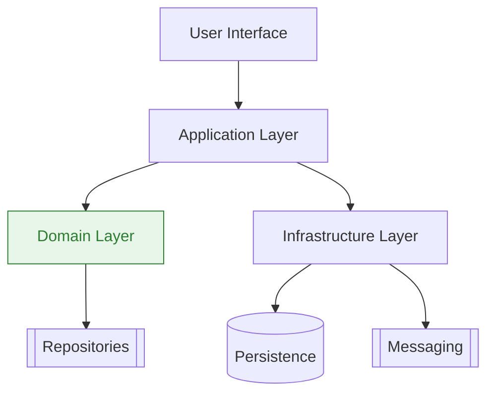

---

## Strategic DDD

### Bounded Contexts

- A bounded context defines the scope of a particular domain model and its ubiquitous language.
- Avoids accidental coupling across domain areas.
- Each context can have different models for similar terms if meanings differ.

Good vs bad boundaries:

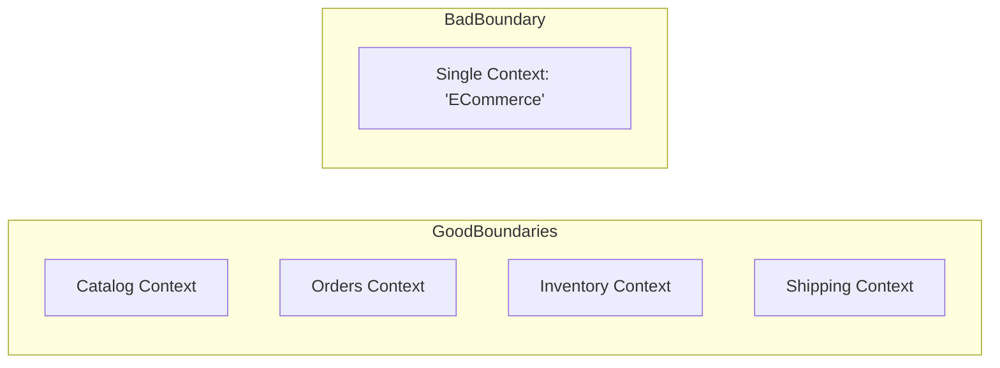

### Context Mapping Patterns

- Shared Kernel: small shared model subset maintained by collaborating teams.
- Customer/Supplier: upstream (supplier) influences downstream (customer) needs/priorities.
- Conformist: downstream adopts upstream’s model due to constraints.
- Anti-Corruption Layer (ACL): translation layer to protect your model from external influence.
- Open Host Service & Published Language: clear external protocol and schema for integration.

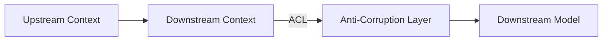

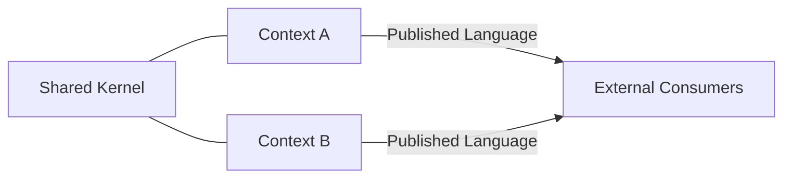

### Ubiquitous Language

- Build vocabulary with domain experts: terms, invariants, relationships.
- Use the language in code, diagrams, and documentation.

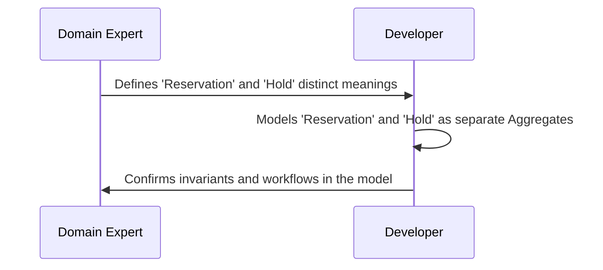

---

## Tactical DDD Patterns

All pseudocode below is language-agnostic and illustrative only.

### Entities

- Identity-based equality; mutable lifecycle within the aggregate boundary.

Pseudocode:
```
class Entity:
  id: Identifier

  method equals(other):
    return this.id == other.id
```

### Value Objects

- Equality by value; immutable; represent concepts like Money, Address, Email.

```
class Money:
  amount: Decimal
  currency: String

  constructor(amount, currency):
    assert amount >= 0
    this.amount = amount
    this.currency = currency

  method add(other: Money) -> Money:
    assert this.currency == other.currency
    return Money(this.amount + other.amount, this.currency)

  method equals(other) -> Boolean:
    return this.amount == other.amount and this.currency == other.currency
```

### Aggregates

- Cluster of entities and value objects with a single aggregate root enforcing invariants and transactional consistency.
- Maintain small aggregates with clear invariants to avoid contention.

``+
class Order(aggregate_root):
  id: Identifier
  lines: List<OrderLine>
  status: OrderStatus

  method addLine(productId, qty, price):
    assert status == 'DRAFT'
    assert qty > 0
    this.lines.append(OrderLine(productId, qty, price))

  method confirm():
    assert total() > 0
    this.status = 'CONFIRMED'

  method total() -> Money:
    sum = Money(0, 'USD')
    for line in lines:
      sum = sum.add(line.subtotal())
    return sum
``+

Aggregate visualization:
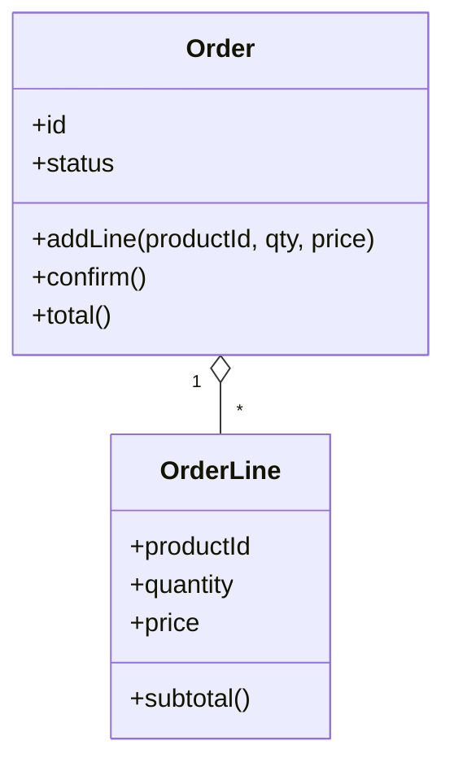

### Domain Events

- Represent meaningful domain occurrences, help decouple side-effects from core state transitions.
- Typically immutable, named in past tense.

```
event OrderConfirmed {
  orderId: Identifier
  occurredAt: Timestamp
}

class Order {
  ...
  method confirm():
    assert status == 'DRAFT' and total() > 0
    this.status = 'CONFIRMED'
    publish(OrderConfirmed(orderId=this.id, occurredAt=now()))
```

Event flow:
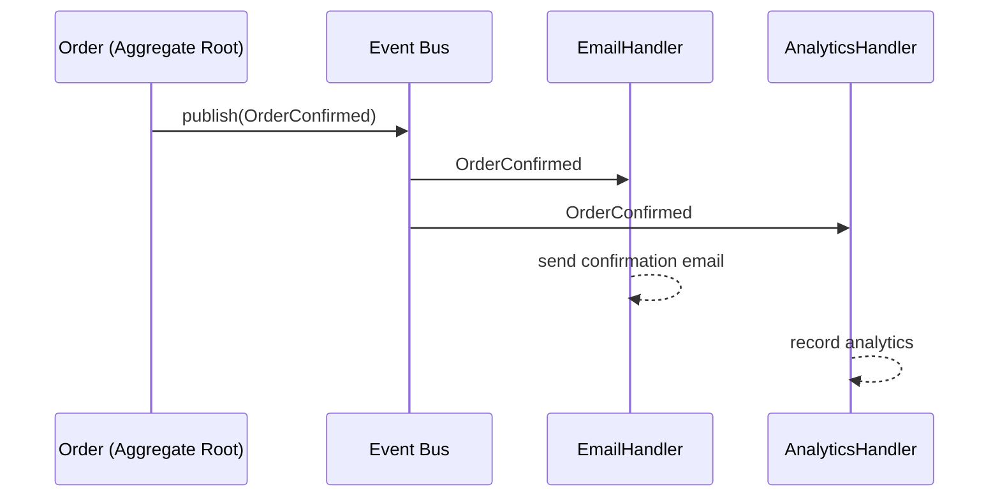

### Domain Services

- Stateless operations that don’t fit well inside a single entity/aggregate.

```
class PricingService:
  method calculate(order: Order) -> Money:
    # applies complex rules, promotions, taxes...
    return order.total() # placeholder
```

### Repositories

- Persistence abstraction that provides aggregate-level access methods.

```
interface OrderRepository:
  method byId(id: Identifier) -> Order | null
  method save(order: Order) -> void
  method findDraftsOlderThan(days: Integer) -> List<Order>
```

### Factories

- Encapsulate complex creation logic and enforce invariants at creation time.

```
class OrderFactory:
  method newDraft(customerId: Identifier) -> Order:
    order = Order(id=generateId(), status='DRAFT', lines=[])
    return order
```

### Specifications

- Encapsulate business rules that can be combined and reused for selection or validation.

```
interface Specification[T]:
  method isSatisfiedBy(candidate: T) -> Boolean

class MinimumLines(implements Specification[Order]):
  constructor(min: Integer)
  method isSatisfiedBy(order):
    return size(order.lines) >= this.min
```

---

## Layered Architecture in DDD

- Domain Layer: entities, value objects, aggregates, domain services, domain events, repositories (interfaces).
- Application Layer: orchestrates use cases, coordinates aggregates, handles transactions and events.
- Infrastructure Layer: technical details (DB, messaging, I/O) implementing domain interfaces.
- Presentation Layer: UI/API.

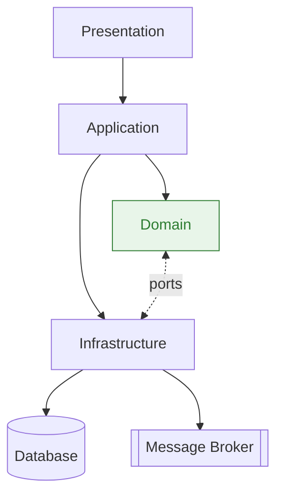

Comparison callout:
- MVC focuses on UI separation (Model/View/Controller).
- DDD layers focus on isolating domain logic from application and infrastructure concerns.

---

## Comparative Analysis: DDD vs Alternatives

### DDD vs MVC

- MVC is a presentation pattern; DDD is a domain modeling approach.
- MVC models are often data-centric or Active Record; DDD models are behavior-centric with aggregates and invariants.

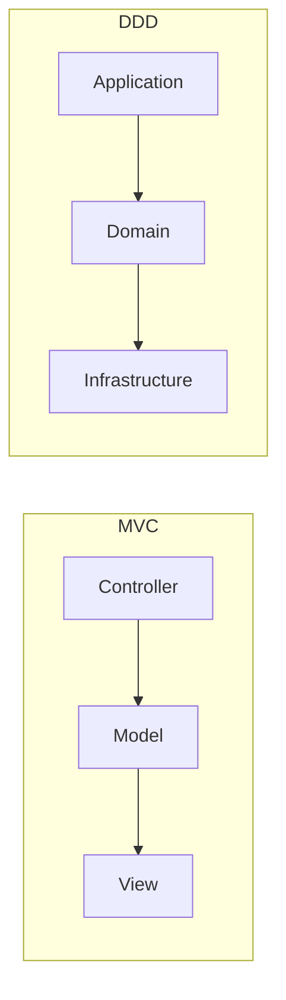

When MVC is sufficient:
- UI-heavy apps, simple business rules, CRUD forms, admin back offices.

When to prefer DDD:
- Complex business rules, multi-step workflows, many invariants, intricate state transitions.

### DDD vs MVP/MVVM

- MVP/MVVM primarily restructure presentation logic. DDD complements them by giving a rich domain beneath the presentation.
- Use MVP/MVVM for complex UI states; use DDD for complex business rules.

### DDD vs Transaction Script

- Transaction Script: procedural functions per use case; minimal modeling.
- Great for simple workflows and data transformations.
- Breaks down with cross-cutting invariants or complex rule composition.

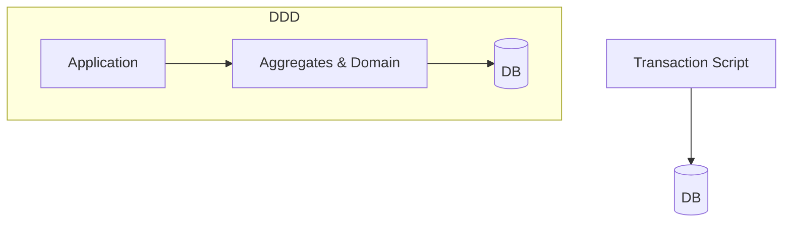

### DDD vs Anemic Domain Model

- Anemic: objects as data containers, behavior pushed to services.
- Easy to start but scatters business rules; invariants become implicit and fragile.
- Rich domain: behavior in aggregates; invariants explicit and testable.

### DDD vs CRUD-based Architecture

- CRUD is fast for simple create/read/update/delete screens.
- Fails when business rules demand validations across multiple fields/objects or require transactional consistency beyond a single table.

### DDD vs Active Record

- Active Record mixes persistence with domain logic; simple and productive for straightforward domains.
- DDD recommends repositories to isolate persistence and keep aggregates persistence-ignorant.

### DDD vs SOA

- SOA focuses on service boundaries and enterprise integration.
- DDD focuses on modeling within boundaries. They can coexist.
- Bounded Contexts help define cohesive service boundaries.

### DDD vs Event-Driven

- Event-driven is an integration and coordination style.
- DDD uses Domain Events internally; integration events connect contexts.
- Event Sourcing is an optional storage strategy that pairs with DDD when auditability is key.

### DDD vs Data-Driven

- Data-driven (DB-first) is effective for reporting, analytics, and CRUD systems.
- DDD (domain-first) is effective when behavior/invariants matter more than data structure.

### DDD vs Microservices

- Microservices are deployment units. DDD helps discover correct boundaries through Bounded Contexts.
- A monolith can still apply DDD; microservices without DDD can devolve into distributed CRUD.

Summary guidance:
- Prefer the simplest approach that satisfies current needs; adopt DDD where domain complexity demands it.

---

## Decision Framework: When (Not) to Use DDD

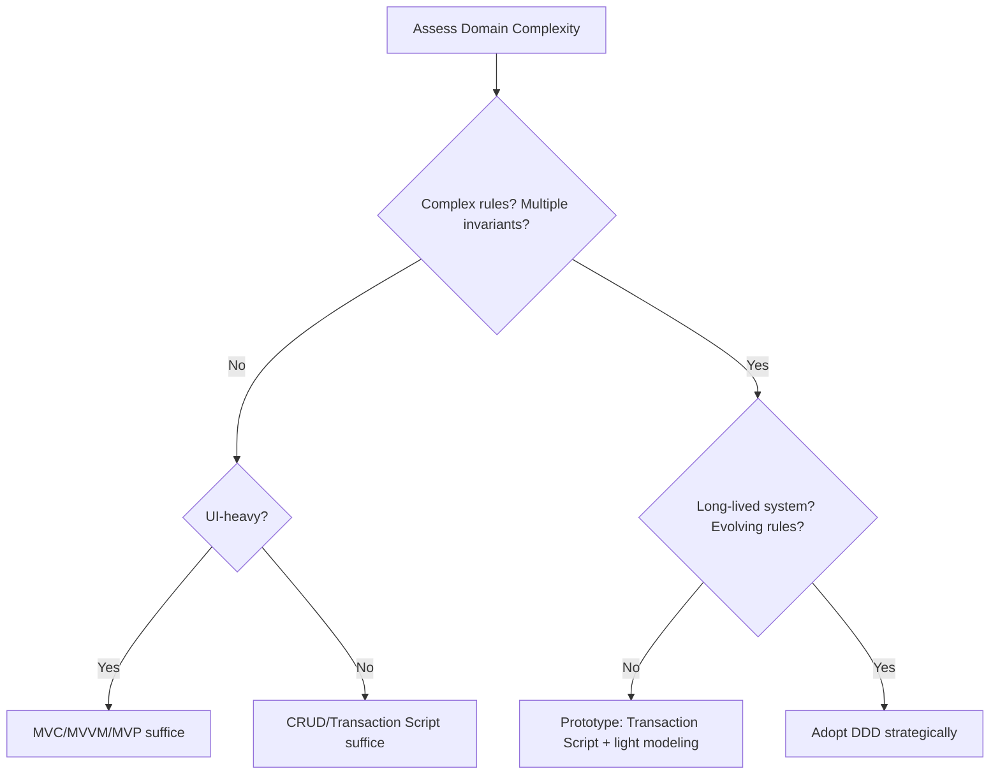

When to use DDD:
- Complex domain logic, long-lived system, evolving rules, multiple teams, high correctness needs.

When not to use DDD:
- Simple CRUD, short-lived prototypes, data/reporting pipelines, infrastructure-only projects.

Gradual adoption:
- Start with ubiquitous language, value objects, and a few aggregates.
- Add context mapping and ACLs as integrations grow.
- Scale into microservices when boundaries are stable.

---

## Real-World Patterns & Anti-Patterns

Common pitfalls:
- Anemic domain disguised as DDD.
- Over-large aggregates; transactional hotspots.
- Too many bounded contexts too early.
- Repository overload with query logic.

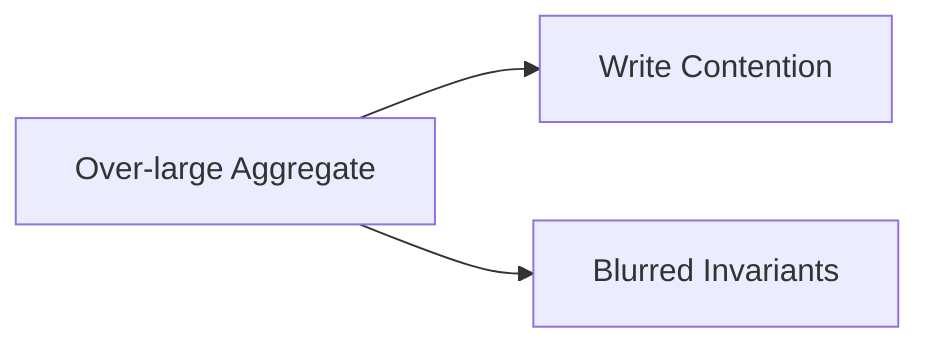

Success patterns:
- Event Storming workshops with domain experts.
- Context mapping before splitting teams/services.
- Model refactoring as language evolves.

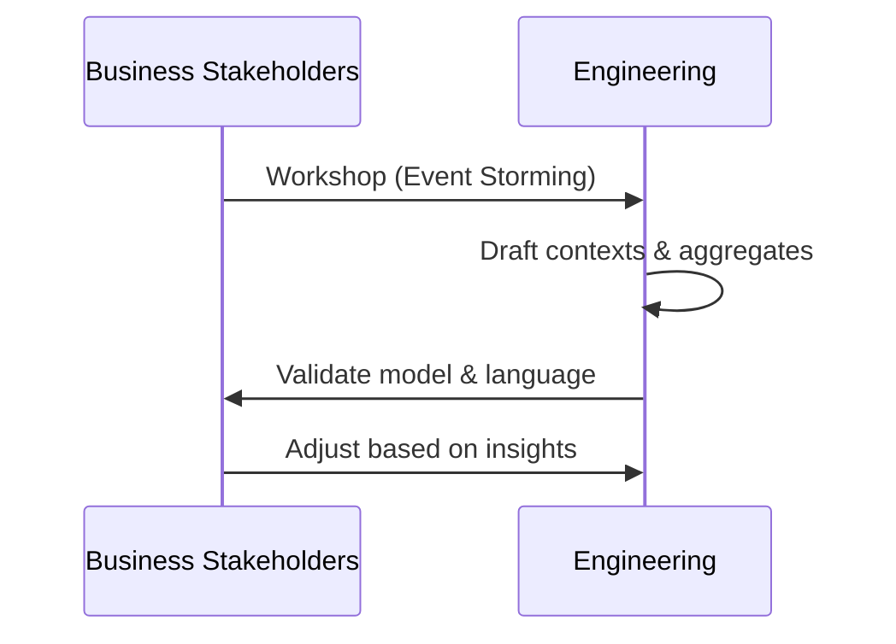

---

## Integration with Modern Practices

- Microservices alignment: Bounded Contexts inform service boundaries. See `microservices-patterns-php-vs-go.md`.
- CQRS: Split read/write models where justified. See `microservices-patterns-php-vs-go.md`.
- Event Sourcing: Immutable history for strong auditability. See `microservices-patterns-php-vs-go.md`.
- Hexagonal/Clean Architecture: Ports and adapters fit DDD well. See `system-architecture-patterns-php-vs-go.md`.
- Testing: Unit tests for aggregates and value objects; contract/integration tests across contexts. See `testing-patterns-php-vs-go.md`.

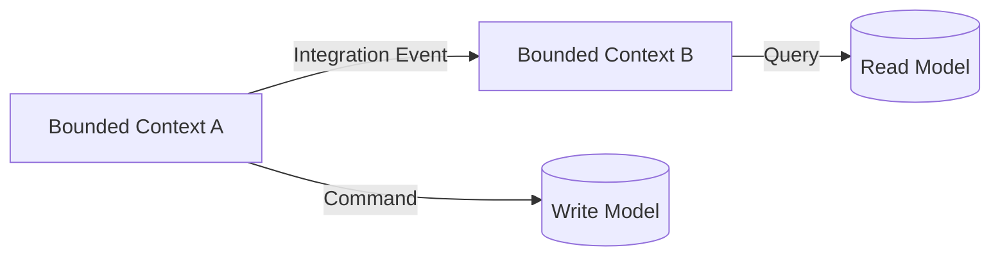

---

## Case Studies & Scenarios

### E-commerce (DDD success)
- Contexts: Catalog, Pricing, Orders, Inventory, Shipping.
- Aggregates: Order (root), OrderLine; InventoryItem; Shipment.
- Domain Events: OrderConfirmed, ItemsReserved, ShipmentCreated.

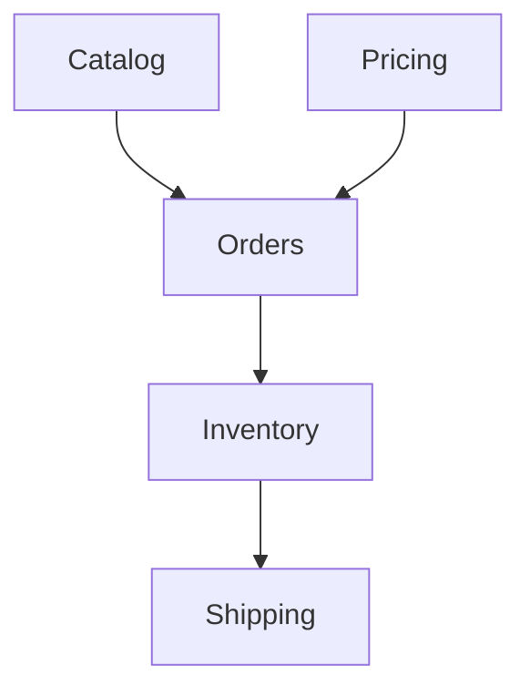

### Simple Blog (MVC was better)
- CRUD posts/comments, minimal rules.
- MVC or CRUD suffices; DDD is overkill.

### Trading Platform (DDD was right)
- Complex validations, state machines, risk controls.
- Rich domain with aggregates and domain services reduced defects and clarified invariants.

### Reporting System (CRUD was right)
- ETL and reporting with few business rules.
- Data-driven design and Transaction Scripts were simpler and faster.

---

## Quick Reference Tables

When to choose an approach:

| Scenario | Recommended Approach | Rationale |
| --- | --- | --- |
| UI-heavy forms, simple rules | MVC/MVP/MVVM | Presentation complexity dominates |
| Simple CRUD admin | CRUD/Transaction Script | Low domain complexity |
| Complex rules and invariants | DDD | Behavior-centric model needed |
| Analytics/reporting pipeline | Data-Driven | Data transformations dominate |
| Complex integrations | DDD + Context Mapping + ACL | Protect your model |

Core building blocks:

| Pattern | Purpose | Notes |
| --- | --- | --- |
| Entity | Identity-based behavior | Mutable inside aggregate |
| Value Object | Value-based equality | Immutable |
| Aggregate | Consistency boundary | One root per aggregate |
| Domain Event | Decouple side-effects | Named in past tense |
| Repository | Persistence abstraction | Return aggregates |
| Factory | Complex creation | Enforce invariants |
| Specification | Rule composition | Selection/validation |

---

## References & Further Reading

- Eric Evans, Domain-Driven Design: Tackling Complexity in the Heart of Software
- Vaughn Vernon, Implementing Domain-Driven Design
- Alberto Brandolini, Event Storming
- Martin Fowler, Patterns of Enterprise Application Architecture
- Series cross-references: `microservices-patterns-php-vs-go.md`, `system-architecture-patterns-php-vs-go.md`, `cross-cutting-patterns-php-vs-go.md`, `testing-patterns-php-vs-go.md`
- Data persistence companion: `data-persistence-patterns-sql-vs-nosql.md`


