# Modern Backend & Microservice Patterns: PHP vs. Go

**Part 2 of "Backend Design Patterns: PHP vs. Go"**

This document covers modern distributed system and microservice patterns, building on the GoF patterns from Part 1. See [Part 1: GoF Patterns](backend-design-patterns-php-vs-go.md) for foundational patterns, [Part 3: System Architecture Patterns](system-architecture-patterns-php-vs-go.md) for application architecture, [Part 4: Security, API Design, Performance & DevOps](cross-cutting-patterns-php-vs-go.md) for cross-cutting concerns, and [Part 5: Testing Patterns](testing-patterns-php-vs-go.md) for quality assurance.

---

## Table of Contents

1. [Pattern Categories](#pattern-categories)
2. [Dependency Injection vs. Service Locator](#dependency-injection-vs-service-locator)
3. [Communication Patterns](#communication-patterns)
   - [Middleware / HTTP Pipeline](#middleware--http-pipeline)
   - [Message Bus / Event-Driven Architecture](#message-bus--event-driven-architecture)
4. [External API Patterns](#external-api-patterns)
   - [API Gateway](#api-gateway)
   - [Backend-for-Frontend (BFF)](#backend-for-frontend-bff)
5. [Migration Patterns](#migration-patterns)
   - [Strangler Fig](#strangler-fig)
6. [Reliability Patterns](#reliability-patterns)
   - [Circuit Breaker](#circuit-breaker)
7. [Data Management Patterns](#data-management-patterns)
   - [CQRS](#cqrs)
   - [Event Sourcing](#event-sourcing)
   - [API Composition](#api-composition)
   - [Saga](#saga)
8. [Resilience Patterns](#resilience-patterns)
   - [Retry Pattern](#retry-pattern)
   - [Timeout Pattern](#timeout-pattern)
   - [Bulkhead Pattern](#bulkhead-pattern)
9. [Database Patterns](#database-patterns)
   - [Database per Service](#database-per-service)
   - [Transactional Outbox](#transactional-outbox)
   - [Shared Database Anti-Pattern](#shared-database-anti-pattern)
10. [Infrastructure Patterns](#infrastructure-patterns)
    - [Service Discovery](#service-discovery)
    - [Sidecar Pattern](#sidecar-pattern)
    - [Health Check API](#health-check-api)
11. [Observability Patterns](#observability-patterns)
    - [Distributed Tracing](#distributed-tracing)
    - [Log Aggregation](#log-aggregation)
    - [Application Metrics](#application-metrics)
    - [Exception Tracking](#exception-tracking)
12. [Conclusion](#conclusion)
13. [Continue the Series](#continue-the-series)
14. [References](#references)

---

## Pattern Categories

> **Quick Reference — Modern Patterns ☁️**
> - `Middleware/Pipeline`: Chain request/response processors for cross-cutting concerns.
> - `Message Bus`: Decouple components via async message passing.
> - `API Gateway`: Single ingress performing routing, auth, aggregation.
> - `Circuit Breaker`: Fail fast and avoid cascading outages.
> - `CQRS`: Split read and write models for scalability.
> - `Event Sourcing`: Persist every state change as an event log.
> - `Saga`: Coordinate multi-service workflows with compensations.
> - `Retry/Timeout/Bulkhead`: Resilience patterns for transient failures.
> - `Transactional Outbox`: Reliably publish events from DB transactions.
> - `Service Discovery`: Dynamically locate services in cloud environments.
> - `Health Check API`: Expose liveness and readiness probes.

---

## Dependency Injection vs. Service Locator

- **Dependency Injection (DI)**: Dependencies are passed in externally (constructor or setter). Encourages explicit wiring in Go and container-driven auto-wiring in PHP (e.g., Symfony).
- **Service Locator (SL)**: Objects fetch dependencies from a registry. Considered an anti-pattern due to hidden coupling and poor testability.

> **Verdict**: Prefer DI. Reserve Service Locator for legacy code or transitional phases.

---

## Communication Patterns

### Middleware / HTTP Pipeline

**Summary**: Process HTTP requests/responses through a chain of reusable middleware components, each handling cross-cutting concerns like authentication, logging, CORS, or compression.

- This is the **backbone** of modern web frameworks in both PHP and Go.
- Combines Chain of Responsibility with Decorator patterns.

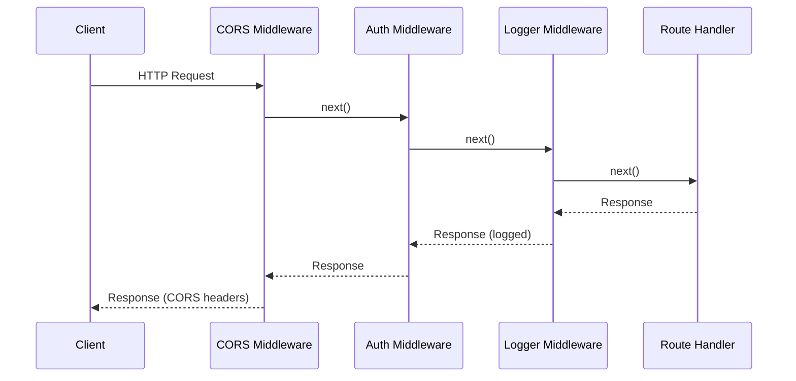

**Symfony HttpKernel Pipeline**

Symfony's request/response cycle processes through kernel events in order:

```php
use Symfony\Component\HttpKernel\Event\RequestEvent;
use Symfony\Component\HttpKernel\Event\ResponseEvent;
use Symfony\Component\EventDispatcher\EventSubscriberInterface;

class CorsMiddleware implements EventSubscriberInterface
{
    public function onKernelRequest(RequestEvent $event): void
    {
        $request = $event->getRequest();
        
        if ($request->getMethod() === 'OPTIONS') {
            $response = new Response('', 200);
            $this->addCorsHeaders($response);
            $event->setResponse($response);
        }
    }

    public function onKernelResponse(ResponseEvent $event): void
    {
        $this->addCorsHeaders($event->getResponse());
    }

    public static function getSubscribedEvents(): array
    {
        return [
            RequestEvent::class => ['onKernelRequest', 9999],
            ResponseEvent::class => ['onKernelResponse', 9999],
        ];
    }

    private function addCorsHeaders(Response $response): void
    {
        $response->headers->set('Access-Control-Allow-Origin', '*');
        $response->headers->set('Access-Control-Allow-Methods', 'GET, POST, PUT');
    }
}
```

**Gin Middleware Chain**

Gin executes middleware in registration order and allows short-circuiting:

```go
package main

import (
    "log"
    "time"
    "github.com/gin-gonic/gin"
)

// Logger middleware logs request duration
func Logger() gin.HandlerFunc {
    return func(c *gin.Context) {
        start := time.Now()
        
        c.Next() // Execute the rest of the chain
        
        duration := time.Since(start)
        log.Printf("%s %s - %d - %v", c.Request.Method, c.Request.URL.Path, 
            c.Writer.Status(), duration)
    }
}

// AuthRequired middleware checks JWT token
func AuthRequired() gin.HandlerFunc {
    return func(c *gin.Context) {
        token := c.GetHeader("Authorization")
        
        if !validateToken(token) {
            c.JSON(401, gin.H{"error": "Unauthorized"})
            c.Abort() // Stop the chain
            return
        }
        
        c.Set("user_id", extractUserID(token))
        c.Next() // Continue to next middleware/handler
    }
}

func main() {
    r := gin.New()
    
    // Global middleware (applies to all routes)
    r.Use(Logger(), gin.Recovery())
    
    // Public routes
    r.GET("/health", HealthCheck)
    
    // Protected routes group
    authorized := r.Group("/api")
    authorized.Use(AuthRequired()) // Group-specific middleware
    {
        authorized.GET("/users", GetUsers)
        authorized.POST("/orders", CreateOrder)
    }
    
    r.Run(":8080")
}
```

**Key Differences**

| Aspect | Symfony | Gin |
| --- | --- | --- |
| Pipeline Model | Event-driven kernel listeners with priorities | Sequential function chain with `c.Next()` |
| Ordering | Priority-based (higher numbers run first) | Registration order (first registered runs first) |
| Short-circuiting | `$event->stopPropagation()` or set response early | `c.Abort()` stops execution |
| Response Modification | Both request and response events available | Middleware wraps handler for pre/post logic |
| DI Integration | Full container integration via service config | Manual wiring, closures capture dependencies |

**When to Use**

- Authentication and authorization
- Request/response logging and metrics
- CORS, compression, rate limiting
- Request validation and sanitization
- Error handling and recovery

**Common Pitfall**

- **Symfony**: Forgetting event priorities can cause middleware to run out of order (e.g., auth running after cache).
- **Gin**: Forgetting `c.Next()` in middleware prevents downstream handlers from executing.

---

### Message Bus / Event-Driven Architecture

**Summary**: Decouple components by passing messages/commands/events through a central bus. Handlers subscribe to specific message types.

- Combines Mediator + Observer + Command patterns.
- Symfony Messenger and Go channels/event buses enable async processing and CQRS.

**Symfony Messenger**

Commands and events are dispatched to registered handlers:

```php
use Symfony\Component\Messenger\MessageBusInterface;
use Symfony\Component\Messenger\Handler\MessageHandlerInterface;

// Command
final class CreateUserCommand
{
    public function __construct(
        public readonly string $email,
        public readonly string $password
    ) {}
}

// Command Handler
final class CreateUserHandler implements MessageHandlerInterface
{
    public function __construct(
        private UserRepository $repo,
        private MessageBusInterface $eventBus
    ) {}

    public function __invoke(CreateUserCommand $command): void
    {
        $user = new User($command->email, $command->password);
        $this->repo->save($user);
        
        // Dispatch domain event
        $this->eventBus->dispatch(new UserCreatedEvent($user->getId()));
    }
}

// Event Subscriber (async via RabbitMQ/Redis)
final class SendWelcomeEmailSubscriber implements MessageHandlerInterface
{
    public function __invoke(UserCreatedEvent $event): void
    {
        $this->mailer->send(new WelcomeEmail($event->userId));
    }
}

// Usage in controller
$this->messageBus->dispatch(new CreateUserCommand($email, $password));
```

**Go Event Bus (Custom or Library)**

```go
package main

import (
    "fmt"
    "sync"
)

// Event types
type UserCreatedEvent struct {
    UserID string
    Email  string
}

type EventHandler func(interface{})

type EventBus struct {
    mu       sync.RWMutex
    handlers map[string][]EventHandler
}

func NewEventBus() *EventBus {
    return &EventBus{
        handlers: make(map[string][]EventHandler),
    }
}

func (bus *EventBus) Subscribe(eventType string, handler EventHandler) {
    bus.mu.Lock()
    defer bus.mu.Unlock()
    bus.handlers[eventType] = append(bus.handlers[eventType], handler)
}

func (bus *EventBus) Publish(eventType string, event interface{}) {
    bus.mu.RLock()
    handlers := bus.handlers[eventType]
    bus.mu.RUnlock()
    
    for _, handler := range handlers {
        go handler(event) // Async execution
    }
}

// Usage
func main() {
    bus := NewEventBus()
    
    // Register handlers
    bus.Subscribe("user.created", func(e interface{}) {
        evt := e.(UserCreatedEvent)
        fmt.Printf("Sending welcome email to %s\n", evt.Email)
    })
    
    bus.Subscribe("user.created", func(e interface{}) {
        evt := e.(UserCreatedEvent)
        fmt.Printf("Creating user analytics record for %s\n", evt.UserID)
    })
    
    // Publish event
    bus.Publish("user.created", UserCreatedEvent{
        UserID: "123",
        Email:  "user@example.com",
    })
}
```

**Using Go Channels for Pub/Sub**

```go
type OrderPlacedEvent struct {
    OrderID   string
    Total     float64
    Timestamp time.Time
}

// Event dispatcher using channels
func EventProcessor(events <-chan OrderPlacedEvent) {
    for event := range events {
        go sendInvoiceEmail(event)
        go updateInventory(event)
        go recordAnalytics(event)
    }
}

// Usage
eventChan := make(chan OrderPlacedEvent, 100)
go EventProcessor(eventChan)

// Publish event
eventChan <- OrderPlacedEvent{
    OrderID:   "ORD-123",
    Total:     99.99,
    Timestamp: time.Now(),
}
```

**When to Use**

- Decoupling domain logic from side effects (emails, notifications, analytics)
- Async processing of long-running tasks
- Implementing CQRS or event sourcing
- Building resilient systems with retry/dead-letter queues

**Key Benefits**

- Single responsibility: handlers focus on one task
- Testability: mock the message bus, test handlers in isolation
- Scalability: async handlers can run in separate workers

**Trade-offs**

- Increased complexity: indirection makes flow harder to trace
- Eventual consistency: handlers may execute out of order or fail independently
- Debugging: errors in async handlers require robust observability

---

## External API Patterns

### API Gateway

- A single entry point for client requests, handling routing, aggregation, and cross-cutting concerns like authentication or rate limiting.
- Go's concurrency and `net/http` tools make it a strong choice for building gateways.

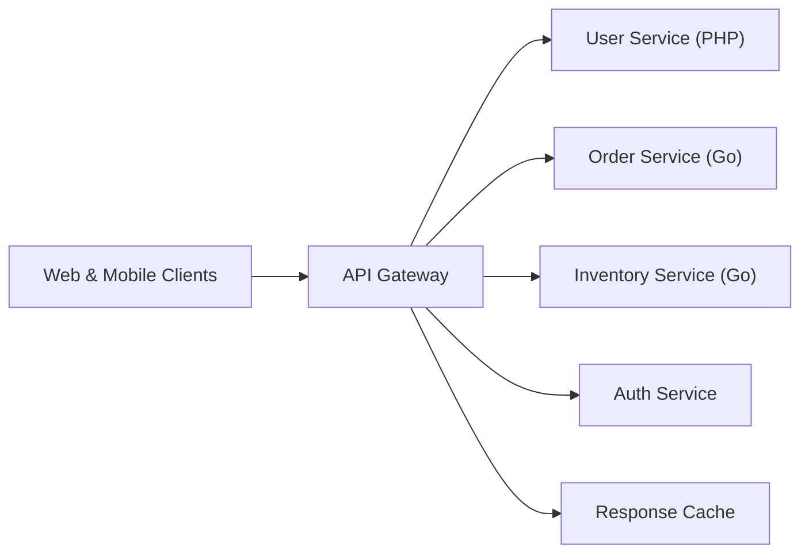

### Backend-for-Frontend (BFF)

- Specialized gateways tailored to different clients (web vs. mobile).
- Use PHP for complex web responses, Go for lightweight mobile APIs.

---

## Migration Patterns

### Strangler Fig

- Proxy legacy monolith traffic and progressively route new features to microservices.
- Go-based gateway can "strangle" a PHP monolith by rerouting per endpoint.

---

## Reliability Patterns

### Circuit Breaker

- Monitor remote service failures and open the circuit to fail fast after a threshold.
- Prevent cascading outages and allow services time to recover.

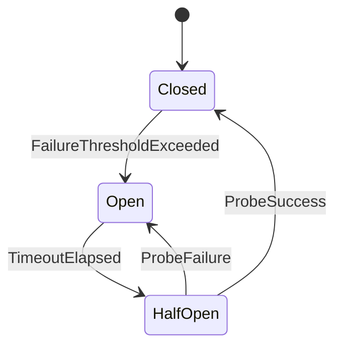

**When to Use**

- Upstream dependencies are unreliable or have unpredictable latency.
- You need to protect cascading failures in highly available systems.

**Key Benefits**

- Improves system resilience and fault isolation.
- Enables rapid failure detection and fallback strategies.

**Trade-offs**

- Requires careful tuning of thresholds and cool-down periods.
- Adds complexity to monitoring and observability pipelines.

**Real-world Example**

- Wrapping a legacy payment provider call behind a circuit breaker to avoid blocking the checkout flow when the provider is overloaded.

```go
type Breaker struct {
    mu        sync.Mutex
    state     State
    failures  int
    threshold int
    timeout   time.Duration
    openedAt  time.Time
}

func (b *Breaker) Call(fn func() error) error {
    if !b.allow() {
        return ErrCircuitOpen
    }

    if err := fn(); err != nil {
        b.recordFailure()
        return err
    }

    b.reset()
    return nil
}
```

**Common Pitfall**

- Forgetting to provide fallback logic (e.g., cached responses) can still result in a poor user experience even though the breaker trips properly.

---

## Data Management Patterns

### CQRS

- Separate write models (commands) from read models (queries).
- Write service emits events; read service builds optimized denormalized views.

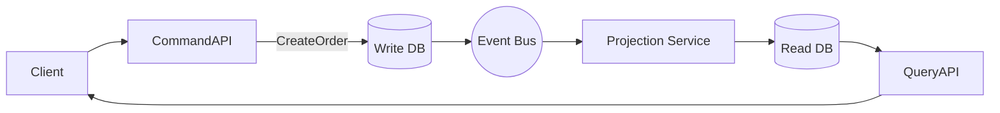

**When to Use**

- Read and write workloads have different performance or scaling requirements.
- The domain benefits from clear separation between command validation and query optimization.

**Key Benefits**

- Enables independent scaling of write and read paths.
- Simplifies read models by tailoring them to client queries.

**Trade-offs**

- Eventual consistency between write and read models can complicate UX.
- Requires additional infrastructure (event buses, projection services).

**Real-world Example**

- E-commerce checkout systems where orders (commands) are written to a transactional store, and customer dashboards read from a pre-computed view.

```go
type CreateOrder struct {
    CustomerID string
    Items      []Item
}

type OrderHandler struct {
    repo OrderRepository
    bus  EventBus
}

func (h *OrderHandler) Handle(cmd CreateOrder) error {
    order := NewOrder(cmd.CustomerID, cmd.Items)
    if err := h.repo.Save(order); err != nil {
        return err
    }
    return h.bus.Publish(OrderCreated{ID: order.ID})
}
```

**Common Pitfall**

- Failing to document consistency expectations can lead to confusion when users see stale data on read models.

---

### API Composition

**Summary**: Implement queries that retrieve data from multiple services by composing/aggregating responses from each service.

- Solves the challenge of querying data in a microservices architecture where each service owns its database.
- The API Composer orchestrates parallel calls to services and combines results.
- Alternative to CQRS read models when eventual consistency is not acceptable.

**Pattern Reference**: [API Composition Pattern - Microservices.io](https://microservices.io/patterns/data/api-composition.html)

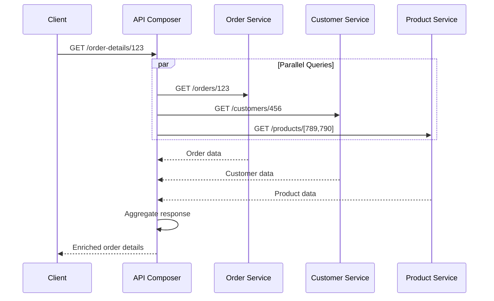

**Symfony Implementation**

```php
namespace App\Query;

use Symfony\Contracts\HttpClient\HttpClientInterface;
use Symfony\Component\HttpClient\Exception\TransportException;

class OrderDetailsComposer
{
    public function __construct(
        private HttpClientInterface $httpClient,
        private string $orderServiceUrl,
        private string $customerServiceUrl,
        private string $productServiceUrl
    ) {}

    public function getOrderDetails(string $orderId): OrderDetailsDTO
    {
        // Make parallel HTTP requests
        $responses = [
            'order' => $this->httpClient->request('GET', "{$this->orderServiceUrl}/orders/{$orderId}"),
            'customer' => null, // Will be filled after getting order
            'products' => null,
        ];

        try {
            // Get order first
            $orderData = $responses['order']->toArray();
            $customerId = $orderData['customerId'];
            $productIds = array_column($orderData['items'], 'productId');

            // Now fetch customer and products in parallel
            $responses['customer'] = $this->httpClient->request(
                'GET', 
                "{$this->customerServiceUrl}/customers/{$customerId}"
            );
            $responses['products'] = $this->httpClient->request(
                'GET', 
                "{$this->productServiceUrl}/products?ids=" . implode(',', $productIds)
            );

            // Wait for all responses
            $customerData = $responses['customer']->toArray();
            $productsData = $responses['products']->toArray();

            // Compose the result
            return new OrderDetailsDTO(
                order: $orderData,
                customer: $customerData,
                products: $productsData
            );

        } catch (TransportException $e) {
            // Handle partial failures
            throw new OrderDetailsUnavailableException(
                "Failed to fetch order details: {$e->getMessage()}"
            );
        }
    }

    public function getOrderDetailsBatch(array $orderIds): array
    {
        // Batch version for better performance
        $results = [];
        $promises = [];

        foreach ($orderIds as $orderId) {
            $promises[$orderId] = $this->httpClient->request(
                'GET', 
                "{$this->orderServiceUrl}/orders/{$orderId}"
            );
        }

        foreach ($promises as $orderId => $response) {
            try {
                $results[$orderId] = $this->getOrderDetails($orderId);
            } catch (\Exception $e) {
                $results[$orderId] = null; // Partial failure handling
            }
        }

        return array_filter($results);
    }
}
```

**Go Implementation with Gin**

```go
package api

import (
    "context"
    "encoding/json"
    "fmt"
    "net/http"
    "strings"
    "sync"
    "time"
    "github.com/gin-gonic/gin"
)

type OrderDetailsComposer struct {
    orderServiceURL    string
    customerServiceURL string
    productServiceURL  string
    httpClient         *http.Client
}

type OrderDetailsDTO struct {
    Order    OrderData     `json:"order"`
    Customer CustomerData  `json:"customer"`
    Products []ProductData `json:"products"`
}

func (c *OrderDetailsComposer) GetOrderDetails(ctx context.Context, orderID string) (*OrderDetailsDTO, error) {
    // Create context with timeout
    ctx, cancel := context.WithTimeout(ctx, 5*time.Second)
    defer cancel()

    // Step 1: Fetch order
    orderData, err := c.fetchOrder(ctx, orderID)
    if err != nil {
        return nil, fmt.Errorf("failed to fetch order: %w", err)
    }

    // Step 2: Fetch customer and products in parallel
    var (
        customerData CustomerData
        productsData []ProductData
        wg           sync.WaitGroup
        errChan      = make(chan error, 2)
    )

    wg.Add(2)

    // Fetch customer
    go func() {
        defer wg.Done()
        data, err := c.fetchCustomer(ctx, orderData.CustomerID)
        if err != nil {
            errChan <- fmt.Errorf("customer fetch failed: %w", err)
            return
        }
        customerData = data
    }()

    // Fetch products
    go func() {
        defer wg.Done()
        productIDs := extractProductIDs(orderData.Items)
        data, err := c.fetchProducts(ctx, productIDs)
        if err != nil {
            errChan <- fmt.Errorf("products fetch failed: %w", err)
            return
        }
        productsData = data
    }()

    // Wait for all goroutines
    wg.Wait()
    close(errChan)

    // Check for errors
    for err := range errChan {
        if err != nil {
            return nil, err
        }
    }

    return &OrderDetailsDTO{
        Order:    orderData,
        Customer: customerData,
        Products: productsData,
    }, nil
}

func (c *OrderDetailsComposer) fetchOrder(ctx context.Context, orderID string) (OrderData, error) {
    url := fmt.Sprintf("%s/orders/%s", c.orderServiceURL, orderID)
    req, _ := http.NewRequestWithContext(ctx, "GET", url, nil)
    
    resp, err := c.httpClient.Do(req)
    if err != nil {
        return OrderData{}, err
    }
    defer resp.Body.Close()

    if resp.StatusCode != http.StatusOK {
        return OrderData{}, fmt.Errorf("order service returned %d", resp.StatusCode)
    }

    var data OrderData
    if err := json.NewDecoder(resp.Body).Decode(&data); err != nil {
        return OrderData{}, err
    }

    return data, nil
}

func (c *OrderDetailsComposer) fetchCustomer(ctx context.Context, customerID string) (CustomerData, error) {
    url := fmt.Sprintf("%s/customers/%s", c.customerServiceURL, customerID)
    req, _ := http.NewRequestWithContext(ctx, "GET", url, nil)
    
    resp, err := c.httpClient.Do(req)
    if err != nil {
        return CustomerData{}, err
    }
    defer resp.Body.Close()

    var data CustomerData
    json.NewDecoder(resp.Body).Decode(&data)
    return data, nil
}

func (c *OrderDetailsComposer) fetchProducts(ctx context.Context, productIDs []string) ([]ProductData, error) {
    url := fmt.Sprintf("%s/products?ids=%s", c.productServiceURL, strings.Join(productIDs, ","))
    req, _ := http.NewRequestWithContext(ctx, "GET", url, nil)
    
    resp, err := c.httpClient.Do(req)
    if err != nil {
        return nil, err
    }
    defer resp.Body.Close()

    var data []ProductData
    json.NewDecoder(resp.Body).Decode(&data)
    return data, nil
}

// Gin handler
func (c *OrderDetailsComposer) HandleGetOrderDetails(ctx *gin.Context) {
    orderID := ctx.Param("id")
    
    details, err := c.GetOrderDetails(ctx.Request.Context(), orderID)
    if err != nil {
        ctx.JSON(500, gin.H{"error": err.Error()})
        return
    }
    
    ctx.JSON(200, details)
}
```

**When to Use**

- Query spans multiple services and eventual consistency is not acceptable
- Simple queries with low latency requirements
- Number of services to query is small (2-4 services)
- Read-heavy workload where CQRS read models would be overkill

**Key Benefits**

- Strong consistency: Always returns current data
- Simple to implement: No event processing infrastructure needed
- No data duplication: Services remain authoritative sources

**Trade-offs**

- **Higher latency**: Network calls to multiple services add up
- **Reduced availability**: Failure in any service breaks the query
- **Increased load**: Each query hits multiple services
- **Complexity**: Error handling and partial failure scenarios

**Comparison with CQRS**

| Aspect | API Composition | CQRS Read Models |
| --- | --- | --- |
| Consistency | Strong (real-time) | Eventual |
| Latency | Higher (multiple network calls) | Lower (single query) |
| Availability | Lower (depends on all services) | Higher (read model is cached) |
| Complexity | Lower (no event processing) | Higher (event handling, projections) |
| Data Duplication | None | Read model duplicates data |
| Best For | Simple queries, small # of services | Complex queries, high-scale reads |

**Real-world Example**

- E-commerce product detail page combining product info, reviews, inventory, and pricing from separate services
- Customer dashboard showing orders, profile, and loyalty points from different bounded contexts

**Common Pitfalls**

- **N+1 Problem**: Fetching related entities one-by-one instead of batching
- **No Timeout**: Slow service blocks entire composition
- **No Fallback**: One service failure breaks entire response
- **No Caching**: Repeatedly fetching rarely-changed data

**Optimization Strategies**

```php
// 1. Use response caching for rarely-changed data
$cacheKey = "customer:{$customerId}";
$customerData = $this->cache->get($cacheKey, function() use ($customerId) {
    return $this->httpClient->request('GET', "/customers/{$customerId}")->toArray();
});

// 2. Implement fallback for non-critical data
try {
    $productsData = $this->fetchProducts($productIds);
} catch (TransportException $e) {
    $productsData = []; // Partial response is acceptable
}
```

```go
// 1. Use circuit breaker to fail fast
if c.productCircuitBreaker.IsOpen() {
    productsData = []ProductData{} // Return empty, don't wait
} else {
    productsData, err = c.fetchProducts(ctx, productIDs)
}

// 2. Implement response caching
func (c *OrderDetailsComposer) fetchCustomerCached(ctx context.Context, customerID string) (CustomerData, error) {
    cacheKey := fmt.Sprintf("customer:%s", customerID)
    
    if cached, found := c.cache.Get(cacheKey); found {
        return cached.(CustomerData), nil
    }
    
    data, err := c.fetchCustomer(ctx, customerID)
    if err == nil {
        c.cache.Set(cacheKey, data, 5*time.Minute)
    }
    return data, err
}
```

---

### Event Sourcing

- Store immutable events instead of current state.
- Replay events to rebuild state; pairs naturally with CQRS.

**When to Use**

- Auditability and traceability are critical.
- Business logic benefits from replaying history (debugging, forecasting).

**Key Benefits**

- Provides a complete audit log and allows retroactive insight generation.
- Enables rebuilding projections or migrating data by replaying events.

**Trade-offs**

- Event schema evolution must be managed carefully to avoid breaking replays.
- Replaying long event streams can be expensive without snapshots.

**Real-world Example**

- Financial ledgers where each credit/debit is stored as an immutable event, enabling accurate compliance reports.

```php
final class Account
{
    /** @var DomainEvent[] */
    private array $changes = [];

    public function deposit(int $amount): void
    {
        $this->apply(new MoneyDeposited($amount));
    }

    private function apply(DomainEvent $event): void
    {
        $this->mutate($event);
        $this->changes[] = $event;
    }
}
```

```go
type Account struct {
    Balance int
    events  []Event
}

func (a *Account) Apply(evt Event) {
    switch e := evt.(type) {
    case MoneyDeposited:
        a.Balance += e.Amount
    }
    a.events = append(a.events, evt)
}
```

**Common Pitfall**

- Skipping snapshotting can lead to slow recovery times as event counts grow.

---

### Saga

- Manage distributed transactions via a sequence of local steps with compensating actions.
- Common in order/payment workflows where atomic transactions aren't feasible.

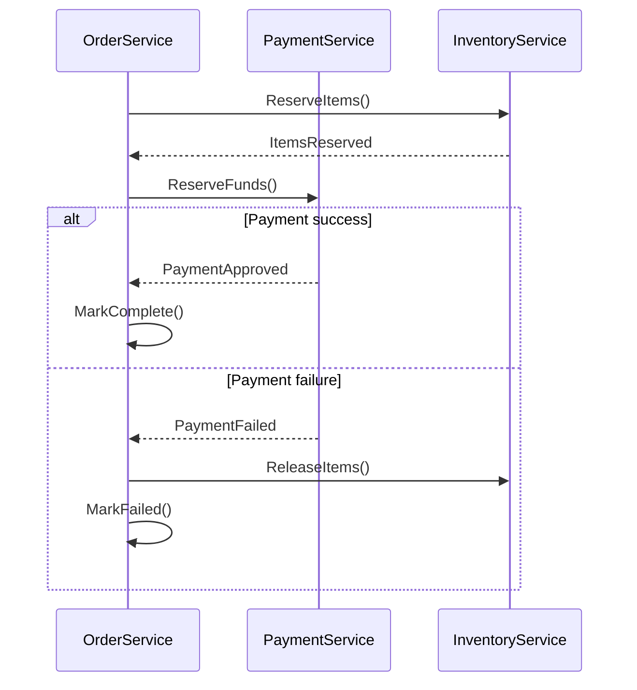

**When to Use**

- Business workflows span multiple microservices with independent data stores.
- You need to maintain consistency without global transactions.

**Key Benefits**

- Coordinates complex multi-service operations reliably.
- Supports compensating actions to roll back partial failures.

**Trade-offs**

- Requires explicit modeling of compensating transactions.
- Orchestration vs. choreography styles introduce different complexity profiles.

**Real-world Example**

- Travel booking: reserve flight, hotel, and rental car. Failure in one step triggers compensations for already reserved services.

**Common Pitfall**

- Neglecting idempotency in saga steps can cause duplicate side effects during retries.

---

## Resilience Patterns

Resilience patterns help systems gracefully handle failures, maintain availability, and recover from transient faults.

### Retry Pattern

**Summary**: Automatically retry failed operations with configurable backoff strategies to handle transient failures.

- Essential for network calls, database operations, and external API interactions.
- Combined with exponential backoff and jitter to avoid thundering herd problems.

**Symfony Implementation**

```php
use Symfony\Component\HttpClient\Retry\GenericRetryStrategy;
use Symfony\Component\HttpClient\RetryableHttpClient;
use Symfony\Component\HttpClient\HttpClient;

// Configure retry strategy
$retryStrategy = new GenericRetryStrategy(
    statusCodes: [423, 425, 429, 500, 502, 503, 504],
    delayMs: 1000,
    multiplier: 2.0,
    maxDelayMs: 10000,
    jitter: 0.1
);

$client = new RetryableHttpClient(
    HttpClient::create(),
    $retryStrategy,
    maxRetries: 3
);

try {
    $response = $client->request('GET', 'https://api.example.com/data');
    $data = $response->toArray();
} catch (TransportExceptionInterface $e) {
    // All retries exhausted
    $this->logger->error('API call failed after retries', ['error' => $e->getMessage()]);
}
```

**Go Implementation with Gin**

```go
package main

import (
    "context"
    "errors"
    "math"
    "math/rand"
    "time"
    "github.com/gin-gonic/gin"
)

type RetryConfig struct {
    MaxRetries  int
    InitialWait time.Duration
    MaxWait     time.Duration
    Multiplier  float64
}

func RetryWithBackoff(ctx context.Context, cfg RetryConfig, operation func() error) error {
    var lastErr error
    
    for attempt := 0; attempt <= cfg.MaxRetries; attempt++ {
        if attempt > 0 {
            // Exponential backoff with jitter
            wait := time.Duration(float64(cfg.InitialWait) * math.Pow(cfg.Multiplier, float64(attempt-1)))
            if wait > cfg.MaxWait {
                wait = cfg.MaxWait
            }
            
            // Add jitter (±10%)
            jitter := time.Duration(rand.Float64() * 0.2 * float64(wait)) - time.Duration(0.1*float64(wait))
            wait += jitter
            
            select {
            case <-time.After(wait):
            case <-ctx.Done():
                return ctx.Err()
            }
        }
        
        if err := operation(); err != nil {
            lastErr = err
            
            // Don't retry on permanent errors
            if errors.Is(err, context.Canceled) || !isRetryable(err) {
                return err
            }
            continue
        }
        
        return nil // Success
    }
    
    return lastErr
}

func isRetryable(err error) bool {
    // Implement your retry logic
    return true
}

// Usage example: Retry HTTP client calls
func FetchUserWithRetry(ctx context.Context, userID string) (*User, error) {
    cfg := RetryConfig{
        MaxRetries:  3,
        InitialWait: 100 * time.Millisecond,
        MaxWait:     5 * time.Second,
        Multiplier:  2.0,
    }

    var user *User
    err := RetryWithBackoff(ctx, cfg, func() error {
        resp, err := http.Get(fmt.Sprintf("https://api.example.com/users/%s", userID))
        if err != nil {
            return err
        }
        defer resp.Body.Close()

        if resp.StatusCode >= 500 {
            return fmt.Errorf("server error: %d", resp.StatusCode)
        }

        return json.NewDecoder(resp.Body).Decode(&user)
    })

    return user, err
}
```

**When to Use**

- Network calls to unreliable services
- Database deadlock scenarios
- Rate-limited API interactions
- Cloud service transient failures

**Common Pitfall**

- Retrying non-idempotent operations (like payments) can cause duplicate processing.

---

### Timeout Pattern

**Summary**: Set maximum wait times for operations to prevent indefinite blocking and resource exhaustion.

- Critical for maintaining system responsiveness.
- Prevents cascading failures in distributed systems.

**Symfony Implementation**

```php
use Symfony\Component\HttpClient\HttpClient;

$client = HttpClient::create([
    'timeout' => 2.5,           // Overall request timeout
    'max_duration' => 10.0,     // Maximum duration including redirects
]);

// Per-request timeout override
$response = $client->request('GET', 'https://slow-api.com/data', [
    'timeout' => 5.0,
]);
```

**Go Implementation with Context**

```go
func FetchUserData(c *gin.Context) {
    // Create context with timeout
    ctx, cancel := context.WithTimeout(c.Request.Context(), 3*time.Second)
    defer cancel()
    
    // Channel for result
    type result struct {
        data *User
        err  error
    }
    resultChan := make(chan result, 1)
    
    // Execute operation in goroutine
    go func() {
        user, err := userService.GetUser(ctx, userID)
        resultChan <- result{user, err}
    }()
    
    // Wait for result or timeout
    select {
    case res := <-resultChan:
        if res.err != nil {
            c.JSON(500, gin.H{"error": res.err.Error()})
            return
        }
        c.JSON(200, res.data)
    case <-ctx.Done():
        c.JSON(504, gin.H{"error": "Request timeout"})
    }
}
```

**Key Considerations**

| Aspect | Recommendation |
| --- | --- |
| Read timeout | 5-30 seconds for typical APIs |
| Write timeout | 10-60 seconds for uploads |
| Connection timeout | 2-5 seconds |
| Graceful degradation | Return cached/default data on timeout |

---

### Bulkhead Pattern

**Summary**: Isolate resources into pools to prevent a failure in one area from cascading to others.

- Named after ship compartments that prevent flooding from spreading.
- Limits concurrent requests to protect system resources.

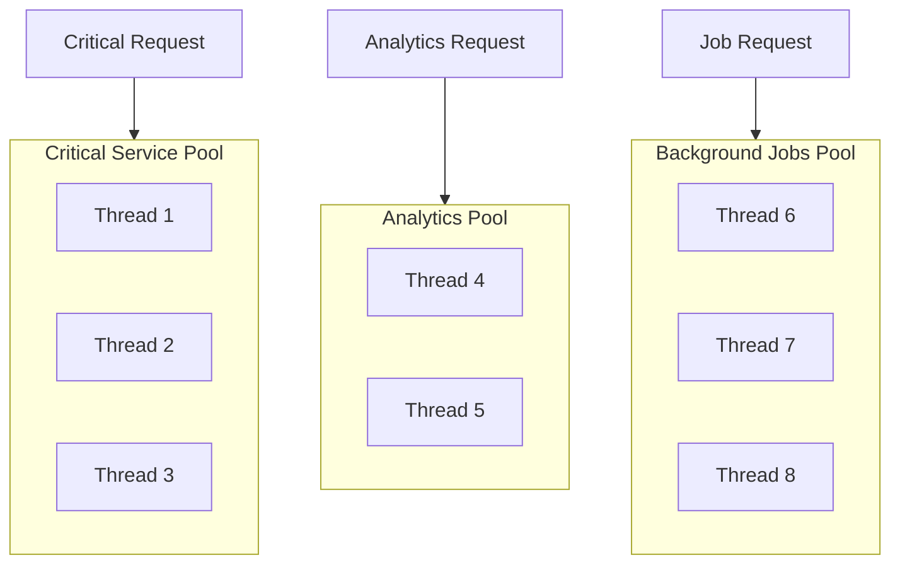

**Go Implementation**

```go
package main

import (
    "context"
    "errors"
    "github.com/gin-gonic/gin"
)

type Bulkhead struct {
    sem chan struct{}
}

func NewBulkhead(maxConcurrent int) *Bulkhead {
    return &Bulkhead{
        sem: make(chan struct{}, maxConcurrent),
    }
}

func (b *Bulkhead) Execute(ctx context.Context, fn func() error) error {
    select {
    case b.sem <- struct{}{}:
        defer func() { <-b.sem }()
        return fn()
    case <-ctx.Done():
        return errors.New("bulkhead: request rejected, pool exhausted")
    }
}

// Usage in Gin
var (
    criticalBulkhead   = NewBulkhead(10)  // Max 10 concurrent critical operations
    analyticsBulkhead  = NewBulkhead(5)   // Max 5 concurrent analytics calls
)

func CriticalEndpoint(c *gin.Context) {
    err := criticalBulkhead.Execute(c.Request.Context(), func() error {
        // Execute critical operation
        return processPayment(c)
    })
    
    if err != nil {
        c.JSON(429, gin.H{"error": "Service capacity exceeded"})
        return
    }
    
    c.JSON(200, gin.H{"status": "success"})
}
```

**Symfony Implementation**

```php
use Predis\Client as RedisClient;

class BulkheadService
{
    public function __construct(private RedisClient $redis) {}

    public function execute(string $poolName, int $maxConcurrent, callable $operation): mixed
    {
        $key = "bulkhead:{$poolName}";

        // Increment counter
        $current = $this->redis->incr($key);

        if ($current > $maxConcurrent) {
            $this->redis->decr($key);
            throw new \RuntimeException('Resource pool exhausted');
        }

        try {
            return $operation();
        } finally {
            $this->redis->decr($key);
        }
    }
}

// Usage
try {
    $result = $bulkhead->execute('payment-pool', 10, function() {
        return $this->paymentService->process($order);
    });
} catch (\RuntimeException $e) {
    return new JsonResponse(['error' => 'Too many concurrent requests'], 429);
}
```

**When to Use**

- Protecting critical services from resource starvation
- Isolating expensive operations (DB queries, external APIs)
- Multi-tenant systems requiring fair resource allocation

---

## Database Patterns

### Database per Service

**Summary**: Each microservice owns its private database schema, ensuring loose coupling and independent scaling.

- Fundamental to microservices architecture.
- Enables polyglot persistence (PostgreSQL, MongoDB, Redis per service needs).

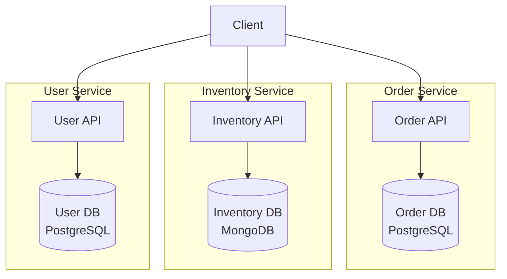

**Trade-offs**

| Aspect | Benefit | Challenge |
| --- | --- | --- |
| Independence | Deploy/scale services independently | Distributed transactions are complex |
| Technology choice | Use optimal DB per service | Higher operational overhead |
| Data integrity | Service-level consistency | Cross-service queries require APIs |
| Failure isolation | DB failure affects only one service | Eventual consistency across services |

**Implementation Notes**

- **Symfony**: Use Doctrine with multiple entity managers, each configured for a different database.
- **Go**: Use separate database connections per service package.

---

### Transactional Outbox

**Summary**: Ensure reliable event publishing by storing events in the same database transaction as business data, then publishing them asynchronously.

- Solves the dual-write problem (updating DB + publishing event atomically).
- Guarantees at-least-once delivery semantics.

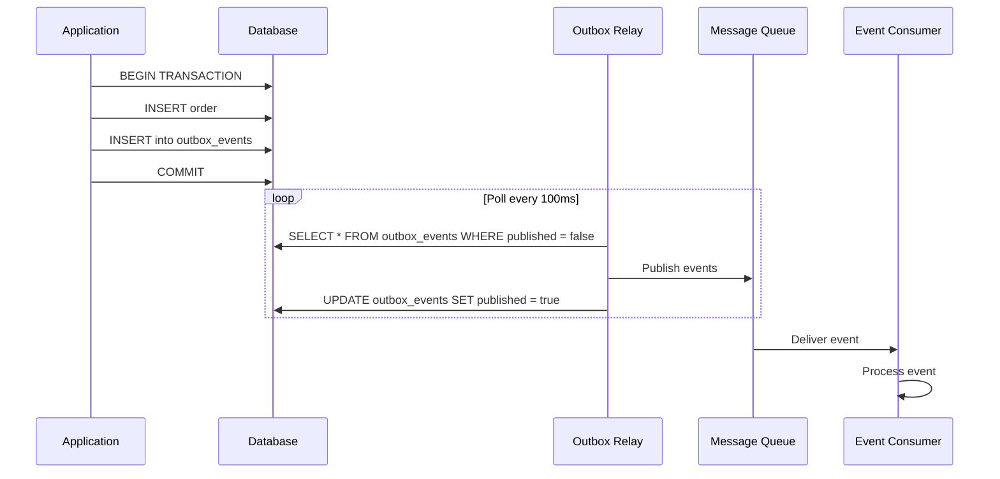

**Symfony Implementation**

```php
use Doctrine\ORM\EntityManagerInterface;
use Symfony\Component\Messenger\MessageBusInterface;

final class OrderService
{
    public function __construct(
        private EntityManagerInterface $em,
        private MessageBusInterface $bus
    ) {}

    public function placeOrder(CreateOrderCommand $command): void
    {
        $this->em->beginTransaction();
        try {
            // 1. Save business entity
            $order = new Order($command->customerId, $command->items);
            $this->em->persist($order);
            
            // 2. Save event to outbox table
            $event = new OutboxEvent(
                aggregateId: $order->getId(),
                eventType: 'order.created',
                payload: json_encode(['orderId' => $order->getId(), 'total' => $order->getTotal()])
            );
            $this->em->persist($event);
            
            $this->em->flush();
            $this->em->commit();
        } catch (\Exception $e) {
            $this->em->rollback();
            throw $e;
        }
    }
}

// Outbox Relay (runs as background worker)
final class OutboxRelay
{
    public function __construct(
        private EntityManagerInterface $em,
        private MessageBusInterface $bus
    ) {}

    public function publishPendingEvents(): void
    {
        $events = $this->em->getRepository(OutboxEvent::class)
            ->findBy(['published' => false], limit: 100);
        
        foreach ($events as $event) {
            try {
                $this->bus->dispatch(new OutboxEventMessage($event));
                
                $event->markAsPublished();
                $this->em->flush();
            } catch (\Exception $e) {
                // Log and continue to next event
                $this->logger->error('Failed to publish outbox event', [
                    'eventId' => $event->getId(),
                    'error' => $e->getMessage()
                ]);
            }
        }
    }
}
```

**Go Implementation**

```go
package outbox

import (
    "context"
    "database/sql"
    "encoding/json"
    "time"
)

type OutboxEvent struct {
    ID          int64
    AggregateID string
    EventType   string
    Payload     json.RawMessage
    Published   bool
    CreatedAt   time.Time
}

type OrderService struct {
    db            *sql.DB
    eventPublisher EventPublisher
}

func (s *OrderService) PlaceOrder(ctx context.Context, cmd CreateOrderCommand) error {
    tx, err := s.db.BeginTx(ctx, nil)
    if err != nil {
        return err
    }
    defer tx.Rollback()
    
    // 1. Insert order
    result, err := tx.ExecContext(ctx,
        "INSERT INTO orders (customer_id, total, status) VALUES (?, ?, ?)",
        cmd.CustomerID, cmd.Total, "PENDING")
    if err != nil {
        return err
    }
    
    orderID, _ := result.LastInsertId()
    
    // 2. Insert event into outbox
    payload, _ := json.Marshal(map[string]interface{}{
        "orderId":    orderID,
        "customerId": cmd.CustomerID,
        "total":      cmd.Total,
    })
    
    _, err = tx.ExecContext(ctx,
        "INSERT INTO outbox_events (aggregate_id, event_type, payload, published) VALUES (?, ?, ?, ?)",
        fmt.Sprintf("order-%d", orderID), "order.created", payload, false)
    if err != nil {
        return err
    }
    
    return tx.Commit()
}

// Outbox Relay
type OutboxRelay struct {
    db        *sql.DB
    publisher EventPublisher
}

func (r *OutboxRelay) Run(ctx context.Context) error {
    ticker := time.NewTicker(100 * time.Millisecond)
    defer ticker.Stop()
    
    for {
        select {
        case <-ticker.C:
            if err := r.publishPendingEvents(ctx); err != nil {
                log.Printf("Error publishing events: %v", err)
            }
        case <-ctx.Done():
            return ctx.Err()
        }
    }
}

func (r *OutboxRelay) publishPendingEvents(ctx context.Context) error {
    rows, err := r.db.QueryContext(ctx,
        "SELECT id, aggregate_id, event_type, payload FROM outbox_events WHERE published = false LIMIT 100")
    if err != nil {
        return err
    }
    defer rows.Close()
    
    for rows.Next() {
        var event OutboxEvent
        if err := rows.Scan(&event.ID, &event.AggregateID, &event.EventType, &event.Payload); err != nil {
            continue
        }
        
        if err := r.publisher.Publish(ctx, event.EventType, event.Payload); err != nil {
            log.Printf("Failed to publish event %d: %v", event.ID, err)
            continue
        }
        
        // Mark as published
        _, _ = r.db.ExecContext(ctx,
            "UPDATE outbox_events SET published = true WHERE id = ?", event.ID)
    }
    
    return nil
}
```

**When to Use**

- Publishing domain events after database transactions
- Ensuring event delivery guarantees
- Implementing event sourcing or CQRS
- Microservices requiring reliable inter-service communication

**Common Pitfall**

- Forgetting to clean up old published events can bloat the outbox table.

---

### Shared Database Anti-Pattern

**Summary**: Multiple services accessing the same database schema creates tight coupling and defeats microservices benefits.

**Why It's an Anti-Pattern**

- **Schema coupling**: Changes require coordinating multiple teams
- **Deployment coupling**: Can't deploy services independently
- **Scaling bottleneck**: Database becomes single point of contention
- **Technology lock-in**: All services must use same DB technology

**Instead Use**

1. **Database per Service** + API calls for cross-service data
2. **CQRS** with read replicas and event-driven projections
3. **Data replication** via events or CDC (Change Data Capture)

---

## Infrastructure Patterns

### Service Discovery

**Summary**: Enable services to dynamically find and communicate with each other without hardcoded addresses.

- Essential for dynamic cloud environments (Kubernetes, ECS).
- Common tools: Consul, Eureka, etcd, Kubernetes DNS.

**Go with Consul**

```go
package main

import (
    "fmt"
    "github.com/hashicorp/consul/api"
    "github.com/gin-gonic/gin"
)

func registerService() error {
    config := api.DefaultConfig()
    client, err := api.NewClient(config)
    if err != nil {
        return err
    }
    
    registration := &api.AgentServiceRegistration{
        ID:      "order-service-1",
        Name:    "order-service",
        Port:    8080,
        Address: "192.168.1.10",
        Check: &api.AgentServiceCheck{
            HTTP:     "http://192.168.1.10:8080/health",
            Interval: "10s",
            Timeout:  "3s",
        },
    }
    
    return client.Agent().ServiceRegister(registration)
}

func discoverService(serviceName string) (string, error) {
    config := api.DefaultConfig()
    client, err := api.NewClient(config)
    if err != nil {
        return "", err
    }
    
    services, _, err := client.Health().Service(serviceName, "", true, nil)
    if err != nil || len(services) == 0 {
        return "", fmt.Errorf("service not found")
    }
    
    service := services[0]
    return fmt.Sprintf("http://%s:%d", service.Service.Address, service.Service.Port), nil
}
```

**Symfony with Consul**

```php
use SensioLabs\Consul\ServiceFactory;
use SensioLabs\Consul\Services\Agent;

class ServiceRegistry
{
    private Agent $agent;
    
    public function __construct()
    {
        $sf = new ServiceFactory();
        $this->agent = $sf->get(Agent::class);
    }
    
    public function register(string $serviceId, string $serviceName, int $port): void
    {
        $this->agent->registerService([
            'ID' => $serviceId,
            'Name' => $serviceName,
            'Port' => $port,
            'Check' => [
                'HTTP' => "http://localhost:$port/health",
                'Interval' => '10s',
            ],
        ]);
    }
    
    public function discover(string $serviceName): ?string
    {
        $services = $this->agent->getHealthyServices($serviceName);
        
        if (empty($services)) {
            return null;
        }
        
        $service = $services[0];
        return sprintf('http://%s:%d', $service['Address'], $service['Port']);
    }
}
```

---

### Sidecar Pattern

**Summary**: Deploy auxiliary components alongside main services to handle cross-cutting concerns without modifying application code.

- Common sidecars: Service mesh proxies (Envoy, Linkerd), log shippers, secret managers.

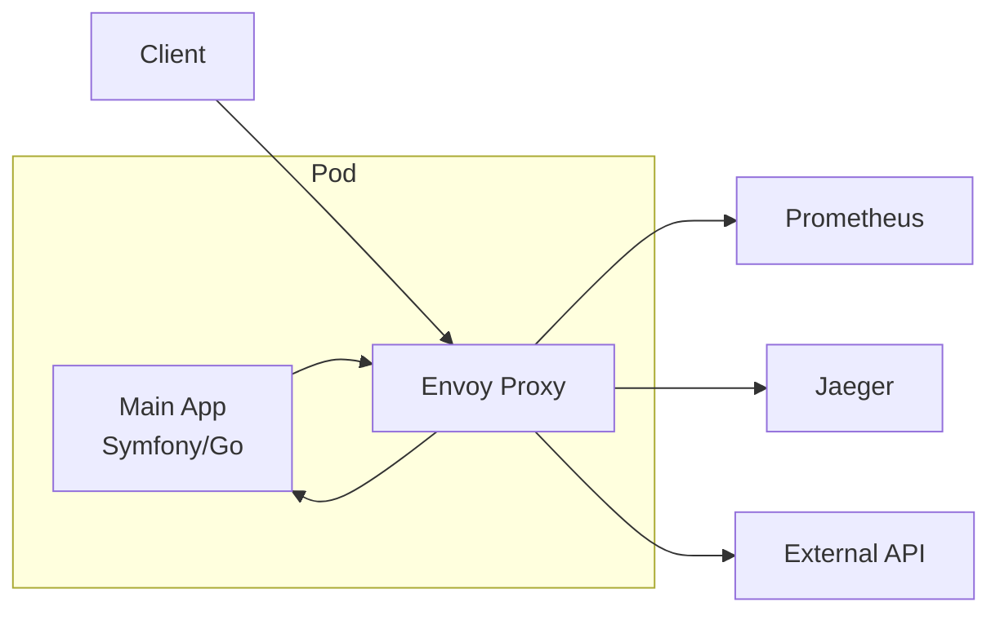

**Use Cases**

- **Service Mesh**: Envoy sidecar handles mTLS, load balancing, retries
- **Logging**: Fluentd sidecar ships logs to central aggregator
- **Secrets**: Vault agent injects secrets into app
- **Monitoring**: Telegraf sidecar collects and exports metrics

**Kubernetes Example**

```yaml
apiVersion: v1
kind: Pod
metadata:
  name: order-service
spec:
  containers:
  # Main application container
  - name: app
    image: order-service:latest
    ports:
    - containerPort: 8080
    
  # Envoy sidecar for service mesh
  - name: envoy
    image: envoyproxy/envoy:v1.25
    ports:
    - containerPort: 15001
    volumeMounts:
    - name: envoy-config
      mountPath: /etc/envoy
```

---

### Health Check API

**Summary**: Expose standardized health endpoints that infrastructure can poll to determine service status.

- Critical for load balancers, orchestrators, and monitoring.
- Separate liveness (is it running?) from readiness (can it serve traffic?).

**Symfony Implementation**

```php
use Symfony\Component\HttpFoundation\JsonResponse;
use Symfony\Component\HttpFoundation\Response;
use Symfony\Component\Routing\Annotation\Route;

class HealthController
{
    public function __construct(
        private Connection $db,
        private CacheInterface $cache,
        private HttpClientInterface $httpClient
    ) {}
    
    #[Route('/health/live', methods: ['GET'])]
    public function liveness(): JsonResponse
    {
        // Simple check: is the process alive?
        return new JsonResponse(['status' => 'UP'], Response::HTTP_OK);
    }
    
    #[Route('/health/ready', methods: ['GET'])]
    public function readiness(): JsonResponse
    {
        $checks = [
            'database' => $this->checkDatabase(),
            'cache' => $this->checkCache(),
            'external_api' => $this->checkExternalDependency(),
        ];
        
        $allHealthy = !in_array(false, $checks, true);
        
        return new JsonResponse([
            'status' => $allHealthy ? 'UP' : 'DOWN',
            'checks' => $checks,
        ], $allHealthy ? Response::HTTP_OK : Response::HTTP_SERVICE_UNAVAILABLE);
    }
    
    private function checkDatabase(): bool
    {
        try {
            $this->db->executeQuery('SELECT 1');
            return true;
        } catch (\Exception $e) {
            return false;
        }
    }
    
    private function checkCache(): bool
    {
        try {
            $this->cache->get('health_check_key');
            return true;
        } catch (\Exception $e) {
            return false;
        }
    }
    
    private function checkExternalDependency(): bool
    {
        try {
            $response = $this->httpClient->request('GET', 'https://api.partner.com/health', [
                'timeout' => 2,
            ]);
            return $response->getStatusCode() === 200;
        } catch (\Exception $e) {
            return false;
        }
    }
}
```

**Go with Gin**

```go
package main

import (
    "context"
    "database/sql"
    "net/http"
    "time"
    "github.com/gin-gonic/gin"
    "github.com/go-redis/redis/v8"
)

type HealthCheck struct {
    db          *sql.DB
    redisClient *redis.Client
    httpClient  *http.Client
}

// Liveness probe - simple check
func (h *HealthCheck) Liveness(c *gin.Context) {
    c.JSON(200, gin.H{
        "status": "UP",
    })
}

// Readiness probe - check dependencies
func (h *HealthCheck) Readiness(c *gin.Context) {
    ctx, cancel := context.WithTimeout(c.Request.Context(), 3*time.Second)
    defer cancel()
    
    checks := map[string]bool{
        "database":     h.checkDatabase(ctx),
        "cache":        h.checkCache(ctx),
        "external_api": h.checkExternalAPI(ctx),
    }
    
    allHealthy := true
    for _, healthy := range checks {
        if !healthy {
            allHealthy = false
            break
        }
    }
    
    status := "UP"
    code := 200
    if !allHealthy {
        status = "DOWN"
        code = 503
    }
    
    c.JSON(code, gin.H{
        "status": status,
        "checks": checks,
    })
}

func (h *HealthCheck) checkDatabase(ctx context.Context) bool {
    err := h.db.PingContext(ctx)
    return err == nil
}

func (h *HealthCheck) checkCache(ctx context.Context) bool {
    _, err := h.redisClient.Ping(ctx).Result()
    return err == nil
}

func (h *HealthCheck) checkExternalAPI(ctx context.Context) bool {
    req, _ := http.NewRequestWithContext(ctx, "GET", "https://api.partner.com/health", nil)
    resp, err := h.httpClient.Do(req)
    if err != nil {
        return false
    }
    defer resp.Body.Close()
    return resp.StatusCode == 200
}

// Setup routes
func main() {
    r := gin.Default()
    health := &HealthCheck{
        db:          initDB(),
        redisClient: initRedis(),
        httpClient:  &http.Client{Timeout: 2 * time.Second},
    }
    
    r.GET("/health/live", health.Liveness)
    r.GET("/health/ready", health.Readiness)
    
    r.Run(":8080")
}
```

**Best Practices**

| Endpoint | Purpose | Kubernetes Usage |
| --- | --- | --- |
| `/health/live` | Is the process running? | `livenessProbe` - restart if fails |
| `/health/ready` | Can it serve requests? | `readinessProbe` - remove from load balancer if fails |
| `/health/startup` | Has initialization completed? | `startupProbe` - wait for slow startup |

---

## Observability Patterns

> **Reference**: Observability is critical for operating microservices in production. These patterns are essential for debugging, monitoring, and maintaining distributed systems. See [Observability Patterns - Microservices.io](https://microservices.io/patterns/observability/).

### Distributed Tracing

**Summary**: Track requests as they flow through multiple services by propagating trace context and collecting spans.

- Answers "why is this request slow?" and "which service failed?"
- Uses trace ID + span ID to correlate logs and metrics across services
- Industry standard: OpenTelemetry

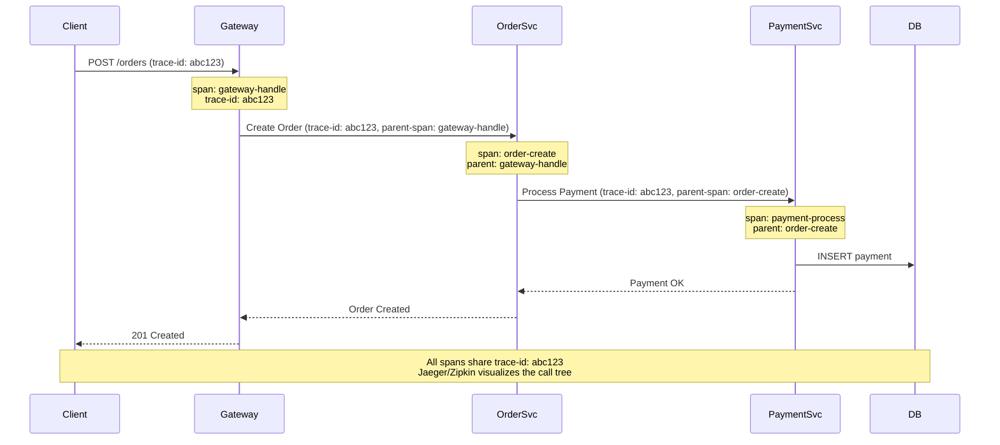

**Symfony with OpenTelemetry**

```php
// composer require open-telemetry/sdk open-telemetry/exporter-otlp

namespace App\Tracing;

use OpenTelemetry\SDK\Trace\TracerProvider;
use OpenTelemetry\SDK\Trace\SpanExporter\ConsoleSpanExporter;
use OpenTelemetry\SDK\Resource\ResourceInfo;
use OpenTelemetry\SDK\Common\Attribute\Attributes;
use OpenTelemetry\SemConv\ResourceAttributes;
use Symfony\Component\HttpKernel\Event\RequestEvent;
use Symfony\Component\HttpKernel\Event\ResponseEvent;

class TracingMiddleware
{
    private TracerProvider $tracerProvider;
    
    public function __construct()
    {
        $resource = ResourceInfo::create(Attributes::create([
            ResourceAttributes::SERVICE_NAME => 'symfony-order-service',
            ResourceAttributes::SERVICE_VERSION => '1.0.0',
        ]));
        
        $this->tracerProvider = TracerProvider::builder()
            ->setResource($resource)
            ->addSpanProcessor(/* OtlpSpanExporter to Jaeger/Tempo */)
            ->build();
    }
    
    public function onKernelRequest(RequestEvent $event): void
    {
        $request = $event->getRequest();
        $tracer = $this->tracerProvider->getTracer('symfony-app');
        
        // Extract trace context from incoming headers
        $traceParent = $request->headers->get('traceparent');
        
        $span = $tracer->spanBuilder('http.server.request')
            ->setAttribute('http.method', $request->getMethod())
            ->setAttribute('http.route', $request->getPathInfo())
            ->setAttribute('http.url', $request->getUri())
            ->startSpan();
        
        // Store span in request attributes for use in controllers
        $request->attributes->set('_trace_span', $span);
    }
    
    public function onKernelResponse(ResponseEvent $event): void
    {
        $span = $event->getRequest()->attributes->get('_trace_span');
        
        if ($span) {
            $span->setAttribute('http.status_code', $event->getResponse()->getStatusCode());
            $span->end();
        }
    }
}

// Usage in service
class OrderService
{
    public function __construct(
        private TracerProvider $tracerProvider,
        private HttpClientInterface $httpClient
    ) {}
    
    public function createOrder(CreateOrderCommand $cmd): Order
    {
        $tracer = $this->tracerProvider->getTracer('order-service');
        
        // Create child span
        $span = $tracer->spanBuilder('order.create')
            ->setAttribute('customer.id', $cmd->customerId)
            ->setAttribute('order.items.count', count($cmd->items))
            ->startSpan();
        
        try {
            $order = new Order($cmd->customerId, $cmd->items);
            $this->repository->save($order);

            // Call payment service with trace propagation
            // Note: OpenTelemetry HTTP client integration handles trace propagation automatically
            $response = $this->httpClient->request('POST', 'http://payment-service/charge', [
                'json' => ['orderId' => $order->getId()],
            ]);

            $span->setAttribute('payment.status', 'success');
            $span->setStatus(\OpenTelemetry\API\Trace\StatusCode::STATUS_OK);

            return $order;
        } catch (\Exception $e) {
            $span->recordException($e);
            $span->setStatus(\OpenTelemetry\API\Trace\StatusCode::STATUS_ERROR);
            throw $e;
        } finally {
            $span->end();
        }
    }
}
```

**Go with OpenTelemetry and Gin**

```go
package main

import (
    "context"
    "github.com/gin-gonic/gin"
    "go.opentelemetry.io/otel"
    "go.opentelemetry.io/otel/attribute"
    "go.opentelemetry.io/otel/exporters/otlp/otlptrace/otlptracehttp"
    "go.opentelemetry.io/otel/sdk/resource"
    "go.opentelemetry.io/otel/sdk/trace"
    semconv "go.opentelemetry.io/otel/semconv/v1.4.0"
    "go.opentelemetry.io/otel/propagation"
)

func initTracer() (*trace.TracerProvider, error) {
    exporter, err := otlptracehttp.New(context.Background(),
        otlptracehttp.WithEndpoint("localhost:4318"),
        otlptracehttp.WithInsecure(),
    )
    if err != nil {
        return nil, err
    }

    tp := trace.NewTracerProvider(
        trace.WithBatcher(exporter),
        trace.WithResource(resource.NewWithAttributes(
            semconv.SchemaURL,
            semconv.ServiceNameKey.String("go-order-service"),
            semconv.ServiceVersionKey.String("1.0.0"),
        )),
    )

    otel.SetTracerProvider(tp)
    otel.SetTextMapPropagator(propagation.TraceContext{})

    return tp, nil
}

// Middleware to start tracing span for each request
func TracingMiddleware() gin.HandlerFunc {
    return func(c *gin.Context) {
        tracer := otel.Tracer("gin-server")
        
        // Extract trace context from headers
        ctx := otel.GetTextMapPropagator().Extract(c.Request.Context(), propagation.HeaderCarrier(c.Request.Header))
        
        ctx, span := tracer.Start(ctx, "http.server.request",
            trace.WithAttributes(
                semconv.HTTPMethodKey.String(c.Request.Method),
                semconv.HTTPRouteKey.String(c.FullPath()),
                semconv.HTTPURLKey.String(c.Request.RequestURI),
            ),
        )
        defer span.End()
        
        // Store context for downstream use
        c.Request = c.Request.WithContext(ctx)
        
        c.Next()
        
        // Record response status
        span.SetAttributes(semconv.HTTPStatusCodeKey.Int(c.Writer.Status()))
    }
}

// Service with tracing
type OrderService struct {
    repo        OrderRepository
    paymentClient *http.Client
}

func (s *OrderService) CreateOrder(ctx context.Context, cmd CreateOrderCommand) (*Order, error) {
    tracer := otel.Tracer("order-service")
    
    ctx, span := tracer.Start(ctx, "order.create",
        trace.WithAttributes(
            attribute.String("customer.id", cmd.CustomerID),
            attribute.Int("order.items.count", len(cmd.Items)),
        ),
    )
    defer span.End()
    
    order := NewOrder(cmd.CustomerID, cmd.Items)
    
    if err := s.repo.Save(ctx, order); err != nil {
        span.RecordError(err)
        return nil, err
    }
    
    // Call payment service with trace propagation
    if err := s.chargePayment(ctx, order.ID, order.Total); err != nil {
        span.RecordError(err)
        return nil, err
    }
    
    span.SetAttributes(attribute.String("order.status", "completed"))
    return order, nil
}

func (s *OrderService) chargePayment(ctx context.Context, orderID string, amount float64) error {
    tracer := otel.Tracer("order-service")
    ctx, span := tracer.Start(ctx, "payment.charge")
    defer span.End()
    
    req, _ := http.NewRequestWithContext(ctx, "POST", "http://payment-service/charge", nil)
    
    // Propagate trace context in HTTP headers
    otel.GetTextMapPropagator().Inject(ctx, propagation.HeaderCarrier(req.Header))
    
    resp, err := s.paymentClient.Do(req)
    if err != nil {
        span.RecordError(err)
        return err
    }
    defer resp.Body.Close()
    
    span.SetAttributes(attribute.Int("http.status_code", resp.StatusCode))
    return nil
}

func main() {
    tp, _ := initTracer()
    defer tp.Shutdown(context.Background())
    
    r := gin.Default()
    r.Use(TracingMiddleware())
    
    r.POST("/orders", HandleCreateOrder)
    r.Run(":8080")
}
```

**When to Use**

- Debugging slow requests in distributed systems
- Understanding service dependencies
- Root cause analysis for failures

**Key Benefits**

- End-to-end visibility across service boundaries
- Identifies bottlenecks and latency sources
- Correlates logs/metrics with specific requests

---

### Log Aggregation

**Summary**: Centralize logs from all service instances into a searchable, queryable store.

- Essential for debugging issues across distributed services
- Structured logging (JSON) enables powerful queries
- Common stacks: ELK (Elasticsearch, Logstash, Kibana), Loki + Grafana

**Symfony with Monolog**

```php
// config/packages/prod/monolog.yaml
monolog:
    handlers:
        json:
            type: stream
            path: "php://stdout"
            level: info
            formatter: monolog.formatter.json

// Custom JSON formatter with trace context
namespace App\Logging;

use Monolog\Formatter\JsonFormatter;

class TraceAwareJsonFormatter extends JsonFormatter
{
    public function format(array $record): string
    {
        // Inject trace ID from context
        if (isset($GLOBALS['trace_id'])) {
            $record['extra']['trace_id'] = $GLOBALS['trace_id'];
            $record['extra']['span_id'] = $GLOBALS['span_id'] ?? null;
        }
        
        $record['extra']['service'] = 'order-service';
        $record['extra']['environment'] = $_ENV['APP_ENV'];
        
        return parent::format($record);
    }
}

// Usage in application
class OrderService
{
    public function __construct(private LoggerInterface $logger) {}
    
    public function createOrder(CreateOrderCommand $cmd): Order
    {
        $this->logger->info('Creating order', [
            'customer_id' => $cmd->customerId,
            'items_count' => count($cmd->items),
            'total' => $cmd->total,
        ]);
        
        try {
            $order = new Order($cmd->customerId, $cmd->items);
            $this->repository->save($order);
            
            $this->logger->info('Order created successfully', [
                'order_id' => $order->getId(),
                'status' => $order->getStatus(),
            ]);
            
            return $order;
        } catch (\Exception $e) {
            $this->logger->error('Failed to create order', [
                'customer_id' => $cmd->customerId,
                'error' => $e->getMessage(),
                'exception_class' => get_class($e),
                'stack_trace' => $e->getTraceAsString(),
            ]);
            throw $e;
        }
    }
}
```

**Go with Structured Logging (zerolog)**

```go
package main

import (
    "context"
    "os"
    "github.com/rs/zerolog"
    "github.com/rs/zerolog/log"
    "github.com/gin-gonic/gin"
)

func init() {
    // Configure JSON structured logging
    zerolog.TimeFieldFormat = zerolog.TimeFormatUnix
    log.Logger = zerolog.New(os.Stdout).With().
        Timestamp().
        Str("service", "order-service").
        Str("environment", os.Getenv("ENV")).
        Logger()
}

// Middleware to log requests
func LoggingMiddleware() gin.HandlerFunc {
    return func(c *gin.Context) {
        logger := log.With().
            Str("method", c.Request.Method).
            Str("path", c.Request.URL.Path).
            Str("client_ip", c.ClientIP()).
            Logger()
        
        // Store logger in context
        ctx := logger.WithContext(c.Request.Context())
        c.Request = c.Request.WithContext(ctx)
        
        logger.Info().Msg("Request started")
        
        c.Next()
        
        logger.Info().
            Int("status", c.Writer.Status()).
            Int("bytes", c.Writer.Size()).
            Msg("Request completed")
    }
}

type OrderService struct {
    repo OrderRepository
}

func (s *OrderService) CreateOrder(ctx context.Context, cmd CreateOrderCommand) (*Order, error) {
    logger := zerolog.Ctx(ctx).With().
        Str("operation", "create_order").
        Str("customer_id", cmd.CustomerID).
        Int("items_count", len(cmd.Items)).
        Logger()
    
    logger.Info().Msg("Creating order")
    
    order := NewOrder(cmd.CustomerID, cmd.Items)
    
    if err := s.repo.Save(ctx, order); err != nil {
        logger.Error().
            Err(err).
            Str("order_id", order.ID).
            Msg("Failed to save order")
        return nil, err
    }
    
    logger.Info().
        Str("order_id", order.ID).
        Str("status", order.Status).
        Float64("total", order.Total).
        Msg("Order created successfully")
    
    return order, nil
}

func main() {
    r := gin.New()
    r.Use(LoggingMiddleware())
    r.POST("/orders", HandleCreateOrder)
    r.Run(":8080")
}
```

**Best Practices**

- Use structured logging (JSON) for machine parsing
- Include trace IDs to correlate with distributed traces
- Log at appropriate levels (DEBUG, INFO, WARN, ERROR)
- Never log sensitive data (passwords, credit cards, PII)
- Include context: service name, version, environment

**Common Log Aggregation Stack**

```yaml
# Docker Compose example
version: '3'
services:
  # Application
  order-service:
    image: order-service:latest
    logging:
      driver: "json-file"
      options:
        max-size: "10m"
        max-file: "3"
    
  # Log collector
  filebeat:
    image: elastic/filebeat:7.17.0
    volumes:
      - /var/lib/docker/containers:/var/lib/docker/containers:ro
      - ./filebeat.yml:/usr/share/filebeat/filebeat.yml:ro
    
  # Storage & Search
  elasticsearch:
    image: elasticsearch:7.17.0
    environment:
      - discovery.type=single-node
    
  # Visualization
  kibana:
    image: kibana:7.17.0
    ports:
      - "5601:5601"
```

---

### Application Metrics

**Summary**: Expose service health, performance, and business metrics for monitoring and alerting.

- Standard format: Prometheus exposition format
- Key metric types: Counter, Gauge, Histogram, Summary
- Monitor: Request rate, error rate, latency (RED metrics)

**Symfony with Prometheus**

```php
// composer require promphp/prometheus_client_php

namespace App\Metrics;

use Prometheus\CollectorRegistry;
use Prometheus\Storage\InMemory;
use Prometheus\RenderTextFormat;

class MetricsService
{
    private CollectorRegistry $registry;
    private array $counters = [];
    private array $histograms = [];
    
    public function __construct()
    {
        $this->registry = new CollectorRegistry(new InMemory());
        
        // Define metrics
        $this->counters['http_requests_total'] = $this->registry->getOrRegisterCounter(
            'app',
            'http_requests_total',
            'Total HTTP requests',
            ['method', 'route', 'status']
        );
        
        $this->histograms['http_request_duration_seconds'] = $this->registry->getOrRegisterHistogram(
            'app',
            'http_request_duration_seconds',
            'HTTP request duration in seconds',
            ['method', 'route'],
            [0.005, 0.01, 0.025, 0.05, 0.1, 0.25, 0.5, 1, 2.5, 5, 10]
        );
        
        $this->counters['orders_created_total'] = $this->registry->getOrRegisterCounter(
            'app',
            'orders_created_total',
            'Total orders created',
            ['status']
        );
    }
    
    public function incrementHttpRequests(string $method, string $route, int $status): void
    {
        $this->counters['http_requests_total']->inc([$method, $route, (string)$status]);
    }
    
    public function observeHttpDuration(string $method, string $route, float $duration): void
    {
        $this->histograms['http_request_duration_seconds']->observe($duration, [$method, $route]);
    }
    
    public function incrementOrdersCreated(string $status): void
    {
        $this->counters['orders_created_total']->inc([$status]);
    }
    
    public function renderMetrics(): string
    {
        $renderer = new RenderTextFormat();
        return $renderer->render($this->registry->getMetricFamilySamples());
    }
}

// Middleware
class MetricsMiddleware
{
    public function __construct(private MetricsService $metrics) {}
    
    public function onKernelRequest(RequestEvent $event): void
    {
        $event->getRequest()->attributes->set('_request_start_time', microtime(true));
    }
    
    public function onKernelResponse(ResponseEvent $event): void
    {
        $request = $event->getRequest();
        $duration = microtime(true) - $request->attributes->get('_request_start_time');
        
        $this->metrics->incrementHttpRequests(
            $request->getMethod(),
            $request->attributes->get('_route'),
            $event->getResponse()->getStatusCode()
        );
        
        $this->metrics->observeHttpDuration(
            $request->getMethod(),
            $request->attributes->get('_route'),
            $duration
        );
    }
}

// Expose metrics endpoint
#[Route('/metrics', methods: ['GET'])]
class MetricsController
{
    public function __invoke(MetricsService $metrics): Response
    {
        return new Response(
            $metrics->renderMetrics(),
            200,
            ['Content-Type' => RenderTextFormat::MIME_TYPE]
        );
    }
}
```

**Go with Prometheus**

```go
package main

import (
    "time"
    "github.com/gin-gonic/gin"
    "github.com/prometheus/client_golang/prometheus"
    "github.com/prometheus/client_golang/prometheus/promauto"
    "github.com/prometheus/client_golang/prometheus/promhttp"
)

var (
    httpRequestsTotal = promauto.NewCounterVec(
        prometheus.CounterOpts{
            Name: "http_requests_total",
            Help: "Total HTTP requests",
        },
        []string{"method", "route", "status"},
    )
    
    httpRequestDuration = promauto.NewHistogramVec(
        prometheus.HistogramOpts{
            Name:    "http_request_duration_seconds",
            Help:    "HTTP request duration in seconds",
            Buckets: prometheus.DefBuckets,
        },
        []string{"method", "route"},
    )
    
    ordersCreatedTotal = promauto.NewCounterVec(
        prometheus.CounterOpts{
            Name: "orders_created_total",
            Help: "Total orders created",
        },
        []string{"status"},
    )
    
    activeOrders = promauto.NewGauge(
        prometheus.GaugeOpts{
            Name: "active_orders",
            Help: "Number of active orders",
        },
    )
)

// Middleware
func PrometheusMiddleware() gin.HandlerFunc {
    return func(c *gin.Context) {
        start := time.Now()
        
        c.Next()
        
        duration := time.Since(start).Seconds()
        status := c.Writer.Status()
        
        httpRequestsTotal.WithLabelValues(
            c.Request.Method,
            c.FullPath(),
            http.StatusText(status),
        ).Inc()
        
        httpRequestDuration.WithLabelValues(
            c.Request.Method,
            c.FullPath(),
        ).Observe(duration)
    }
}

type OrderService struct {
    repo OrderRepository
}

func (s *OrderService) CreateOrder(ctx context.Context, cmd CreateOrderCommand) (*Order, error) {
    order := NewOrder(cmd.CustomerID, cmd.Items)
    
    if err := s.repo.Save(ctx, order); err != nil {
        ordersCreatedTotal.WithLabelValues("failed").Inc()
        return nil, err
    }
    
    ordersCreatedTotal.WithLabelValues("success").Inc()
    activeOrders.Inc()
    
    return order, nil
}

func main() {
    r := gin.Default()
    r.Use(PrometheusMiddleware())
    
    // Expose metrics endpoint
    r.GET("/metrics", gin.WrapH(promhttp.Handler()))
    
    r.POST("/orders", HandleCreateOrder)
    r.Run(":8080")
}
```

**Key Metrics to Track**

| Metric Type | Use Case | Example |
| --- | --- | --- |
| **Counter** | Things that only increase | `http_requests_total`, `orders_created` |
| **Gauge** | Things that go up and down | `active_connections`, `memory_usage_bytes` |
| **Histogram** | Measure distributions | `http_request_duration_seconds` |
| **Summary** | Similar to histogram, calculated client-side | `request_size_bytes` |

**RED Method** (for request-driven services):
- **Rate**: Requests per second
- **Errors**: Number of failed requests
- **Duration**: Time to process requests

---

### Exception Tracking

**Summary**: Automatically capture, aggregate, and alert on application exceptions.

- Tools: Sentry, Rollbar, Bugsnag
- Captures stack traces, context, and user impact
- Deduplicates similar errors

**Symfony with Sentry**

```php
// composer require sentry/sentry-symfony

// config/packages/sentry.yaml
sentry:
    dsn: '%env(SENTRY_DSN)%'
    options:
        environment: '%env(APP_ENV)%'
        release: '%env(APP_VERSION)%'

// Automatic exception capture
class OrderService
{
    public function createOrder(CreateOrderCommand $cmd): Order
    {
        try {
            $order = new Order($cmd->customerId, $cmd->items);
            $this->repository->save($order);
            return $order;
        } catch (InsufficientInventoryException $e) {
            // Add context to Sentry
            \Sentry\configureScope(function (\Sentry\State\Scope $scope) use ($cmd, $e): void {
                $scope->setContext('order_details', [
                    'customer_id' => $cmd->customerId,
                    'items_count' => count($cmd->items),
                    'total' => $cmd->total,
                ]);
                $scope->setTag('error_type', 'inventory');
                $scope->setLevel(\Sentry\Severity::warning());
            });
            
            throw $e;
        }
    }
}
```

**Go with Sentry**

```go
import (
    "github.com/getsentry/sentry-go"
    sentrygin "github.com/getsentry/sentry-go/gin"
)

func init() {
    sentry.Init(sentry.ClientOptions{
        Dsn:         os.Getenv("SENTRY_DSN"),
        Environment: os.Getenv("ENV"),
        Release:     os.Getenv("VERSION"),
    })
}

func main() {
    r := gin.Default()
    
    // Sentry middleware
    r.Use(sentrygin.New(sentrygin.Options{}))
    
    r.POST("/orders", HandleCreateOrder)
    r.Run(":8080")
}

func (s *OrderService) CreateOrder(ctx context.Context, cmd CreateOrderCommand) (*Order, error) {
    order := NewOrder(cmd.CustomerID, cmd.Items)
    
    if err := s.repo.Save(ctx, order); err != nil {
        // Capture error with context
        sentry.WithScope(func(scope *sentry.Scope) {
            scope.SetContext("order_details", map[string]interface{}{
                "customer_id": cmd.CustomerID,
                "items_count": len(cmd.Items),
                "total":       cmd.Total,
            })
            scope.SetTag("error_type", "database")
            scope.SetLevel(sentry.LevelError)
            sentry.CaptureException(err)
        })
        
        return nil, err
    }
    
    return order, nil
}
```

**When to Use**

- Production error monitoring and alerting
- Understanding error frequency and user impact
- Tracking error trends over releases

---

**Microservices.io References:**
- [Distributed Tracing Pattern](https://microservices.io/patterns/observability/distributed-tracing.html)
- [Log Aggregation Pattern](https://microservices.io/patterns/observability/application-logging.html)
- [Application Metrics Pattern](https://microservices.io/patterns/observability/application-metrics.html)
- [Health Check API Pattern](https://microservices.io/patterns/observability/health-check-api.html)

---

## Conclusion

Modern backend and microservice patterns complement the Gang of Four patterns by addressing distributed system challenges. PHP and Go each bring unique strengths to these architectures:

- **PHP with Symfony**: Rich ecosystem for business logic, mature frameworks, excellent for BFF patterns and complex domain models
- **Go with Gin**: Native concurrency, minimal overhead, ideal for high-throughput gateways, API composition, and event processing

Combine both languages strategically: use PHP for business-critical services requiring rapid development and rich domain modeling, and Go for performance-critical infrastructure components.

---

## Continue the Series

- **Part 1**: [GoF Design Patterns](backend-design-patterns-php-vs-go.md)
- **Part 3**: [System Architecture Patterns](system-architecture-patterns-php-vs-go.md)
- **Part 4**: [Security, API Design, Performance & DevOps Patterns](cross-cutting-patterns-php-vs-go.md)
- **Part 5**: [Testing Patterns](testing-patterns-php-vs-go.md)
- **Part 6**: [Naming Conventions & Class Role Patterns](naming-conventions-php-vs-go.md)
- **Part 7**: [Domain-Driven Design (DDD) Guide](domain-driven-design-guide.md)
- **Part 8**: [Data Persistence Patterns: SQL vs NoSQL](data-persistence-patterns-sql-vs-nosql.md)

---

## References

1. [A Pattern Language for Microservices — Microservices.io](https://microservices.io/patterns/)
2. [Pattern: API Gateway — Microservices.io](https://microservices.io/patterns/apigateway.html)
3. [Pattern: Database per Service — Microservices.io](https://microservices.io/patterns/data/database-per-service)
4. [Pattern: CQRS — Microservices.io](https://microservices.io/patterns/data/cqrs.html)
5. [Pattern: Event Sourcing — Microservices.io](https://microservices.io/patterns/data/event-sourcing.html)
6. [Pattern: Transactional Outbox — Microservices.io](https://microservices.io/patterns/data/transactional-outbox.html)
7. [Pattern: API Composition — Microservices.io](https://microservices.io/patterns/data/api-composition.html)
8. [Pattern: Saga — Microservices.io](https://microservices.io/patterns/data/saga.html)
9. [Pattern: Circuit Breaker — Microservices.io](https://microservices.io/patterns/reliability/circuit-breaker.html)
10. [Pattern: Service Discovery — Microservices.io](https://microservices.io/patterns/server-side-discovery.html)
11. [Pattern: Health Check API — Microservices.io](https://microservices.io/patterns/observability/health-check-api.html)
12. [Design Patterns for Microservices — Azure Architecture Center](https://learn.microsoft.com/en-us/azure/architecture/microservices/design/patterns)
13. [Cloud Design Patterns — AWS Prescriptive Guidance](https://docs.aws.amazon.com/prescriptive-guidance/latest/cloud-design-patterns/introduction.html)
14. [Cloud Design Patterns — Azure Architecture Center](https://learn.microsoft.com/en-us/azure/architecture/patterns/)
15. [Building Microservices — O'Reilly](https://www.oreilly.com/library/view/building-microservices-2nd/9781492034018/)

