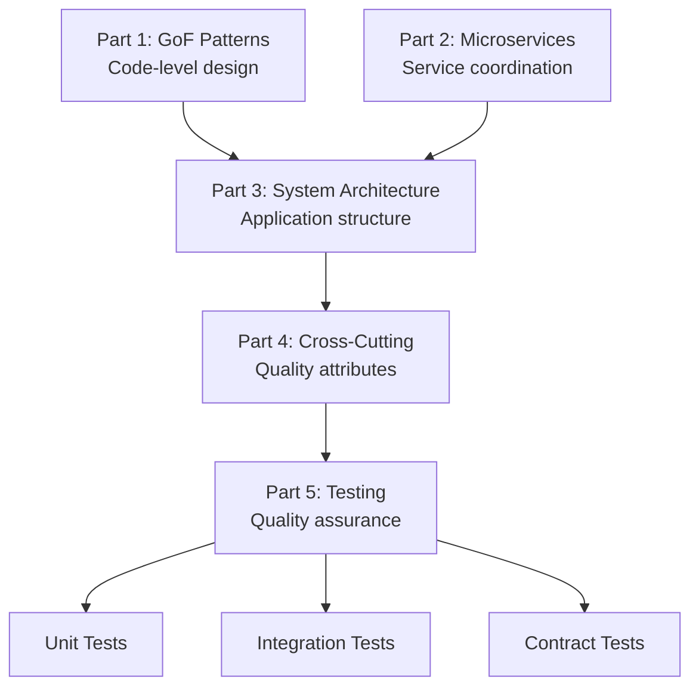
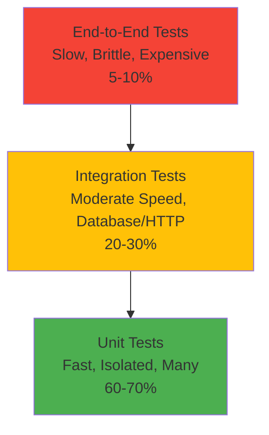
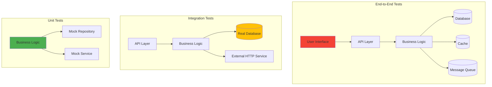
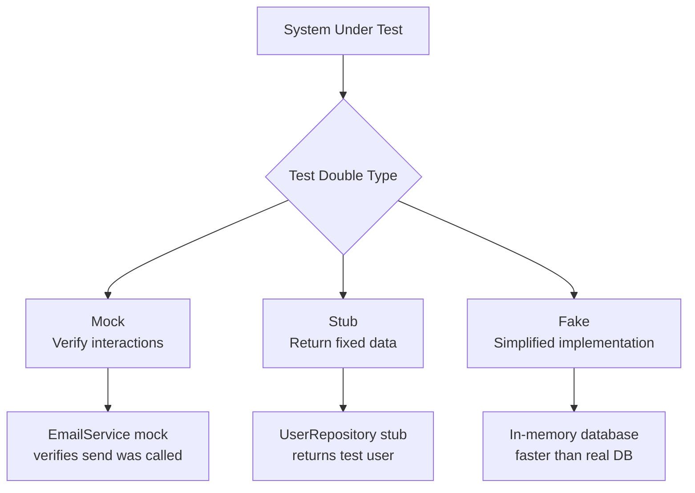
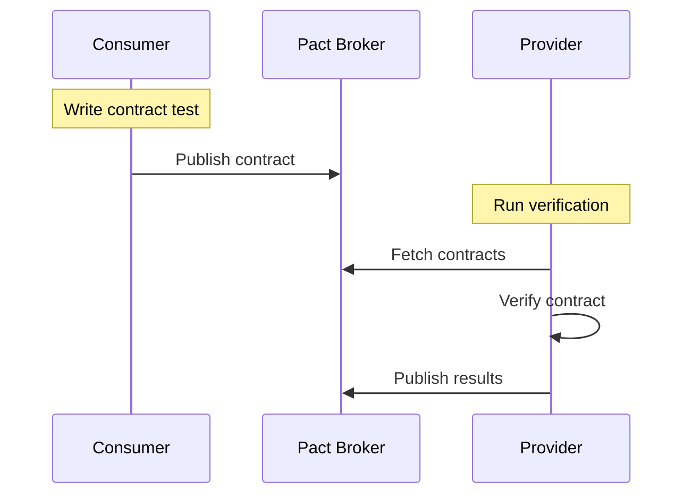

# Testing Patterns: PHP vs. Go

**Part 5 of "Backend Design Patterns: PHP vs. Go"**

This document covers comprehensive testing strategies for backend applications, from unit tests to contract testing. Testing patterns ensure code quality, enable refactoring confidence, and catch regressions early. These patterns work hand-in-hand with the foundational patterns from earlier parts:

- [Part 1: GoF Design Patterns](backend-design-patterns-php-vs-go.md)
- [Part 2: Modern Backend & Microservice Patterns](microservices-patterns-php-vs-go.md)
- [Part 3: System Architecture Patterns](system-architecture-patterns-php-vs-go.md)
- [Part 4: Security, API Design, Performance & DevOps Patterns](cross-cutting-patterns-php-vs-go.md)

---

## Table of Contents

1. [Introduction & Context](#introduction--context)
2. [Understanding Test Types](#understanding-test-types)
   - [What Each Test Type Covers](#what-each-test-type-covers)
   - [Clear Distinctions](#clear-distinctions)
   - [When to Use Each Type](#when-to-use-each-type)
3. [Testing Patterns](#testing-patterns)
   - [Unit Testing Strategies](#unit-testing-strategies)
   - [Testing Doubles](#testing-doubles)
   - [Integration Testing](#integration-testing)
   - [End-to-End Testing](#end-to-end-testing)
   - [Contract Testing](#contract-testing)
   - [Test Data Builders](#test-data-builders)
4. [Testing Strategy Selection](#testing-strategy-selection)
5. [Conclusion](#conclusion)
6. [Continue the Series](#continue-the-series)
7. [References](#references)

---

## Introduction & Context

**Testing** is the foundation of software quality. Well-tested code enables safe refactoring, confident deployments, and rapid iteration. Without comprehensive testing, even the best architecture becomes fragile.

Unlike patterns in Parts 1-3 that focus on code organization and architecture, testing patterns establish **quality assurance** and **confidence** in your system:



**Why Part 5?**

- Parts 1-4 define *what* to build; this part ensures it **works correctly**.
- Testing reveals bugs before production, enables refactoring, and serves as living documentation.
- PHP and Go have rich testing ecosystems (PHPUnit vs. testing/testify) with different idioms.
- Modern backend systems require multiple testing layers: unit, integration, and contract tests.

**Testing Pyramid:**

Most teams follow the testing pyramid: many fast unit tests, fewer integration tests, and minimal end-to-end tests. The pyramid shape reflects both the **quantity** of tests and their **cost** (time, maintenance, brittleness).



**Why the Pyramid Shape Matters:**

| Layer | Speed | Cost | Maintenance | When They Break |
|-------|-------|------|-------------|-----------------|
| **Unit Tests** | 1-10ms | Low | Easy to maintain | Pinpoints exact issue |
| **Integration Tests** | 100ms-5s | Medium | Moderate effort | Points to component interaction |
| **E2E Tests** | 5s-60s+ | High | High effort (brittle UI) | Hard to diagnose (many layers) |

**The Ideal Ratio:**
- **70% Unit Tests**: Fast feedback, test business logic in isolation
- **20% Integration Tests**: Verify components work together (DB, APIs, queues)
- **10% E2E Tests**: Test critical user journeys through the UI

**Anti-Pattern: The Ice Cream Cone 🍦**

Avoid the inverted pyramid where you have mostly E2E tests:

```
❌ Ice Cream Cone (Anti-Pattern)
────────────────────────
    E2E Tests (70%)      ← Slow, brittle, hard to debug
  Integration (20%)
   Unit (10%)            ← Missing fast feedback
```

**What Happens When You Violate the Pyramid:**
- **Too Many E2E Tests**: CI runs take 30+ minutes, flaky tests block deployments, UI changes break hundreds of tests
- **Too Few Unit Tests**: Bugs slip through, refactoring is dangerous, debugging takes hours

**Example: Testing a Checkout Flow**

Instead of one E2E test covering everything:
```
✅ Recommended:
- 15 unit tests (discount calculation, tax logic, validation)
- 5 integration tests (save order to DB, call payment API)
- 1 E2E test (complete checkout from UI)

❌ Avoid:
- 1 E2E test covering all discount scenarios
  (slow, brittle, hard to debug when tax calculation fails)
```

For detailed explanations of each test type, see [Understanding Test Types](#understanding-test-types) below.

---

## Understanding Test Types

Before diving into specific patterns, it's crucial to understand the fundamental differences between unit, integration, and end-to-end (E2E) tests. Each type serves a distinct purpose and has different trade-offs.

### What Each Test Type Covers



### Clear Distinctions

| Aspect | Unit Tests | Integration Tests | End-to-End Tests |
|--------|-----------|-------------------|------------------|
| **Scope** | Single function/class in isolation | Multiple components working together | Entire application from user's perspective |
| **Dependencies** | All mocked/stubbed | Real databases, HTTP clients, message queues | Real browser, all services, databases |
| **Speed** | Milliseconds (1-10ms) | Seconds (100ms-5s) | Minutes (5s-60s+) |
| **Isolation** | Complete (no side effects) | Partial (uses real resources) | None (full system) |
| **Failure Reasons** | Logic bugs, edge cases | Integration issues, config problems | UI bugs, deployment issues, timing problems |
| **When to Use** | Testing business logic, calculations, validations | Testing database queries, API calls, service interactions | Testing critical user flows, complete features |
| **Examples** | `calculateDiscount()`, `validateEmail()` | `saveUserToDatabase()`, `fetchFromExternalAPI()` | "User registration flow", "Complete checkout process" |
| **Maintenance** | Low (changes rarely break) | Medium (schema/API changes affect tests) | High (UI changes break tests frequently) |
| **Debugging** | Easy (pinpoints exact failure) | Moderate (need to check logs, data) | Hard (many possible causes) |
| **CI/CD Impact** | Run on every commit | Run on every commit (with proper isolation) | Run before deployment or on schedule |

### Detailed Definitions

#### Unit Tests
**What:** Test a single unit of code (function, method, class) in complete isolation.

**Key Characteristics:**
- No database, no network, no file system
- All dependencies are mocked or stubbed
- Test one thing at a time (single responsibility)
- Should run in milliseconds
- Should never fail due to external factors

**Example Test Cases:**
```php
// PHP: Testing pure business logic
public function testCalculateDiscountForPremiumUser(): void
{
    $calculator = new PriceCalculator();
    $price = $calculator->calculateDiscount(100, 'PREMIUM', 0.20);
    $this->assertEquals(80.0, $price); // 100 - 20% = 80
}
```

```go
// Go: Testing pure business logic
func TestCalculateDiscountForPremiumUser(t *testing.T) {
    calculator := &PriceCalculator{}
    price := calculator.CalculateDiscount(100, "PREMIUM", 0.20)
    assert.Equal(t, 80.0, price)
}
```

#### Integration Tests
**What:** Test how multiple components work together with real external dependencies.

**Key Characteristics:**
- Uses real databases (with transactions or containers)
- Makes real HTTP calls (to test services or mocked external APIs)
- Tests actual file I/O, message queues, caches
- Runs slower than unit tests (seconds)
- Requires setup/teardown for data isolation

**Example Test Cases:**
```php
// PHP: Testing database interaction
public function testSaveUserAndRetrieveFromDatabase(): void
{
    $user = new User('test@example.com', 'password');
    $this->userRepository->save($user); // Real database call

    $retrieved = $this->userRepository->findByEmail('test@example.com');
    $this->assertEquals('test@example.com', $retrieved->getEmail());
}
```

```go
// Go: Testing with real HTTP service
func TestFetchUserFromExternalAPI(t *testing.T) {
    // Using testcontainers or wiremock for API
    client := NewAPIClient("http://localhost:8080")
    user, err := client.FetchUser(123) // Real HTTP call

    assert.NoError(t, err)
    assert.Equal(t, "john@example.com", user.Email)
}
```

#### End-to-End Tests
**What:** Test complete user workflows through the entire application stack, including the UI.

**Key Characteristics:**
- Simulates real user behavior (browser automation)
- Tests entire system: frontend, backend, database, external services
- Runs slowest (can take minutes)
- Most brittle (breaks with UI changes)
- Best for critical business flows

**Example Test Cases:**
```php
// PHP: Testing complete user registration flow
public function testUserCanRegisterAndLogin(): void
{
    $this->browser->visit('/register');
    $this->browser->fillField('email', 'newuser@example.com');
    $this->browser->fillField('password', 'password123');
    $this->browser->clickButton('Register');

    $this->browser->see('Registration successful');
    $this->browser->visit('/login');
    // ... complete login flow
    $this->browser->see('Dashboard');
}
```

```go
// Go: Testing complete checkout flow
func TestCompleteCheckoutFlow(t *testing.T) {
    driver := selenium.NewChromeDriver()
    driver.Get("http://localhost:3000/products")

    driver.FindElement(selenium.ByID, "add-to-cart-123").Click()
    driver.FindElement(selenium.ByID, "checkout").Click()
    driver.FindElement(selenium.ByID, "payment-submit").Click()

    // Verify order confirmation page
    text, _ := driver.FindElement(selenium.ByClass, "success-message").Text()
    assert.Contains(t, text, "Order confirmed")
}
```

### When to Use Each Type

**Use Unit Tests when:**
- Testing business logic and calculations
- Testing validation rules and edge cases
- Testing pure functions without side effects
- You need fast feedback (runs in CI on every commit)

**Use Integration Tests when:**
- Testing database queries and transactions
- Testing API endpoints (HTTP handlers)
- Testing message queue consumers/producers
- Testing cache behavior
- Verifying component interactions

**Use E2E Tests when:**
- Testing critical user journeys (registration, checkout, payment)
- Verifying frontend-backend integration
- Testing cross-browser compatibility
- Validating complete feature workflows
- Running smoke tests before production deployment

### The Testing Pyramid in Practice

```
E2E Tests (5-10 tests)
├─ Complete user registration flow
├─ End-to-end checkout process
└─ Critical admin workflows

Integration Tests (50-100 tests)
├─ All API endpoints
├─ Database operations (CRUD)
├─ External service integrations
└─ Message queue processing

Unit Tests (500+ tests)
├─ Business logic (services, domain models)
├─ Validators and calculators
├─ Utilities and helpers
└─ Edge cases and error handling
```

**The Golden Rule:** If you can test it with a unit test, don't use an integration test. If you can test it with an integration test, don't use an E2E test.

---

## Testing Patterns

> **Quick Reference — Testing Patterns 🧪**
> - `AAA Pattern`: Arrange, Act, Assert for clear test structure.
> - `Mocks vs Stubs vs Fakes`: Use mocks for behavior verification, stubs for state, fakes for lightweight implementations.
> - `Integration Tests`: Test with real databases using containers (testcontainers) or transaction rollback.
> - `Contract Testing`: Verify service contracts with Pact for microservices.
> - `Test Data Builders`: Use Faker/Foundry (PHP) or gofakeit (Go) for realistic test data.

### Unit Testing Strategies

**Summary**: Unit tests verify individual components in isolation. Follow the AAA pattern: Arrange (setup), Act (execute), Assert (verify).

**PHP Example (PHPUnit)**

```php
use PHPUnit\Framework\TestCase;

class OrderServiceTest extends TestCase
{
    private OrderService $orderService;
    private OrderRepository $orderRepository;

    protected function setUp(): void
    {
        $this->orderRepository = $this->createMock(OrderRepository::class);
        $this->orderService = new OrderService($this->orderRepository);
    }

    public function testCalculateTotalWithDiscount(): void
    {
        // Arrange
        $order = new Order();
        $order->addItem(new OrderItem('Product A', 100, 2)); // 200
        $order->addItem(new OrderItem('Product B', 50, 1));  // 50
        $discountCode = new DiscountCode('SAVE20', 0.20);

        // Act
        $total = $this->orderService->calculateTotal($order, $discountCode);

        // Assert
        $this->assertEquals(200.0, $total); // (200 + 50) * 0.8 = 200
    }

    public function testPlaceOrderPersistsToRepository(): void
    {
        // Arrange
        $order = new Order();
        $order->addItem(new OrderItem('Product A', 100, 1));

        $this->orderRepository
            ->expects($this->once())
            ->method('save')
            ->with($this->equalTo($order));

        // Act
        $this->orderService->placeOrder($order);

        // Assert is implicit in expects/with
    }
}
```

**Go Example (testing + testify)**

```go
import (
    "testing"
    "github.com/stretchr/testify/assert"
    "github.com/stretchr/testify/mock"
)

// Mock repository
type MockOrderRepository struct {
    mock.Mock
}

func (m *MockOrderRepository) Save(order *Order) error {
    args := m.Called(order)
    return args.Error(0)
}

func TestCalculateTotalWithDiscount(t *testing.T) {
    // Arrange
    orderService := &OrderService{}
    order := &Order{
        Items: []OrderItem{
            {Name: "Product A", Price: 100, Quantity: 2},
            {Name: "Product B", Price: 50, Quantity: 1},
        },
    }
    discountCode := &DiscountCode{Code: "SAVE20", Percent: 0.20}

    // Act
    total := orderService.CalculateTotal(order, discountCode)

    // Assert
    assert.Equal(t, 200.0, total)
}

func TestPlaceOrderPersistsToRepository(t *testing.T) {
    // Arrange
    mockRepo := new(MockOrderRepository)
    orderService := &OrderService{Repo: mockRepo}
    order := &Order{Items: []OrderItem{{Name: "Product A", Price: 100, Quantity: 1}}}

    mockRepo.On("Save", order).Return(nil)

    // Act
    err := orderService.PlaceOrder(order)

    // Assert
    assert.NoError(t, err)
    mockRepo.AssertExpectations(t)
}
```

**Best Practices:**

1. **One assertion per test**: Keep tests focused
2. **Descriptive names**: `testPlaceOrder_WhenInventoryLow_ThrowsException`
3. **Fast**: Unit tests should run in milliseconds
4. **Independent**: Tests shouldn't depend on each other

---

### Testing Doubles

**Summary**: Replace dependencies with test doubles to isolate the system under test. Types: **Mocks** (verify behavior), **Stubs** (return canned data), **Fakes** (lightweight implementations).



**When to Use:**

| Type | Use Case | Example |
| --- | --- | --- |
| Mock | Verify behavior (method calls, arguments) | Ensure email was sent |
| Stub | Provide test data without side effects | Return test user data |
| Fake | Lightweight alternative to complex dependency | In-memory cache instead of Redis |

**PHP Example**

```php
// Mock: Verify behavior
public function testUserRegistrationSendsWelcomeEmail(): void
{
    $emailService = $this->createMock(EmailService::class);
    $emailService
        ->expects($this->once())
        ->method('send')
        ->with(
            $this->equalTo('user@example.com'),
            $this->equalTo('Welcome!')
        );

    $userService = new UserService($emailService);
    $userService->register('user@example.com', 'password');
}

// Stub: Return test data
public function testGetUserProfile(): void
{
    $userRepository = $this->createStub(UserRepository::class);
    $userRepository
        ->method('findById')
        ->willReturn(new User(1, 'john@example.com'));

    $profileService = new ProfileService($userRepository);
    $profile = $profileService->getProfile(1);

    $this->assertEquals('john@example.com', $profile->getEmail());
}

// Fake: In-memory implementation
class FakeCache implements CacheInterface
{
    private array $data = [];

    public function get(string $key): mixed
    {
        return $this->data[$key] ?? null;
    }

    public function set(string $key, mixed $value): void
    {
        $this->data[$key] = $value;
    }
}

public function testCachingBehavior(): void
{
    $cache = new FakeCache();
    $service = new ProductService($cache);

    $service->getProduct(1); // Cache miss
    $service->getProduct(1); // Cache hit

    // Verify cache was used
}
```

**Go Example**

```go
// Mock: Verify behavior
type MockEmailService struct {
    mock.Mock
}

func (m *MockEmailService) Send(to, subject string) error {
    args := m.Called(to, subject)
    return args.Error(0)
}

func TestUserRegistrationSendsWelcomeEmail(t *testing.T) {
    mockEmail := new(MockEmailService)
    mockEmail.On("Send", "user@example.com", "Welcome!").Return(nil)

    userService := &UserService{Email: mockEmail}
    userService.Register("user@example.com", "password")

    mockEmail.AssertExpectations(t)
}

// Stub: Return test data
type StubUserRepository struct{}

func (s *StubUserRepository) FindByID(id int) (*User, error) {
    return &User{ID: id, Email: "john@example.com"}, nil
}

func TestGetUserProfile(t *testing.T) {
    stubRepo := &StubUserRepository{}
    profileService := &ProfileService{Repo: stubRepo}

    profile, _ := profileService.GetProfile(1)

    assert.Equal(t, "john@example.com", profile.Email)
}

// Fake: In-memory implementation
type FakeCache struct {
    data map[string]interface{}
}

func (f *FakeCache) Get(key string) interface{} {
    return f.data[key]
}

func (f *FakeCache) Set(key string, value interface{}) {
    f.data[key] = value
}

func TestCachingBehavior(t *testing.T) {
    cache := &FakeCache{data: make(map[string]interface{})}
    service := &ProductService{Cache: cache}

    service.GetProduct(1) // Cache miss
    service.GetProduct(1) // Cache hit

    assert.Equal(t, 1, len(cache.data))
}
```

---

### Integration Testing

**Summary**: Test how components work together with real dependencies (databases, HTTP services). Use containers for isolated environments or transaction rollback for speed.

**PHP Example (Symfony + Doctrine)**

```php
use Symfony\Bundle\FrameworkBundle\Test\KernelTestCase;

class UserRepositoryIntegrationTest extends KernelTestCase
{
    private EntityManagerInterface $entityManager;
    private UserRepository $userRepository;

    protected function setUp(): void
    {
        self::bootKernel();
        $this->entityManager = self::getContainer()->get('doctrine')->getManager();
        $this->userRepository = $this->entityManager->getRepository(User::class);

        // Start transaction (rolled back in tearDown)
        $this->entityManager->beginTransaction();
    }

    protected function tearDown(): void
    {
        // Rollback transaction to keep tests isolated
        $this->entityManager->rollback();
        parent::tearDown();
    }

    public function testSaveAndRetrieveUser(): void
    {
        // Arrange
        $user = new User('test@example.com', 'password');

        // Act
        $this->entityManager->persist($user);
        $this->entityManager->flush();
        $this->entityManager->clear(); // Clear identity map

        $retrievedUser = $this->userRepository->findOneBy(['email' => 'test@example.com']);

        // Assert
        $this->assertNotNull($retrievedUser);
        $this->assertEquals('test@example.com', $retrievedUser->getEmail());
    }
}

// HTTP Integration Test
use Symfony\Bundle\FrameworkBundle\Test\WebTestCase;

class ApiIntegrationTest extends WebTestCase
{
    public function testCreateUser(): void
    {
        $client = static::createClient();

        $client->request('POST', '/api/users', [], [], [
            'CONTENT_TYPE' => 'application/json',
        ], json_encode([
            'email' => 'test@example.com',
            'password' => 'password123',
        ]));

        $this->assertResponseStatusCodeSame(201);
        $response = json_decode($client->getResponse()->getContent(), true);
        $this->assertArrayHasKey('id', $response);
    }
}
```

**Go Example (testcontainers-go)**

```go
import (
    "context"
    "testing"
    "github.com/testcontainers/testcontainers-go"
    "github.com/testcontainers/testcontainers-go/wait"
    "gorm.io/driver/postgres"
    "gorm.io/gorm"
)

func TestUserRepository_Integration(t *testing.T) {
    ctx := context.Background()

    // Start PostgreSQL container
    req := testcontainers.ContainerRequest{
        Image:        "postgres:15",
        ExposedPorts: []string{"5432/tcp"},
        Env: map[string]string{
            "POSTGRES_PASSWORD": "password",
            "POSTGRES_DB":       "testdb",
        },
        WaitingFor: wait.ForLog("database system is ready to accept connections"),
    }

    postgresC, err := testcontainers.GenericContainer(ctx, testcontainers.GenericContainerRequest{
        ContainerRequest: req,
        Started:          true,
    })
    defer postgresC.Terminate(ctx)

    // Get connection string
    host, _ := postgresC.Host(ctx)
    port, _ := postgresC.MappedPort(ctx, "5432")
    dsn := fmt.Sprintf("host=%s port=%s user=postgres password=password dbname=testdb sslmode=disable", host, port.Port())

    // Connect with GORM
    db, _ := gorm.Open(postgres.Open(dsn), &gorm.Config{})
    db.AutoMigrate(&User{})

    // Test repository
    repo := &UserRepository{DB: db}
    user := &User{Email: "test@example.com", Password: "password"}

    // Act
    repo.Save(user)

    // Assert
    var retrieved User
    db.Where("email = ?", "test@example.com").First(&retrieved)
    assert.Equal(t, "test@example.com", retrieved.Email)
}

// HTTP Integration Test
func TestCreateUserAPI(t *testing.T) {
    router := setupRouter() // Your Gin router

    w := httptest.NewRecorder()
    reqBody := `{"email":"test@example.com","password":"password123"}`
    req, _ := http.NewRequest("POST", "/api/users", strings.NewReader(reqBody))
    req.Header.Set("Content-Type", "application/json")

    router.ServeHTTP(w, req)

    assert.Equal(t, 201, w.Code)
    var response map[string]interface{}
    json.Unmarshal(w.Body.Bytes(), &response)
    assert.Contains(t, response, "id")
}
```

**Trade-offs:**

| Aspect | Transaction Rollback (PHP) | Containers (Go) |
| --- | --- | --- |
| Speed | Fast (in-memory rollback) | Slower (container startup) |
| Isolation | Good (per test) | Excellent (full database) |
| Setup | Simple (built-in Doctrine) | Moderate (testcontainers) |
| Real-world accuracy | High | Very high |

---

### End-to-End Testing

**Summary**: Test complete user workflows from the UI through the entire application stack. E2E tests simulate real user behavior using browser automation to verify critical business flows work correctly end-to-end.

**When to Use E2E Tests:**
- Critical user journeys (registration, login, checkout, payment)
- Cross-browser compatibility verification
- Smoke tests before production deployment
- Testing complex multi-step workflows
- Validating frontend-backend-database integration

**Trade-offs:**

| Aspect | Advantage | Disadvantage |
| --- | --- | --- |
| **Coverage** | Tests the entire system as users see it | Hard to test all edge cases |
| **Confidence** | High confidence in critical flows | Slow execution (minutes) |
| **Realism** | Catches real-world integration issues | Brittle (breaks with UI changes) |
| **Debugging** | Shows exact user-facing problems | Hard to debug (many layers involved) |
| **Maintenance** | Documents user workflows | High maintenance cost |

**PHP Example (Symfony Panther)**

Symfony Panther provides browser automation for E2E testing in PHP applications.

```php
use Symfony\Component\Panther\PantherTestCase;

class UserRegistrationE2ETest extends PantherTestCase
{
    public function testUserCanRegisterAndAccessDashboard(): void
    {
        // Create a real browser (Chrome/Firefox)
        $client = static::createPantherClient();

        // Navigate to registration page
        $crawler = $client->request('GET', '/register');

        // Fill out registration form
        $form = $crawler->selectButton('Register')->form([
            'registration[email]' => 'newuser@example.com',
            'registration[password]' => 'SecurePass123!',
            'registration[confirmPassword]' => 'SecurePass123!',
            'registration[firstName]' => 'John',
            'registration[lastName]' => 'Doe',
        ]);

        // Submit form
        $client->submit($form);

        // Wait for redirect to dashboard
        $client->waitFor('.dashboard-welcome');

        // Assert user sees welcome message
        $this->assertSelectorTextContains('.dashboard-welcome', 'Welcome, John!');

        // Verify email confirmation was sent (check database)
        $user = $this->getUserRepository()->findOneBy(['email' => 'newuser@example.com']);
        $this->assertNotNull($user);
        $this->assertFalse($user->isEmailVerified());
    }

    public function testCompleteCheckoutFlow(): void
    {
        $client = static::createPantherClient();

        // Login first
        $this->loginUser($client, 'customer@example.com', 'password');

        // Browse products
        $crawler = $client->request('GET', '/products');

        // Add product to cart
        $client->clickLink('Laptop - $999');
        $client->clickLink('Add to Cart');

        // Wait for cart update
        $client->waitForText('1 item in cart');

        // Go to checkout
        $client->clickLink('Checkout');

        // Fill shipping information
        $form = $crawler->selectButton('Continue to Payment')->form([
            'shipping[address]' => '123 Main St',
            'shipping[city]' => 'New York',
            'shipping[zipCode]' => '10001',
        ]);
        $client->submit($form);

        // Fill payment information (using test Stripe)
        $client->waitFor('#payment-form');
        $form = $crawler->selectButton('Complete Order')->form([
            'payment[cardNumber]' => '4242424242424242', // Stripe test card
            'payment[expiry]' => '12/25',
            'payment[cvc]' => '123',
        ]);
        $client->submit($form);

        // Wait for order confirmation
        $client->waitForText('Order confirmed!');

        // Verify order was created
        $this->assertSelectorExists('.order-number');
        $orderNumber = $crawler->filter('.order-number')->text();

        // Verify in database
        $order = $this->getOrderRepository()->findOneBy(['orderNumber' => $orderNumber]);
        $this->assertNotNull($order);
        $this->assertEquals(999.00, $order->getTotal());
        $this->assertEquals('completed', $order->getStatus());
    }

    private function loginUser($client, string $email, string $password): void
    {
        $crawler = $client->request('GET', '/login');
        $form = $crawler->selectButton('Login')->form([
            'email' => $email,
            'password' => $password,
        ]);
        $client->submit($form);
        $client->waitFor('.user-menu');
    }
}
```

**PHP Example (Behat for BDD-style E2E)**

Behat enables behavior-driven development with human-readable tests.

```gherkin
# features/user_registration.feature
Feature: User Registration
  As a new visitor
  I want to register for an account
  So that I can access member features

  Scenario: Successful registration with valid details
    Given I am on the registration page
    When I fill in the following:
      | Email           | newuser@example.com |
      | Password        | SecurePass123!      |
      | Confirm Password| SecurePass123!      |
      | First Name      | John                |
      | Last Name       | Doe                 |
    And I click "Register"
    Then I should see "Welcome, John!"
    And I should be on the dashboard page
    And a confirmation email should be sent to "newuser@example.com"

  Scenario: Registration fails with mismatched passwords
    Given I am on the registration page
    When I fill in the following:
      | Email           | newuser@example.com |
      | Password        | SecurePass123!      |
      | Confirm Password| DifferentPass456!   |
    And I click "Register"
    Then I should see "Passwords do not match"
    And I should be on the registration page
```

```php
// features/bootstrap/FeatureContext.php
use Behat\MinkExtension\Context\MinkContext;

class FeatureContext extends MinkContext
{
    private $userRepository;
    private $mailer;

    /**
     * @Given I am on the registration page
     */
    public function iAmOnRegistrationPage(): void
    {
        $this->visit('/register');
    }

    /**
     * @When I click :button
     */
    public function iClick(string $button): void
    {
        $this->pressButton($button);
    }

    /**
     * @Then a confirmation email should be sent to :email
     */
    public function confirmationEmailShouldBeSent(string $email): void
    {
        $emails = $this->mailer->getMessages();
        $sent = false;

        foreach ($emails as $message) {
            if (in_array($email, $message->getTo())) {
                $sent = true;
                break;
            }
        }

        Assert::assertTrue($sent, "No confirmation email sent to {$email}");
    }
}
```

**Go Example (Selenium WebDriver)**

```go
import (
    "testing"
    "time"
    "github.com/tebeka/selenium"
    "github.com/stretchr/testify/assert"
)

func TestUserRegistrationE2E(t *testing.T) {
    // Start Selenium WebDriver
    caps := selenium.Capabilities{"browserName": "chrome"}
    wd, err := selenium.NewRemote(caps, "http://localhost:4444/wd/hub")
    require.NoError(t, err)
    defer wd.Quit()

    // Navigate to registration page
    err = wd.Get("http://localhost:3000/register")
    require.NoError(t, err)

    // Fill registration form
    emailField, _ := wd.FindElement(selenium.ByName, "email")
    emailField.SendKeys("newuser@example.com")

    passwordField, _ := wd.FindElement(selenium.ByName, "password")
    passwordField.SendKeys("SecurePass123!")

    confirmPasswordField, _ := wd.FindElement(selenium.ByName, "confirmPassword")
    confirmPasswordField.SendKeys("SecurePass123!")

    firstNameField, _ := wd.FindElement(selenium.ByName, "firstName")
    firstNameField.SendKeys("John")

    lastNameField, _ := wd.FindElement(selenium.ByName, "lastName")
    lastNameField.SendKeys("Doe")

    // Submit form
    submitButton, _ := wd.FindElement(selenium.ByID, "register-button")
    submitButton.Click()

    // Wait for redirect to dashboard
    time.Sleep(2 * time.Second) // In production, use explicit waits
    currentURL, _ := wd.CurrentURL()
    assert.Contains(t, currentURL, "/dashboard")

    // Verify welcome message
    welcomeMsg, _ := wd.FindElement(selenium.ByClass, "dashboard-welcome")
    text, _ := welcomeMsg.Text()
    assert.Contains(t, text, "Welcome, John!")

    // Verify user in database
    user := getUserFromDB("newuser@example.com")
    assert.NotNil(t, user)
    assert.False(t, user.EmailVerified)
}

func TestCompleteCheckoutFlowE2E(t *testing.T) {
    caps := selenium.Capabilities{"browserName": "chrome"}
    wd, err := selenium.NewRemote(caps, "http://localhost:4444/wd/hub")
    require.NoError(t, err)
    defer wd.Quit()

    // Login first
    loginUser(wd, "customer@example.com", "password")

    // Browse products
    wd.Get("http://localhost:3000/products")

    // Add product to cart
    productLink, _ := wd.FindElement(selenium.ByLinkText, "Laptop - $999")
    productLink.Click()

    addToCartBtn, _ := wd.FindElement(selenium.ByID, "add-to-cart")
    addToCartBtn.Click()

    // Wait for cart update
    waitForElement(wd, selenium.ByClass, "cart-count", 5*time.Second)
    cartCount, _ := wd.FindElement(selenium.ByClass, "cart-count")
    text, _ := cartCount.Text()
    assert.Equal(t, "1", text)

    // Go to checkout
    checkoutBtn, _ := wd.FindElement(selenium.ByID, "checkout")
    checkoutBtn.Click()

    // Fill shipping information
    addressField, _ := wd.FindElement(selenium.ByName, "address")
    addressField.SendKeys("123 Main St")

    cityField, _ := wd.FindElement(selenium.ByName, "city")
    cityField.SendKeys("New York")

    zipField, _ := wd.FindElement(selenium.ByName, "zipCode")
    zipField.SendKeys("10001")

    continueBtn, _ := wd.FindElement(selenium.ByID, "continue-to-payment")
    continueBtn.Click()

    // Fill payment information
    waitForElement(wd, selenium.ByID, "payment-form", 5*time.Second)

    cardField, _ := wd.FindElement(selenium.ByName, "cardNumber")
    cardField.SendKeys("4242424242424242")

    expiryField, _ := wd.FindElement(selenium.ByName, "expiry")
    expiryField.SendKeys("12/25")

    cvcField, _ := wd.FindElement(selenium.ByName, "cvc")
    cvcField.SendKeys("123")

    completeBtn, _ := wd.FindElement(selenium.ByID, "complete-order")
    completeBtn.Click()

    // Wait for confirmation
    waitForElement(wd, selenium.ByClass, "order-confirmation", 10*time.Second)

    confirmationMsg, _ := wd.FindElement(selenium.ByClass, "order-confirmation")
    text, _ = confirmationMsg.Text()
    assert.Contains(t, text, "Order confirmed!")

    // Get order number
    orderNumberElem, _ := wd.FindElement(selenium.ByClass, "order-number")
    orderNumber, _ := orderNumberElem.Text()

    // Verify order in database
    order := getOrderFromDB(orderNumber)
    assert.NotNil(t, order)
    assert.Equal(t, 999.00, order.Total)
    assert.Equal(t, "completed", order.Status)
}

func loginUser(wd selenium.WebDriver, email, password string) {
    wd.Get("http://localhost:3000/login")

    emailField, _ := wd.FindElement(selenium.ByName, "email")
    emailField.SendKeys(email)

    passwordField, _ := wd.FindElement(selenium.ByName, "password")
    passwordField.SendKeys(password)

    loginBtn, _ := wd.FindElement(selenium.ByID, "login-button")
    loginBtn.Click()

    waitForElement(wd, selenium.ByClass, "user-menu", 5*time.Second)
}

func waitForElement(wd selenium.WebDriver, by, value string, timeout time.Duration) error {
    deadline := time.Now().Add(timeout)
    for time.Now().Before(deadline) {
        _, err := wd.FindElement(by, value)
        if err == nil {
            return nil
        }
        time.Sleep(100 * time.Millisecond)
    }
    return fmt.Errorf("timeout waiting for element: %s", value)
}
```

**Best Practices for E2E Tests:**

1. **Keep them focused**: Test only critical user flows (registration, checkout, payment)
2. **Use explicit waits**: Don't use `sleep()`, wait for specific elements to appear
3. **Isolate test data**: Create fresh test users/data for each test
4. **Run in CI/CD**: Use headless browsers in continuous integration
5. **Page Object Pattern**: Abstract page interactions into reusable objects
6. **Handle flakiness**: Retry flaky tests, use stable selectors (IDs over classes)
7. **Screenshot on failure**: Capture browser state when tests fail

**E2E vs Integration Tests:**

| When to choose | E2E Test | Integration Test |
| --- | --- | --- |
| **Testing UI** | ✅ E2E (browser automation) | ❌ Integration (no UI) |
| **Testing API** | ❌ Integration (faster) | ✅ Integration (HTTP test) |
| **Testing database** | ❌ Integration (direct DB test) | ✅ Integration |
| **Testing user flow** | ✅ E2E (multi-page journey) | ❌ Integration |
| **Speed matters** | ❌ Integration | ✅ Integration (much faster) |
| **Run on every commit** | ❌ (too slow) | ✅ Integration |

**The Rule of Thumb:** If you can verify the behavior without a browser, use an integration or unit test instead.

---

### Contract Testing

**Summary**: Verify service contracts between consumers and providers. Consumer-driven contracts ensure backward compatibility in microservices.



**PHP Example (Pact-PHP)**

```php
// Consumer side: Order Service
use PhpPact\Consumer\InteractionBuilder;
use PhpPact\Consumer\Model\ConsumerRequest;
use PhpPact\Consumer\Model\ProviderResponse;
use PhpPact\Standalone\MockService\MockServerConfig;

class OrderServiceConsumerTest extends TestCase
{
    public function testGetUser(): void
    {
        $config = new MockServerConfig();
        $config->setConsumer('OrderService')
               ->setProvider('UserService')
               ->setPactDir(__DIR__ . '/pacts');

        $builder = new InteractionBuilder($config);
        $builder
            ->given('User 123 exists')
            ->uponReceiving('A request for user 123')
            ->with(new ConsumerRequest(
                'GET',
                '/users/123',
                ['Accept' => 'application/json']
            ))
            ->willRespondWith(new ProviderResponse(
                200,
                ['Content-Type' => 'application/json'],
                ['id' => 123, 'email' => 'john@example.com']
            ));

        // Make actual HTTP request
        $userService = new UserServiceClient($config->getBaseUri());
        $user = $userService->getUser(123);

        // Verify contract
        $this->assertEquals(123, $user['id']);
        $this->assertEquals('john@example.com', $user['email']);

        // Contract is written to pacts/OrderService-UserService.json
    }
}

// Provider side: User Service verification
use PhpPact\Standalone\ProviderVerifier\Model\VerifierConfig;

$config = new VerifierConfig();
$config->setProviderName('UserService')
       ->setProviderBaseUrl('http://localhost:8080')
       ->setProviderStatesSetupUrl('http://localhost:8080/_pact/provider_states')
       ->setPactUrls([__DIR__ . '/pacts/OrderService-UserService.json']);

$verifier = new ProviderVerifier($config);
$verifier->verify(); // Fails if provider doesn't meet contract
```

**Go Example (Pact-Go)**

```go
import (
    "github.com/pact-foundation/pact-go/v2/consumer"
    "github.com/pact-foundation/pact-go/v2/matchers"
)

// Consumer: Order Service
func TestGetUser_Contract(t *testing.T) {
    mockProvider, _ := consumer.NewV2Pact(consumer.MockHTTPProviderConfig{
        Consumer: "OrderService",
        Provider: "UserService",
        PactDir:  "./pacts",
    })

    mockProvider.
        AddInteraction().
        Given("User 123 exists").
        UponReceiving("A request for user 123").
        WithRequest("GET", "/users/123", func(b *consumer.RequestBuilder) {
            b.Header("Accept", matchers.String("application/json"))
        }).
        WillRespondWith(200, func(b *consumer.ResponseBuilder) {
            b.Header("Content-Type", matchers.String("application/json"))
            b.JSONBody(matchers.MapMatcher{
                "id":    matchers.Integer(123),
                "email": matchers.String("john@example.com"),
            })
        })

    _ = mockProvider.ExecuteTest(t, func(config consumer.MockServerConfig) error {
        // Make actual request
        client := NewUserServiceClient(config.Host, config.Port)
        user, err := client.GetUser(123)

        assert.NoError(t, err)
        assert.Equal(t, 123, user.ID)
        assert.Equal(t, "john@example.com", user.Email)

        return nil
    })
}

// Provider: User Service verification
func TestProviderContract(t *testing.T) {
    verifier := provider.NewVerifier()

    verifier.VerifyProvider(t, provider.VerifyRequest{
        Provider:          "UserService",
        ProviderBaseURL:   "http://localhost:8080",
        PactURLs:          []string{"./pacts/OrderService-UserService.json"},
        StateHandlers: provider.StateHandlers{
            "User 123 exists": func(setup bool, state provider.State) (provider.StateResponse, error) {
                // Setup test data in database
                db.Create(&User{ID: 123, Email: "john@example.com"})
                return provider.StateResponse{}, nil
            },
        },
    })
}
```

**When to Use:**
- **Microservices**: Ensure backward compatibility between services
- **API consumers**: Mobile apps, SPAs verify API contracts
- **CI/CD**: Run on every commit to catch breaking changes

---

### Test Data Builders

**Summary**: Generate realistic test data with libraries like Faker, avoiding manual object construction and improving test readability.

**PHP Example (Foundry)**

```php
use Zenstruck\Foundry\ModelFactory;

class UserFactory extends ModelFactory
{
    protected function getDefaults(): array
    {
        return [
            'email' => self::faker()->email(),
            'password' => 'password123',
            'firstName' => self::faker()->firstName(),
            'lastName' => self::faker()->lastName(),
            'createdAt' => self::faker()->dateTimeBetween('-1 year'),
        ];
    }

    protected static function getClass(): string
    {
        return User::class;
    }
}

// Usage in tests
class UserServiceTest extends KernelTestCase
{
    public function testGetActiveUsers(): void
    {
        // Create 5 active users
        UserFactory::createMany(5, ['status' => 'active']);

        // Create 3 inactive users
        UserFactory::createMany(3, ['status' => 'inactive']);

        $service = self::getContainer()->get(UserService::class);
        $activeUsers = $service->getActiveUsers();

        $this->assertCount(5, $activeUsers);
    }

    public function testCreateOrder(): void
    {
        $user = UserFactory::createOne(['email' => 'test@example.com']);
        $order = OrderFactory::createOne(['user' => $user]);

        $this->assertEquals('test@example.com', $order->getUser()->getEmail());
    }
}
```

**Go Example (gofakeit)**

```go
import (
    "github.com/brianvoe/gofakeit/v6"
    "testing"
)

// Test data builder
type UserBuilder struct {
    user *User
}

func NewUserBuilder() *UserBuilder {
    return &UserBuilder{
        user: &User{
            Email:     gofakeit.Email(),
            Password:  "password123",
            FirstName: gofakeit.FirstName(),
            LastName:  gofakeit.LastName(),
            CreatedAt: gofakeit.DateRange(time.Now().AddDate(-1, 0, 0), time.Now()),
        },
    }
}

func (b *UserBuilder) WithEmail(email string) *UserBuilder {
    b.user.Email = email
    return b
}

func (b *UserBuilder) WithStatus(status string) *UserBuilder {
    b.user.Status = status
    return b
}

func (b *UserBuilder) Build() *User {
    return b.user
}

// Usage in tests
func TestGetActiveUsers(t *testing.T) {
    // Create test users
    activeUsers := []*User{
        NewUserBuilder().WithStatus("active").Build(),
        NewUserBuilder().WithStatus("active").Build(),
        NewUserBuilder().WithStatus("active").Build(),
    }
    inactiveUsers := []*User{
        NewUserBuilder().WithStatus("inactive").Build(),
        NewUserBuilder().WithStatus("inactive").Build(),
    }

    // Save to database
    for _, user := range append(activeUsers, inactiveUsers...) {
        db.Create(user)
    }

    service := &UserService{DB: db}
    result := service.GetActiveUsers()

    assert.Len(t, result, 3)
}

func TestCreateOrder(t *testing.T) {
    user := NewUserBuilder().WithEmail("test@example.com").Build()
    db.Create(user)

    order := &Order{
        UserID: user.ID,
        Total:  gofakeit.Price(10, 1000),
        Items:  gofakeit.Number(1, 10),
    }

    service := &OrderService{DB: db}
    service.CreateOrder(order)

    assert.Equal(t, "test@example.com", order.User.Email)
}
```

**Benefits:**
- **DRY**: Reuse builders across tests
- **Readability**: `UserFactory::createOne(['email' => 'test@example.com'])` vs. manual construction
- **Realistic data**: Faker generates valid emails, names, dates
- **Maintainability**: Change object structure in one place

---

## Testing Strategy Selection

**When to Use Each Testing Pattern:**

| Project Phase | Unit Tests | Integration Tests | Contract Tests | Test Data Builders |
| --- | --- | --- | --- | --- |
| **MVP/Startup** | 🔴 Critical (core logic) | 🟡 Medium (key flows) | ⚪ Skip | 🟡 Medium (if many entities) |
| **Growth** | 🔴 Critical (>80% coverage) | 🔴 Critical (database, HTTP) | 🟡 Medium (if microservices) | 🔴 Critical |
| **Enterprise** | 🔴 Critical (>90% coverage) | 🔴 Critical (all integrations) | 🔴 Critical (all service boundaries) | 🔴 Critical |

**Implementation Order:**

1. **Start with unit tests**: Fast feedback, build testing habits
2. **Add integration tests**: Cover database and HTTP interactions
3. **Introduce test data builders**: When setup becomes repetitive
4. **Add contract tests**: When you have multiple services or external API consumers

**Testing Checklist:**

- [ ] All business logic has unit tests (AAA pattern)
- [ ] Critical paths have integration tests (database, HTTP)
- [ ] Test doubles used appropriately (mocks for behavior, stubs for data)
- [ ] Test data builders reduce boilerplate
- [ ] Contract tests verify service boundaries (if microservices)
- [ ] Tests run in CI/CD pipeline on every commit
- [ ] Tests are fast (<1s for units, <10s for integration suite)

---

## Conclusion

**Testing patterns establish confidence** in your codebase. They enable safe refactoring, rapid iteration, and early bug detection. The patterns in this guide provide a comprehensive testing strategy:

- **Unit tests** validate individual components in isolation
- **Testing doubles** isolate dependencies for focused tests
- **Integration tests** verify components work together with real dependencies
- **Contract tests** ensure microservice compatibility
- **Test data builders** reduce boilerplate and improve readability

**Key Takeaways:**

1. **Follow the testing pyramid**: Many unit tests, fewer integration tests, minimal E2E tests
2. **Use the AAA pattern**: Arrange, Act, Assert for clear test structure
3. **Choose the right test double**: Mocks for behavior, stubs for data, fakes for lightweight implementations
4. **Test integrations**: Use transaction rollback (PHP) or testcontainers (Go) for database tests
5. **Verify contracts**: Use Pact for microservice compatibility testing

**Integration with Other Parts:**

- **Part 1 (GoF Patterns)**: Unit test each pattern implementation (Factory, Strategy, etc.)
- **Part 2 (Microservices)**: Use contract testing for service boundaries, integration tests for message queues
- **Part 3 (Architecture)**: Test architectural layers (Hexagonal ports, Clean Architecture use cases)
- **Part 4 (Cross-Cutting)**: Test security (auth, validation), API endpoints, and performance optimizations

Testing isn't just about finding bugs—it's about **building confidence** that your system works as intended.

---

## Continue the Series

This is **Part 5** of the "Backend Design Patterns: PHP vs. Go" series:

- [Part 1: GoF Design Patterns](backend-design-patterns-php-vs-go.md)
- [Part 2: Modern Backend & Microservice Patterns](microservices-patterns-php-vs-go.md)
- [Part 3: System Architecture Patterns](system-architecture-patterns-php-vs-go.md)
- [Part 4: Security, API Design, Performance & DevOps Patterns](cross-cutting-patterns-php-vs-go.md)
- **Part 5: Testing Patterns** (this document)
- [Part 6: Naming Conventions & Class Role Patterns](naming-conventions-php-vs-go.md)
- [Part 7: Domain-Driven Design (DDD) Guide](domain-driven-design-guide.md)
- [Part 8: Data Persistence Patterns: SQL vs NoSQL](data-persistence-patterns-sql-vs-nosql.md)

---

## References

**Testing Fundamentals:**
- [xUnit Test Patterns](http://xunitpatterns.com/) - Gerard Meszaros
- [Test-Driven Development: By Example](https://www.amazon.com/Test-Driven-Development-Kent-Beck/dp/0321146530) - Kent Beck
- [The Practical Test Pyramid](https://martinfowler.com/articles/practical-test-pyramid.html) - Martin Fowler

**PHP Testing:**
- [PHPUnit Documentation](https://phpunit.de/documentation.html)
- [Symfony Testing Guide](https://symfony.com/doc/current/testing.html)
- [Foundry (Test Data Builders)](https://github.com/zenstruck/foundry)
- [Pact-PHP (Contract Testing)](https://github.com/pact-foundation/pact-php)

**Go Testing:**
- [Go Testing Package](https://pkg.go.dev/testing)
- [Testify (Assertions & Mocks)](https://github.com/stretchr/testify)
- [Testcontainers-Go](https://golang.testcontainers.org/)
- [Pact-Go (Contract Testing)](https://github.com/pact-foundation/pact-go)
- [gofakeit (Test Data)](https://github.com/brianvoe/gofakeit)

**Contract Testing:**
- [Pact Documentation](https://docs.pact.io/)
- [Consumer-Driven Contracts: A Service Evolution Pattern](https://martinfowler.com/articles/consumerDrivenContracts.html) - Martin Fowler

**Testing Best Practices:**
- [Google Testing Blog](https://testing.googleblog.com/)
- [Test Double Taxonomy](https://martinfowler.com/bliki/TestDouble.html) - Martin Fowler
- [Integration Testing Strategies](https://martinfowler.com/bliki/IntegrationTest.html)

---

*This document is part of a comprehensive guide to backend design patterns, comparing idiomatic implementations in PHP and Go.*
